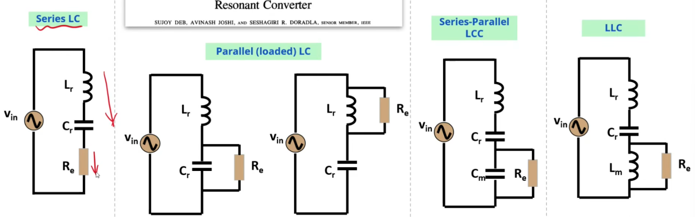
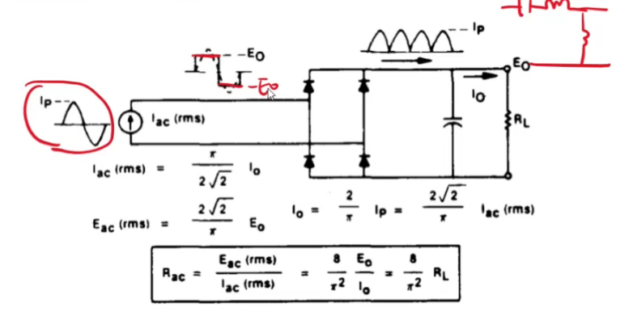
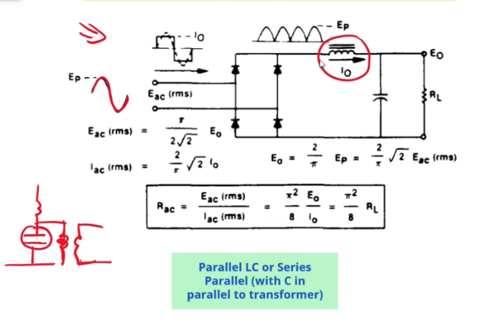
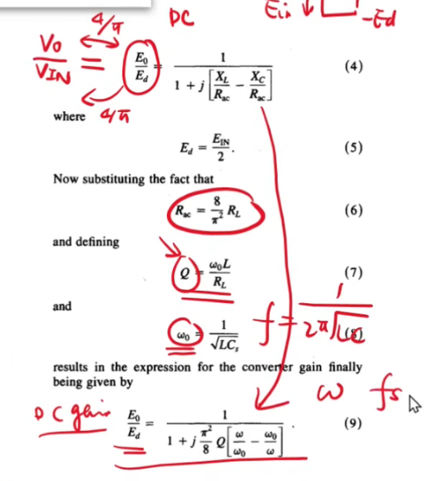

# 【LLC变换器设计基础】第一节 谐振腔分类 等效负载和串联谐振

#### 1.谐振腔分类

​	串联				并联（不是那种L与C并到一块的）		LCC				LLC

#### 2.等效负载计算

​	副边，谐振腔等效为电流源，电流波形为Ip正弦，整流桥的电压波形为Eo，电流经过全波整流之后变成馒头波Ip，滤波之后的平均值为Io
$$
i_{0}=\frac{2}{\pi}i_{p}=\frac{2\sqrt{2}}{\pi}i_{\mathrm{ac}}(rms)
$$
把这个倒过来就可以得到 Iac（rms）
$$
I_{ac}(rms)\quad=\quad\frac{\pi}{2\sqrt{2}}\quad
$$
​	Eo为方波信号的最大值，那么对于峰值电压Eac_p。对于一个方波电压，其等效正弦波的峰值电压是方波最大值Eo 的倍数。这倍数由傅里叶级数的第一项决定，即方波的基波成分。基波成分的峰值是方波峰值的4/π倍
$$
E_{ac_p}=\frac4\pi E_o
$$
等效正弦波的有效值是其峰值的1/根号2 倍：
$$
E_{ac}(rms)\quad=\quad\frac{2\sqrt{2}}\pi E_o
$$
等效电阻Rac
$$
R_{ac}=\frac{E_{ac}(rms)}{I_{ac}(rms)}\quad=\frac{8}{\pi^{2}}\frac{E_{0}}{I_{0}}=\frac{8}{\pi^{2}}R_{L}
$$
**在并联的情况下，比如电容并到变压器的两段，LCC。视为电压驱动，**

#### 3.串联谐振

- 在串联谐振里， DCgain=ACgain，在谐振点处为1
- 在谐振点的时候，输入进来就输出出去了

 
