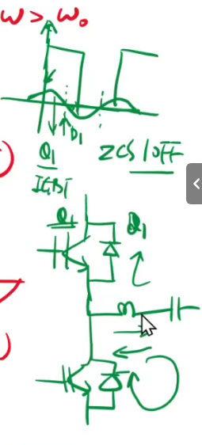
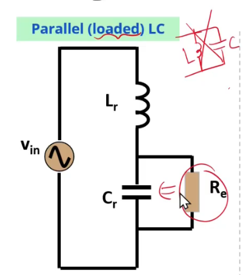

# 【LLC变换器设计基础】第三节 ZCS|并联谐振|LLC的谐振分析|Q品质因数的正解

#### 1.ZCS的理解

​	对于MOSFET而言，ZCS用的比较少，ZVS会比较多，那么ZCS会用在IGBT里面比较多，IGBT在关断的时候有个拖尾的现象，所以有较大的关断损耗

​	电容模式，电流超前电压，再这个位置之前，都是Q1在导通，然后电流反向了，Q1关断，实现ZCSOFF。这时候下面的IGBT还没导通，但是电流反向了呀，所以只能通过D1（上管的反向二极管)，直到下管导通的时候，电流走下管了，那么把下管关断，就会从下管的D2续流，实现ZCSOFF

**开通挑战**：容性模式下实现零电流开通较为困难，因为电流超前电压，开关器件开通时电流可能不为零，导致开通损耗增加

这里出现出入，实现ZCS应该也是在感性状态下的

#### 2. 并联谐振

​	**是说跟这个负载的并联，不是L跟C并联**

