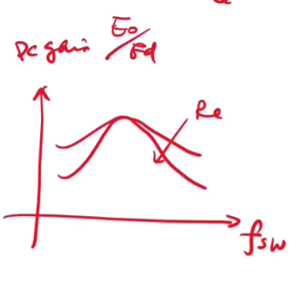
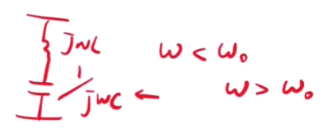
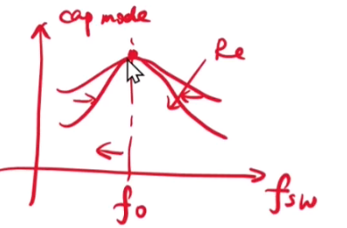
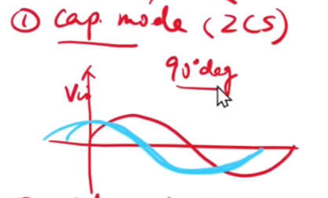
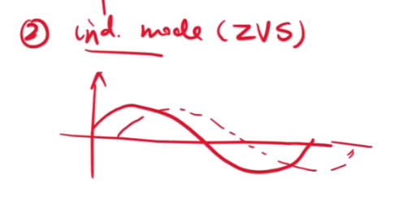
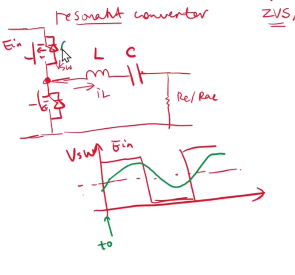
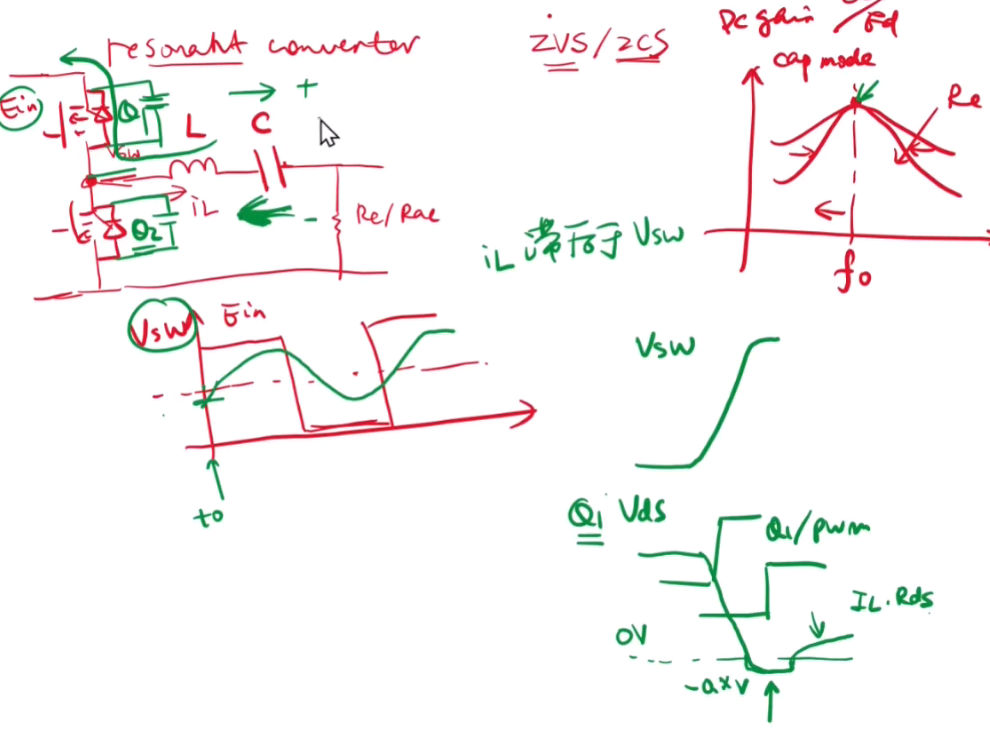

# 【LLC变换器设计基础】第二节 谐振变换器ZVS原理

### 1. 电感电容模式

​	搞谐振电路的目的就是为了实现 ZVS   ZCS

​	负载越重，gain越陡，越窄，Re越小，Q越大，越窄

​	找谐振峰值，小于谐振峰值的时候，电容占据主导地位，呈容性，当大于谐振峰值的时候，电感占据主导地位，呈感性。

**谐振峰值**

​	所以在这个DCgain里面，fo左侧为电容模式，右侧为电感模式

**1. 容性**

​	此时，如果输入电压是个正弦的话，电流应该超前于电压，实现ZCS，这里纯容性的话，会超前90°，所以这里最大为90°

**2. 感性**

​	电流滞后于电压，纯感性的话，电压比电流超前90°，

​	

### 2.ZVS原理（这里默认占空比50，只调频）

​	电容隔离作用，设工作在感性状态下，绿色的iL，滞后于电压，

​	应该是先把Q2关断，再打开Q1，来控制死区

​	电感放电，电流方向如那个绿色的颜色很重的那个~经过不了Q2，但是Q1因为有电容的存在，电流也过不去，Q1两端的电压如Vds所示，当他降到0的时候，电容g了，如果还有电流存在，就通过Q1的二极管，所以最后会出现一个零点几的反向电压，然后Q1接受到PWM的导通信号，Q1导通  

tip：

- 要有负电流，（相对于导通的方向）
- 适当的死区

如何去实现负电流：

​	使整个谐振腔呈现感性，电流才滞后于电压，电压上升的时候，电流还是负的，利用这个电流来充放电结电容，实现对当前开通管子的ZVS

**零电压导通（ZVS）**的实现依赖于将开关器件导通时的电压降至接近零。具体步骤如下：

- 当一个开关器件（比如S1）关闭时，电感和电容的谐振作用会使电压开始下降。
- 在死区时间内，由于S1已经关闭而另一个开关器件（比如S2）还没有打开，电压继续下降，达到或接近零。
- 这时，如果S2在电压接近零的时刻开启，那么由于电压非常低，开关损耗就会大大减少。这就是零电压导通的原理。

**关系总结：**

- 工作频率f~sw~>谐振频率f~0~，呈现为感性，此时电流滞后于电压，易于实现ZVS
- 工作频率f~sw~<谐振频率f~0~，呈现为容性，此时电流超前于电压，易于实现ZCS