## 01. STM32+软件安装

#### 1. 硬件介绍

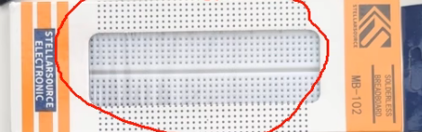面板板

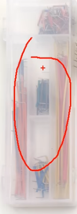面包板的跳线，较短，可以贴在面包板上，适合长时间的接线

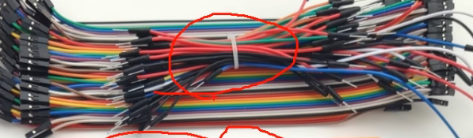上面这个是面包板的飞线，比较长，方便挪动；下面是杜邦线，分别是公对母和母对母的，用于插接一些电路模块

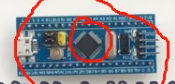STM32最小系统板，上面这黑色的就是stm32，

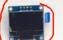0.96寸的OLED显示屏模块，4引脚的

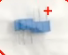电位器，主要用来进行AD转换实验

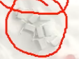按键，选用两引脚正好可以跨接在面包板的引脚插孔和电源插孔之间，

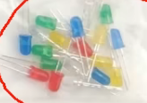led灯

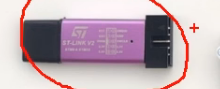STLINK，用来下载程序和供电的

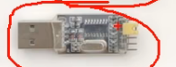USB转串口模块，使用这个模块就可以实现STM32和电脑进行串口通信了

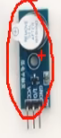有源蜂鸣器模块，内置振荡源，接电就响

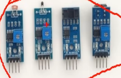一些传感器模块分别是:光敏电阻模块，下面的四个引脚有两个是用来供电，还有两个是光敏电阻信号的模拟输出和数字输出，可以用来进行IO口读取实验或者AD实验，第二个是热敏电阻模块，也是有模拟输出和数字输出的；第三个是对射式红外模块，配合遮光片可以用来计次，或者配合编码盘用来测速；第四个是反射式红外模块，在小车寻迹里，向地面发射红外光，再用红外接收管接收地面反射的红外光，通过判断接收光的强度，就可以大致识别出地面的颜色变化

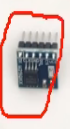W25Q64 Flash存储模块，可以存储数据，并且是用SPI总线进行通信的

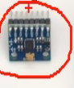MPU6050陀螺仪和加速度计；可以测量芯片自身的姿态，I2C总线通信

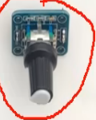旋转编码器，可以输出两路正交的方波信号，用于指示旋转的方向和速度，

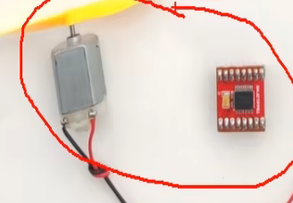直流电机和TB6612电机驱动模块，可以用来进行直流电机的PWM调速实验

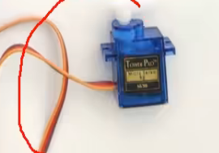SG90舵机；用PWM控制，输出端可以像船舵一样，根据给定PWM信号的占空比固定在某个角度上

#### 2. STM32简介

​	32位微处理器，st是公司，m是微控制器；51是8位的，采用ARM Cortex-M内核

**ARM**

- 指ARM公司，也指ARM处理器内核

**STM32F103C8T6**

- 系列： 主流系列STM32F1
- 内核： ARM Cortex-M3
- 主频： 72MHz
- RAM： 20K(SRAM)
- ROM:    64K(Flash)
- 供电： 2.0~3.6V（标准3.3v）
- 封装： LQFP48

**片上资源/外设**

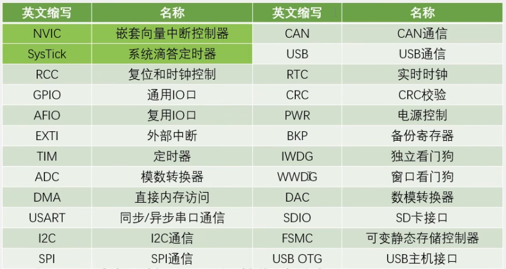

-  **NVIC：**位于Cortex-M3内核里的外设；用于管理中断的设备，比如配置中断优先级
-  **SysTick：**位于Cortex-M3内核里的外设，剩下的都是内核外的外设；内核里面的定时器，用于给操作系统提供定时服务
- **RCC：**对系统的时钟进行配置,使能各模块的时钟，（不给时钟的情况下，操作外设是无效的）
- **GPIO:** 点灯，读取按键等
- **AFIO:** 复用功能端口的重定义，还有中断端口的配置
- **EXTI:** 配置好外部中断之后，当引脚有电平变化时，就可以触发中断，让CPU来处理任务
- **TIM:** 分为高级，通用，基本定时器三种类型，不仅可以完成定时中断任务，还可以完成测频率，生成PWM波形，配置成专用的编码器接口等功能
- **ADC：** 内置了12位的AD转换器，可以直接读取IO口的模拟电压值，无需外部连接AD芯片，使用非常方便
- **DMA: ** 帮助CPU完成搬运大量数据的繁琐任务
- **USART:** 实际还是用异步串口多
- **I2C:** 通信协议
- **SPI:** 通信协议
- **CAN:** 通信协议，一般用于汽车领域
- **USB:** 通信协议
- **RTC:** 实时时钟
- **CRC: ** 数据校验方式，用于判断数据的正确性
- **PWR:** 可以让芯片进入睡眠模式等状态，达到省电的目的
- **BKP: ** 系统掉电时，仍可用备用电池保持数据
- **IWDG:** 看门狗，
- **WWDG:** 看门狗，及时复位芯片，保持系统稳定
- **DAC:** 在IO口直接输出模拟电压
- **SDIO:** 用于读取SD卡
- **FSMC:** 可以用于扩展内存，或者配置成其他总线协议
- **USB OTG: ** 可以让stm32作为USB主机去读取其他usb设备

#### 芯片命名规则

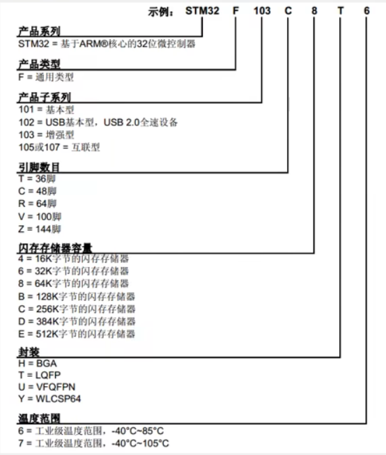

#### 芯片系统结构

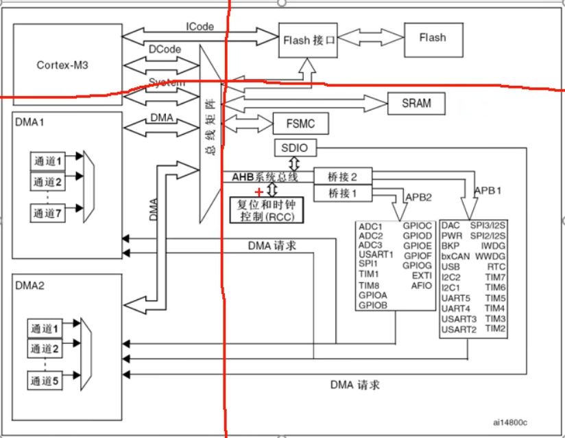

- 左上角是Cortex-M3的内核，引出三条总线，分别是ICode指令总线，DCode数据总线，System系统总线，前两种总线主要是用于连接Flash闪存的，Flash里面存储的是我们编写的程序，ICode指令总线是用来加载程序指令的，DCode数据总线是用来加载数据的，比如常量和调试参数这些；System系统总线连接了些其他东西，比如SRAM，用于存储程序运行时的变量数据，还有FMSC，AHB系统总线，用于挂载基本或高性能外设，比如复位和时钟控制这些基本电路，还有SDIO也是挂载上AHB上的，再后来就是两个桥接，接到了APB2和APB1两个外设总线上，APB是指先进外设总线，用于连接一般的外设
- （待重学）

#### 引脚配置

#### 启动配置

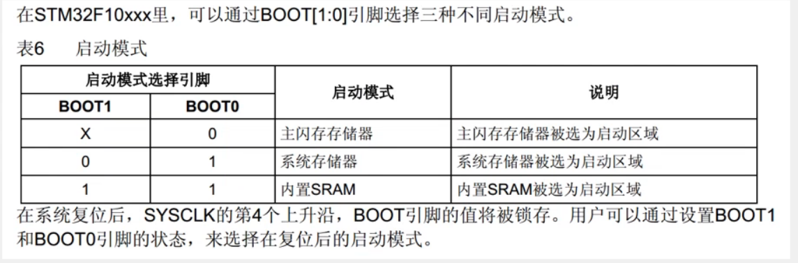

​	用于指定程序开始运行的位置，一般情况下，程序都是从Flash程序存储器开始运行，

## 软件安装

#### 安装器件支持包

**why**

​	型号多，芯片的器件支持包独立出来，只需要安装对应的器件支持包即可

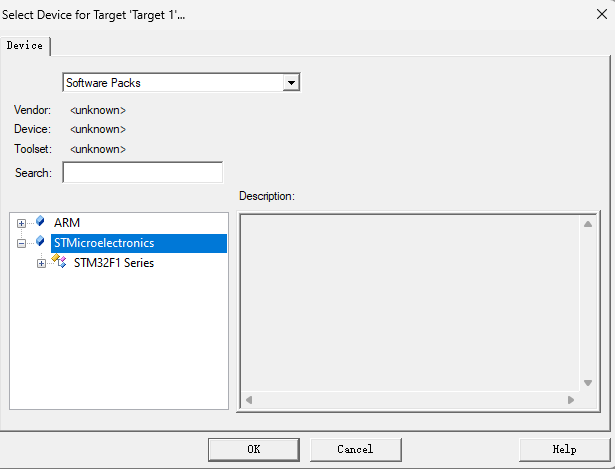

**how**

在线安装

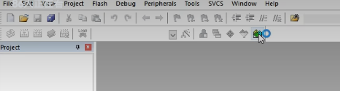

点击绿色按钮

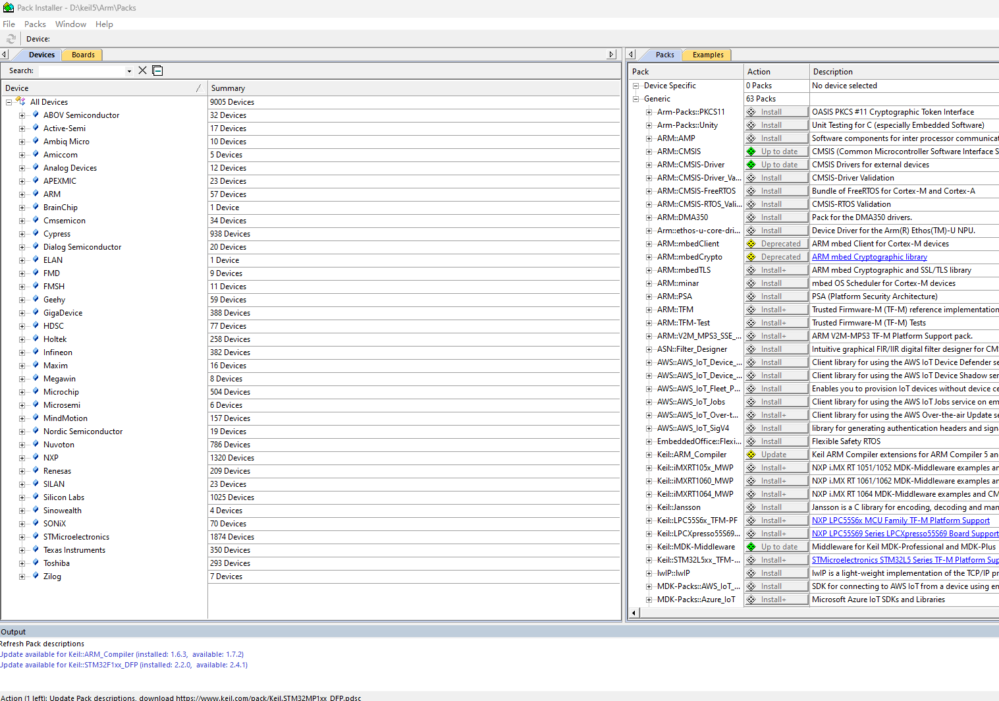