## 02. 新建工程

**目前STM32的开发方式主要有**

- 基于寄存器
- 库函数
  - 需要固件库
- HAL库

### 1. 新建工程文件

1. project---new project
2. 在工程文件里，新建一个文件夹用于存放工程结构，然后再里面输入项目名称
3. 需要添加工程必备文件
   1. 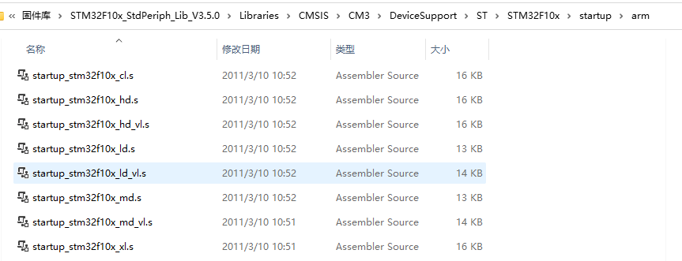这就是STM32的启动文件，程序的执行就是从启动文件开始的；然后就把这些玩意复制到所建的工程结构文件夹，可命名为一个start的子文件夹
   2. stm32f10x.h
      1. 这是外设寄存器描述文件，用于描述有哪些寄存器和它对应的地址的
   3. system_stm32f10x.h；；；；system_stm32f10x.c
      1. 用于配置时钟
   4. 以上为外核寄存器的描述文件，除此之外还有内核寄存器的描述文件
   5. 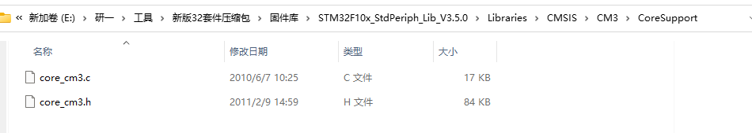
   6. 至此，必要文件复制完成，然后需要配置到工程上
   7. 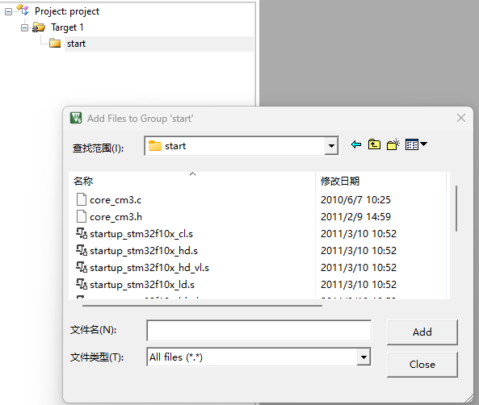改名start，然后选择添加已有，启动文件只需要选择一个，教程需要的是后缀为md.s的启动文件，然后.C//.H都要添加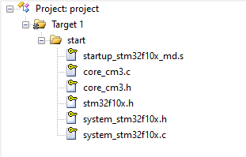
   8. 然后需要添加头文件路径，不然软件找不到.h文件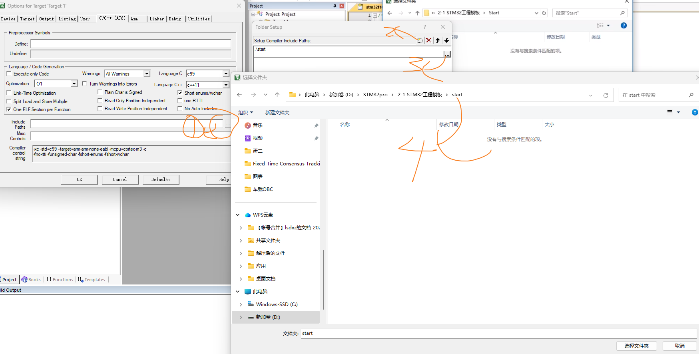
   9. 然后测试，在工程结构目录下新建一个文件夹User，然后再工程里新建个组，改为User，然后新建一个C文件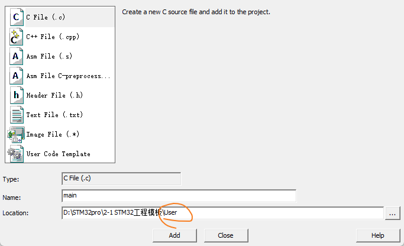

### 2. 通过配置寄存器点灯

- 连接

  - STM32最小系统板+STLink + 四根杜邦线

    

  - 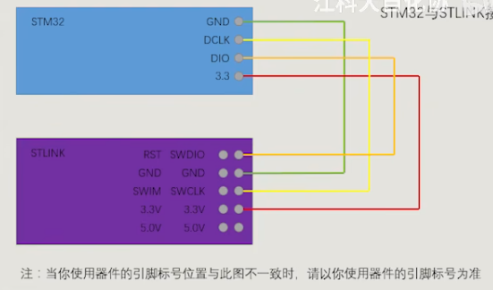

  - **配置调试器**魔术棒----debug--

    - 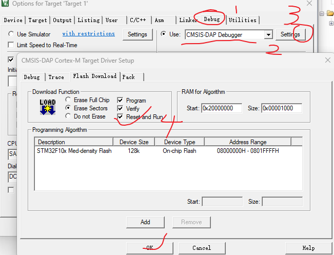

  

- 点灯

   ```c
    //通过寄存器的方式点灯
    
    #include "stm32f10x.h"
    
    int main(void)
    {
        RCC->APB2ENR = 0x00000010;
        GPIOC->CRH = 0x00300000;
        GPIOC->ODR = 0x00000000;//这个灯是低电平亮，所以ODR全0就是亮；0x00002000
        while (1)
        {
        }
    }
    
   ```

  - 通过库函数点灯
    - 新建library文件夹，下面的先是库函数的源文件，然后第二个是库函数的头文件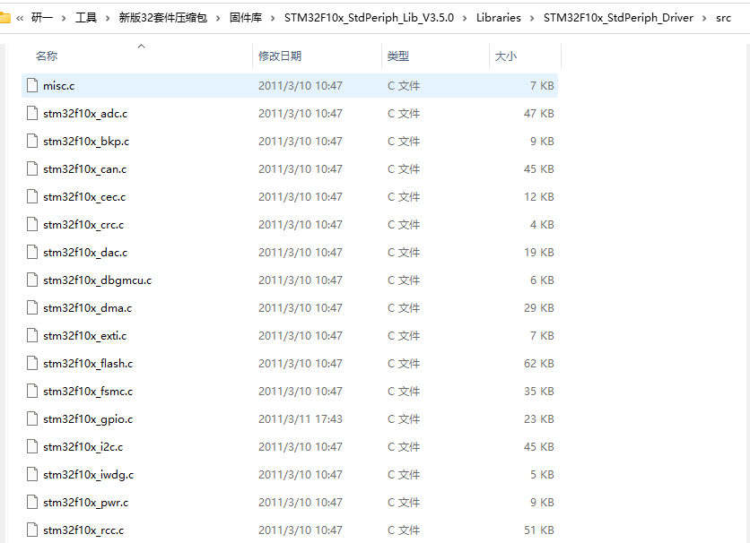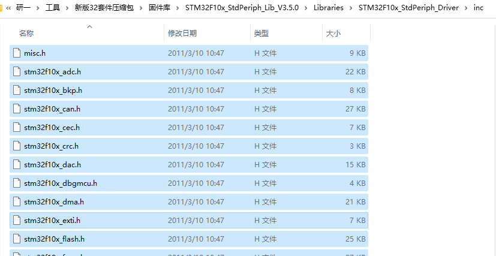
    - 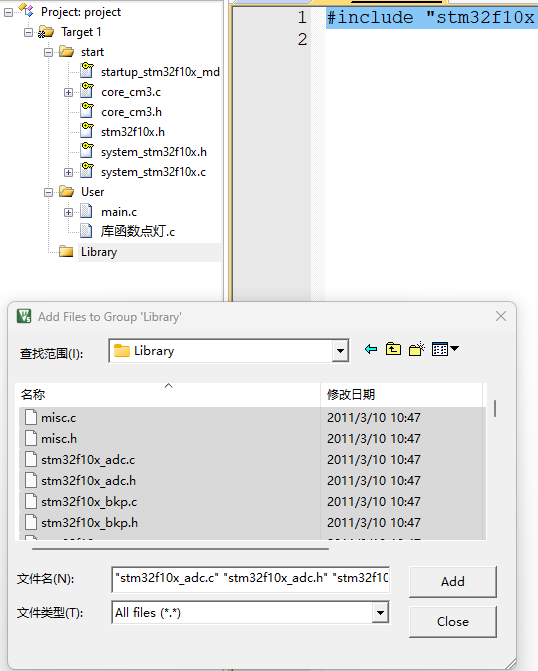全选添加
    - 还有三个需要配置的：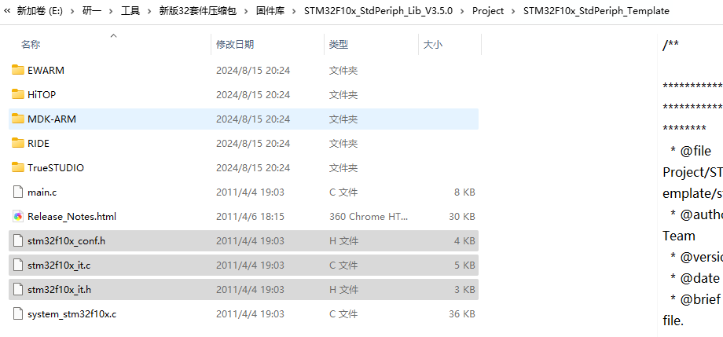
      - conf是用来配置库函数头文件的包含关系的
      - 两个it文件是用来存放中断函数的
      - 把这三个文件复制到User文件夹里，并在工程里添加（User就是我们用来执行程序的文件夹
    - 最后需要一个宏定义，在头文件右键，打开文件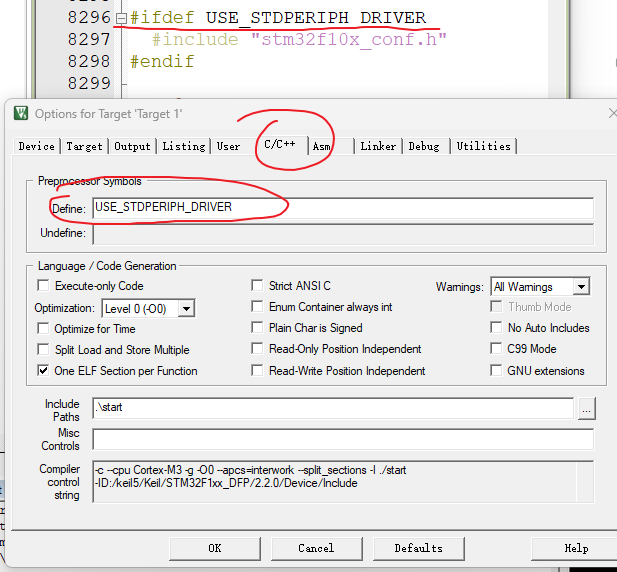
      - 这样才能包含标准外设库，也就是库函数
    - 还是上面这位置，下面的路径也不要忘了library跟User
  
- ```c
  #include "stm32f10x.h"
  
  int main(void)
  {
      GPIO_InitTypeDef GPIO_InitStructure; // 将声明提前
  
      RCC_APB2PeriphClockCmd(RCC_APB2Periph_GPIOC, ENABLE);
  
      GPIO_InitStructure.GPIO_Mode = GPIO_Mode_Out_PP;
      GPIO_InitStructure.GPIO_Pin = GPIO_Pin_13;
      GPIO_InitStructure.GPIO_Speed = GPIO_Speed_50MHz;
      GPIO_Init(GPIOC, &GPIO_InitStructure);
  
      // GPIO_SetBits(GPIOC, GPIO_Pin_13); //高电平，
      GPIO_ResetBits(GPIOC, GPIO_Pin_13); //低电平，灯亮
  
      while (1)
      {
      }
  }
  
  ```

### 启动文件的选择

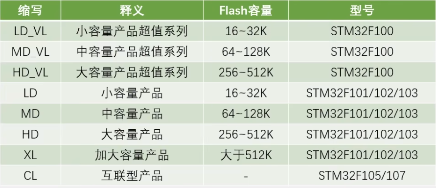

​	如图所示为STM32F1系列中的型号分类，根据Flash容量大小分类，F100是超值系列，然后根据Flash容量大小确定

### 新建工程步骤总结

- **建立工程文件夹**，在Keil中创建工程，选择对应的芯片型号。
- 在工程文件夹里建立 `Start`、`Library`、`User` 等文件夹，复制固件库里面的文件到工程文件夹。
- 在工程里对应建立 `Start`、`Library`、`User` 等同名的分组，然后将文件夹内的文件添加到工程分组里。
- **工程选项** -> **C/C++** -> 在 **Include Paths** 内声明所有包含头文件的文件夹路径。
- **工程选项** -> **C/C++** -> 在 **Define** 内定义 `USE_STDPERIPH_DRIVER`。
- **工程选项** -> **Debug** -> 在下拉列表中选择对应调试器 -> **Settings** -> **Flash Download** 里勾选 `Reset and Run`。

### 工程架构

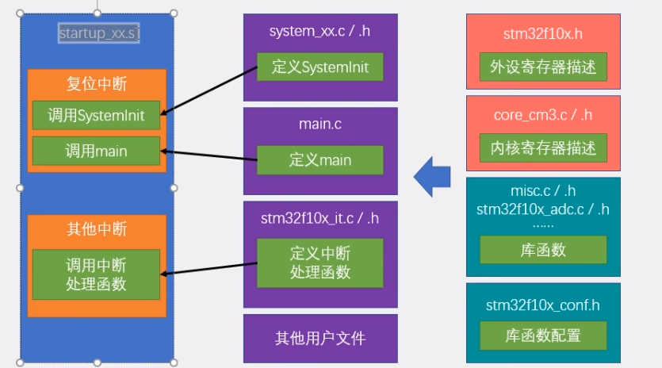

- 蓝色为启动文件，是程序执行的最基本的文件