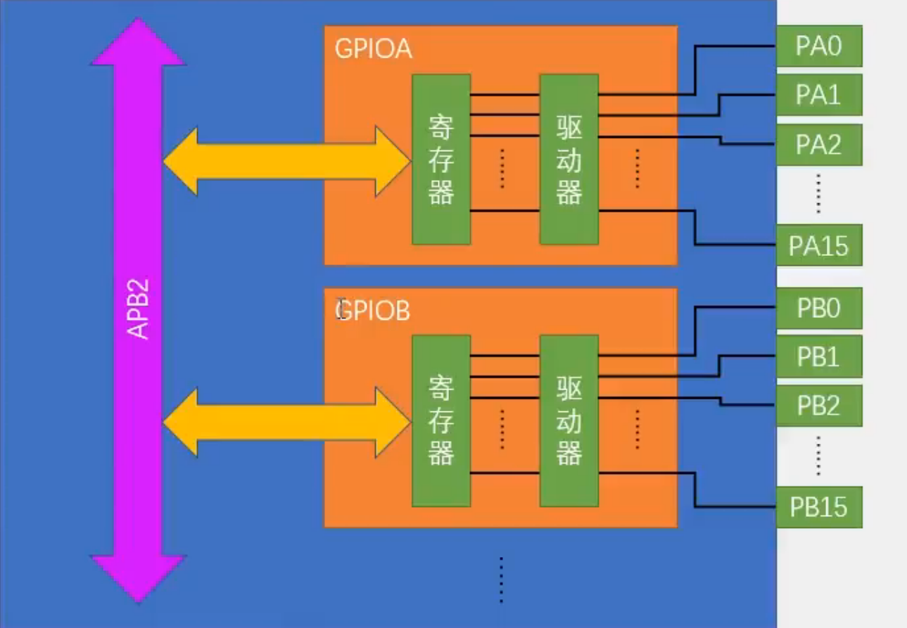
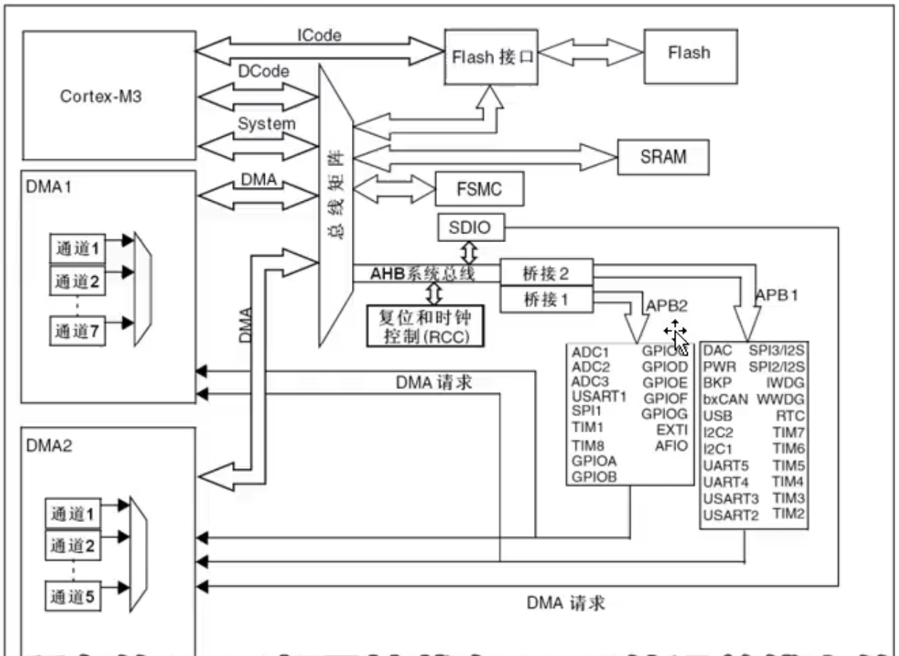
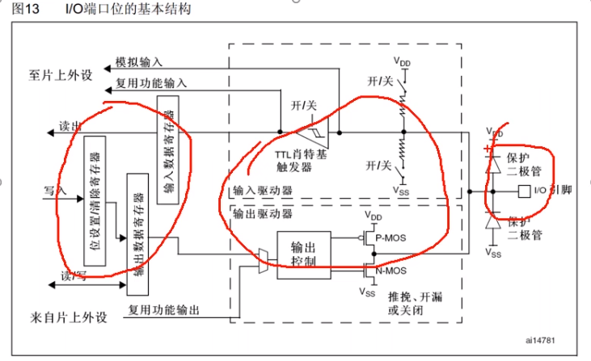
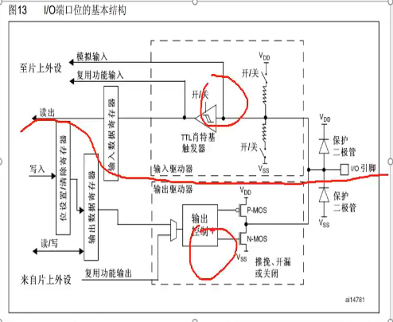
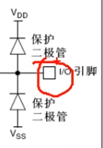
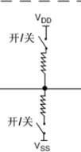
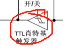
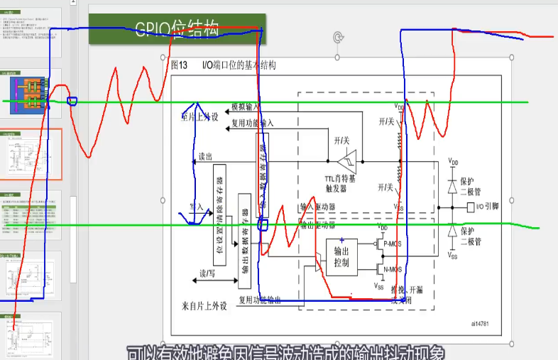
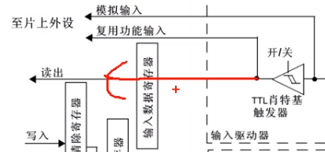
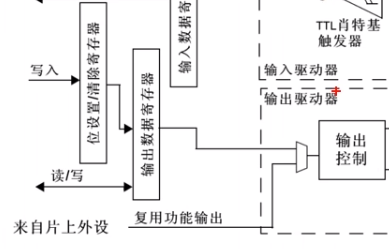

### GPIO输出

#### GPIO简介

- GPIO 通用输入输出口
- 可配置8种输入输出模式
- 引脚电平：0V-3.3V， 部分引脚可容忍5V
- 输出模式下可控制端口输出高低电平，用以驱动LED、控制蜂鸣器、模拟通信协议输出时序等
- 输入模式下可读取端口的高低电平或电压，用于读取按键输入、外接模块电平信号输入、ADC电压采集、模拟通信协议接收数据等

#### GPIO基本结构

- GPIO 外设的名称是按照GPIOA，GPIOB....
- 每个GPIO外设，总共有16个引脚，编号0-15，PA0...PA15
- 在每个GPIO模块内，主要包含了寄存器和驱动器
  - 寄存器就是一段特殊的存储器，内核可以通过APB2总线对寄存器进行读写，这样就可以完成输出电平跟读取电平的功能了
  - 寄存器是32位的，跟后面的引脚是对应的，所以只有低16位对应的又端口
  - 驱动器是用来增加信号的驱动能力的

在STM32中，所有GPIO都是挂载在APB2外设总线上的

#### GPIO位结构

- 左边三个为寄存器
- 中间虚线部分为驱动器
- 右边这个就是某一个IO口的引脚

​	整体结构可以分为如下两个部分，上面是输入部分，下面是输出部分。

**输入部分**

- 
  - 接两个保护二极管对输入电压进行限幅，上面接VDD3.3V，下面VSS 0V。
  - 输入电压大于3.3V，上方二极管导通，电流不流入内部电路了就
  - 输入电压小于0V，下方二极管导通，保护电路
  - 0-3.3V，正常工作
- 
  - ·上通，下断--->上拉输入模式
  - 上断下通---->下拉输入模式
  - 两个都断开---->浮空输入模式
- 
  - 这里的触发器应该是翻译错误，应该是施密特触发器，规定某一阈值上下限，高于阈值输出高电平，低于阈值输出低电平
  - 这里是规定了两个值，大于大的才是高，低于小的才为低，在遇到上下限之前~电平不会发生变化
  - 
  - 绿色的为上下限阈值，蓝色的为输出波形，红色为给定信号
- 
  - 经施密特触发器整形的波形就可以直接写入输入数据寄存器了，在用程序读取输入寄存器对应某一位的数据，就可以知道端口的输入电平了
  - 上面那两条线路，就是连接到片上外设的一些端口
    - 模拟输入，是连接到ADC上的，因为ADC需要接收模拟量。所以这根线是接到施密特触发器前面的
    - 复用功能输入，连接到其他需要读取端口的外设上的，比如串口的输入引脚等，接收的是数字量，所以在施密特触发器后面
- 输出部分
  - 数字部分可以由输出数据寄存器或片上外设控制
  - 选择通过输出