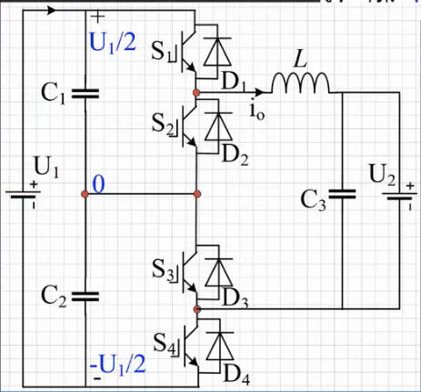
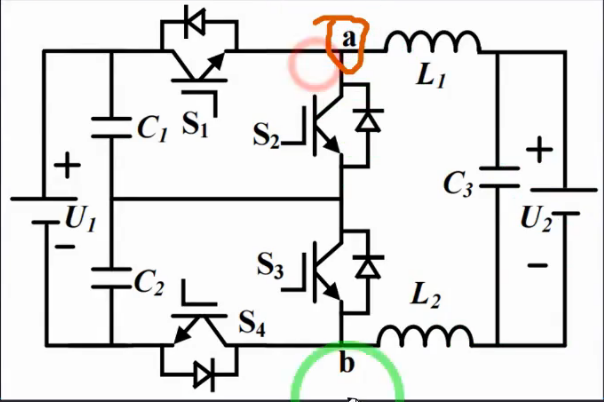
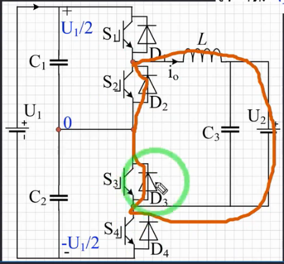
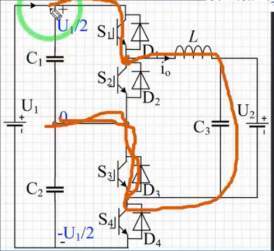
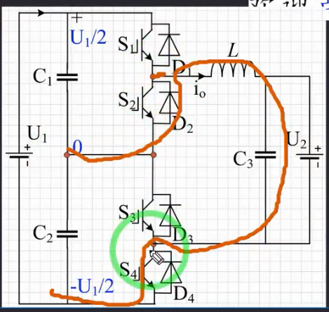
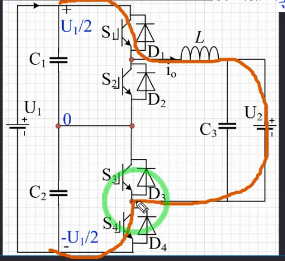

## 01. 三电平DCDC拓扑结构介绍

**单相三电平DCDC变换器-Buck-主电路结构**

U~1~为输入电压，U~2~为输出电压，C~12~为分压电容，每个电容的电压为1/2；四个开关管，（都用的双向的，所以可以实现能量的双向流动）；下面的图把电感分为两个是为了对称，为上图的一半；

- **三个电平**： **U~ab~： 0（右侧电路通过S~23~的二极管续流，ab两侧电位差为0，电压为0）

**U~1~/2**：U~ab~为电容C~1~两端的电压

 **-U~1~/2**：U~ab~为电容C~2~两端的电压

​	S~1~这里就跟电容C~1~并联了，所以对于S~1~,它的耐压基准应该根据U~1~/2来选择，S~4~同理(根据前面一个图来选)

**U~1~**:

这里S~2,3~分别与C~1,2~并联了，其耐压也是以U~1~/2

- S~1,2~互补导通，S~3,4~互补导通，否则上下直流侧会短路从而烧毁管子，则有且仅有四种开关状态 
- 两对不同工作状态的管子，则最简要么他们的调制信号相同，载波不同（通常是相位不同），或者相反
  - 

**补充：关于调制信号与载波**

​	**调制信号**：通常是个低频信号

​	**载波信号**：通常是高频锯齿波或三角波信号

**工作过程**

1. **调制信号与载波信号的比较：**
   - 将调制信号与载波信号输入到比较器。
   - 比较器实时比较两者的瞬时值。
2. **产生PWM信号：**
   - 当调制信号大于载波信号时，比较器输出高电平。
   - 当调制信号小于载波信号时，比较器输出低电平。
   - 通过这种比较，产生一个脉宽调制（PWM）信号，其脉冲宽度与调制信号的幅度成比例。
3. **控制开关管导通：**
   - PWM信号用来驱动开关管（如晶体管或MOSFET）。
   - 当PWM信号为高电平时，开关管导通；当PWM信号为低电平时，开关管关闭。
   - 通过控制PWM信号的占空比，可以精确控制开关管的导通时间，从而实现对负载（如电机、电源）的控制。

- C~1,2~的平衡：考虑电位偏移，电位波动
- 换流时最好是0-U~1~/2-U~1~，否则开关损耗增加，电压变化太过剧烈
- 输出侧电路和原Buck一致，参数计算方法不变

- 其余优点通过理论分析来获得：电感电流纹波减小，纹波频率提高一倍，因此电感体积可以减少

