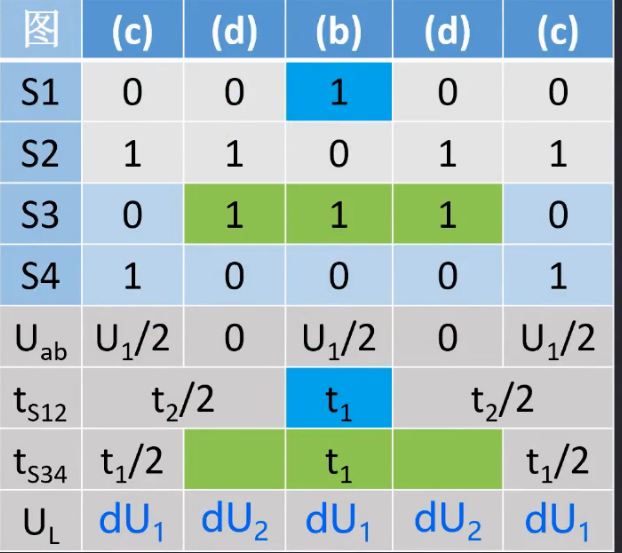
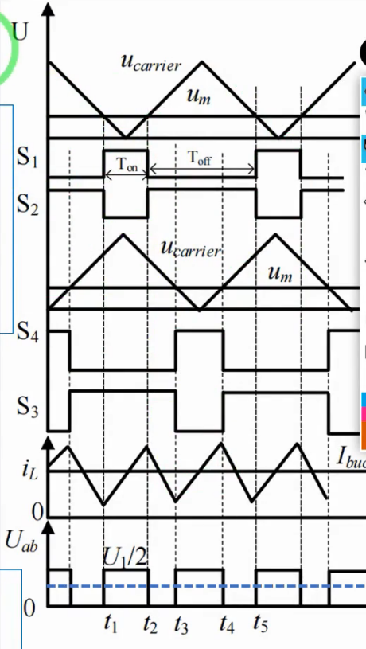
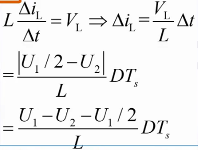
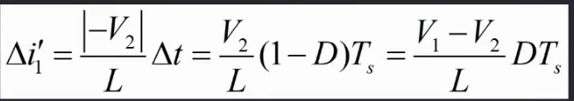

## 06. 占空比D在0到0.5之间的工作波形分析

- 一样的分析。**t~1~=DT~s~**。  **t~2~= (1-D)T~s~**
- 0<U~2~<U~1~/2; dU~1~=U~1~/2-U~2~>0;  此时电感电流上升。dU~2~=-U~2~<0，下降
- **电感电流纹波：（选取t~1~-t~2~）
  - 
  - 
  - 又多减去了U1/2L*DT~s~
  - 带入数据可得，相比于之前，电感电流波动总共减少了5.2A,之前总共约7.8A，还剩2.6A

