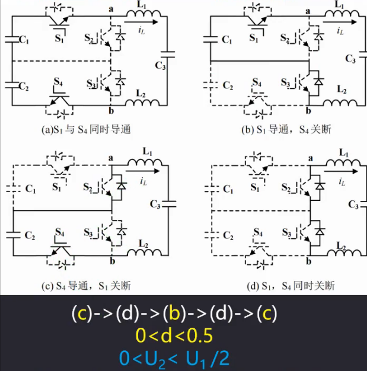
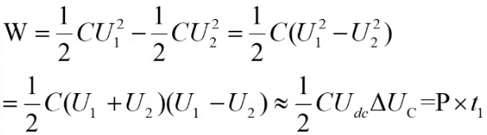
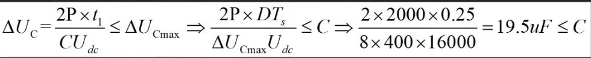

## 08. 计算输入侧分压电容

0<D<0.5,C-D-B-D-C

​	为了保持电荷平衡，b的时间跟c的时间是一样的，工作状态在bd之间与cd之间切换，二者具有对称性，只分析一个即可。

​	在b状态。C~1~放电给负载，由**能量守恒**，在这个状态时间内，负载需要P*t~1~能量，所以电容必须提供这么大的能量：

- 这里U~1~是指在t~0~初始时刻电容两端的电压值，U~2~指经过时间t，电容两端的电压
- U~1~+U~2~可以近似为直流侧的电压即电源电压U~dc~，基本不变
- P为额定功率，t~1~表示b状态作用的时间，t~1~=DTs，都是保持不变
- 
  - △U~cmax~=2%*Udc=8V，可取C~1~=C~2~=22uf