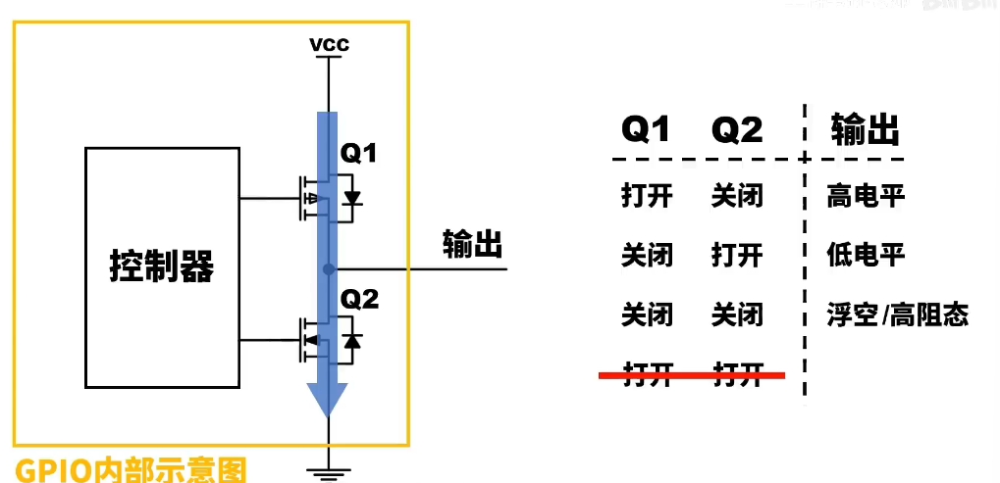
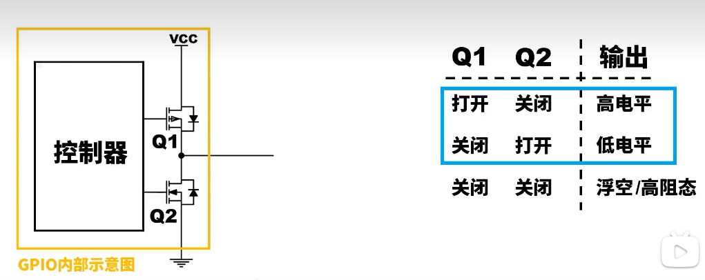
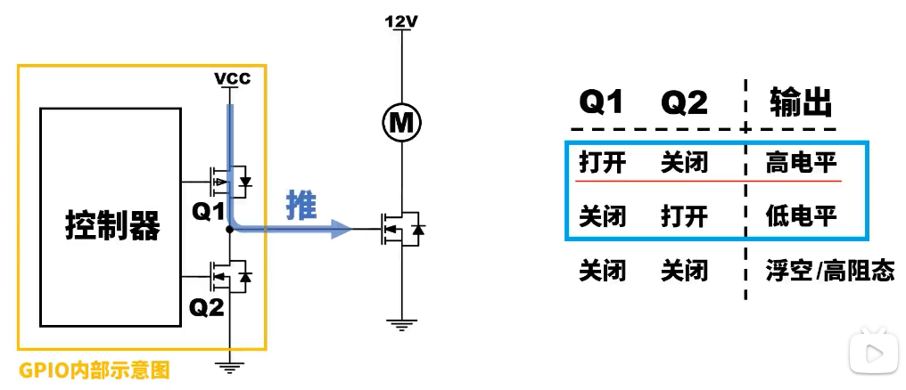
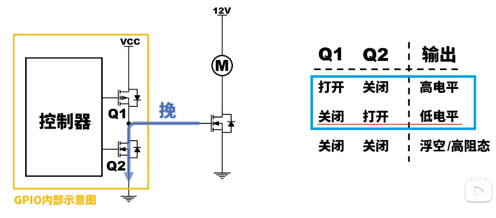
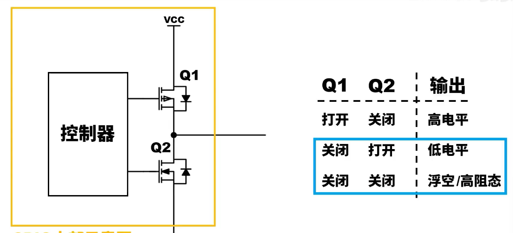
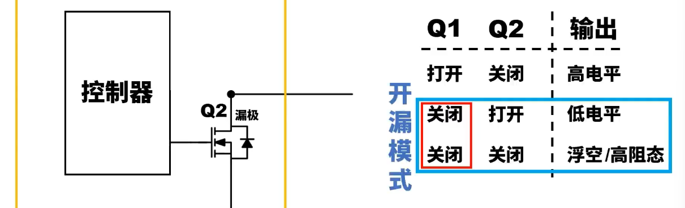
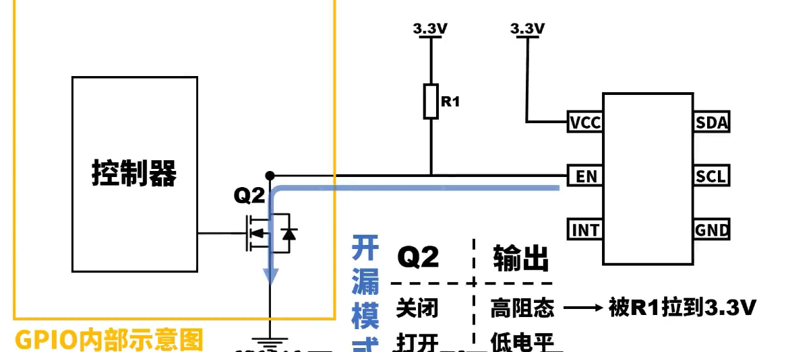
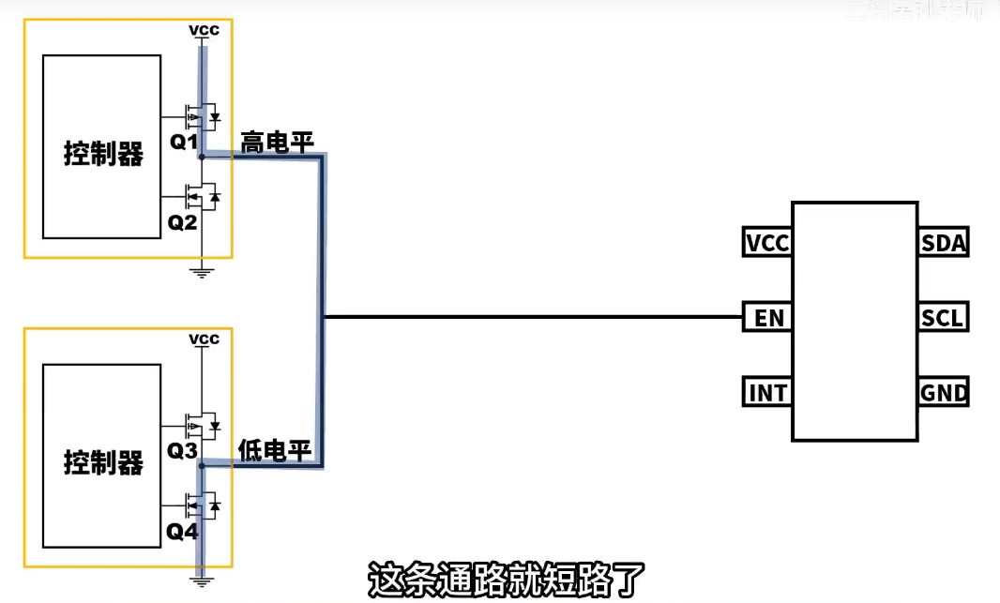
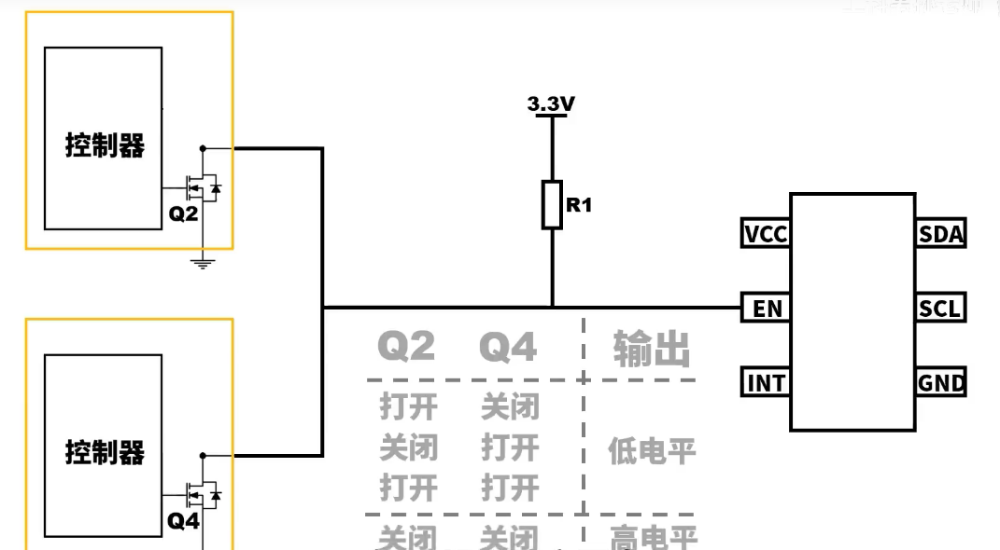

## GPIO输出

### GPIO内部示意图

​	所以GPIO配置为输出时，就会处于这三种状态

### 推挽输出

把这俩拿出来做个组合

​	输出高电平为推，把电流推出去

​	输出为低电平的时候，电流流入，给外面的MOS的栅极放电，给电流挽回来

### 开漏输出

这个组合里，上面的MOS一直是关闭的，这时候下面MOS管的漏极就相当于啥也没接，就是**开漏**

**第一个作用**

- Q2关闭，输出为高阻态，这时候给他一个上拉电阻，输出为3.3V的高电平
- Q2打开，电压全部落在上拉电阻上，该点处电压为低电平

**第二个作用**

​	实现几个GPIO同时控制一个输入

**如果用推挽的话**

所以需要把两个GPIO配置为开漏模式，然后再外接一个上拉电阻

​	只要有任意一个GPIO输出低电平，这边的enable就是低电平

​	如果都处于高阻态，就输出高电平