## 电子器件01-----MOS管

### 1. 三个极的判定

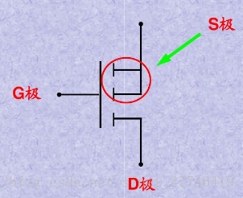
G极(gate)—栅极，不用说比较好认
S极(source)—源极，不论是P沟道还是N沟道，两根线相交的就是
D极(drain)—漏极，不论是P沟道还是N沟道，是单独引线的那边

### 2. N沟道与P沟道判别

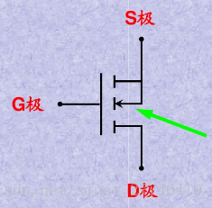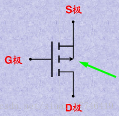
箭头指向G极的是N沟道
箭头背向G极的是P沟道

### 3. 寄生二极管方向判定

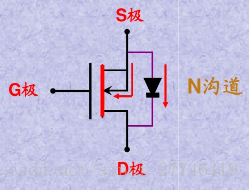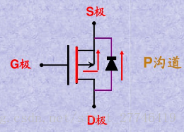
不论N沟道还是P沟道MOS管，中间衬底箭头方向和寄生二极管的箭头方向总是一致的：
**要么都由S指向D，要么都有D指向S**

### MOS管的方向

- nmos--从D到S，D接电源正极，S接电源负极
- Pmos--从S到D，S接电源正极，D接电源负极

这个跟二极管对应着看就行，二极管导通要我MOS干嘛

也不能这么说，SD是同一沟道的两端，跟PN结不一样，这玩意两个方向其实都能导通，只要满足导通条件，

### MOS管的导通

- nmos---G为高电平，S为低电平（D-->S)
- pmos---S极电压大于G极，则导通(S-->D)

### 4. MOS开关实现的功能

- 信号切换
- 电压通断

### 5. MOS管用作开关时在电路中的连接方法

关键点:

- 确定那一极连接输入端，那一极连接输出端

- 控制极电平为？V 时MOS管导通

- 控制极电平为？V 时MOS管截止

  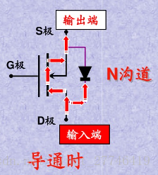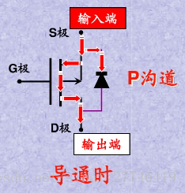

  NMOS：D极接输入，S极接输出
  PMOS：S极接输入，D极接输出

**反证法加强理解**
NMOS假如：S接输入，D接输出
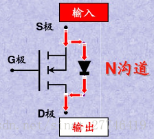
由于寄生二极管直接导通，因此S极电压可以无条件到D极，MOS管就失去了开关的作用
PMOS假如：D接输入，S接输出
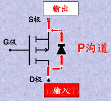
同样失去了开关的作用

### 6. MOS管的开关条件

N沟道—导通时 Ug> Us,Ugs> Ugs(th)时导通
P沟道—导通时 Ug< Us,Ugs< Ugs(th)时导通
总之，导通条件：**|Ugs|>|Ugs(th)|**

- **n型三极管（NPN）**：
  - **高电平**（基极相对于发射极的电压高于0.7V）时导通。
  - **低电平**时断开。

- **p型三极管（PNP）**：

  - **低电平**（基极相对于发射极的电压低于-0.7V）时导通。

  - **高电平**时断开。

### 7. 相关概念

**BJT**
Bipolar Junction Transistor 双极性晶体管，BJT是电流控制器件；
**FET**
Field Effect Transistor 场效应晶体管，FET是电压控制器件.
按结构场效应管分为：结型场效应（简称JFET）、绝缘栅场效应（简称MOSFET）两大类
按沟道材料：结型和绝缘栅型各分N沟道和P沟道两种.
按导电方式：耗尽型与增强型，结型场效应管均为耗尽型，绝缘栅型场效应管既有耗尽型的，也有增强型的。
总的来说场效应晶体管可分为结场效应晶体管和MOS场效应晶体管，而MOS场效应晶体管又分为N沟耗尽型和增强型；P沟耗尽型和增强型四大类。

### 8. MOS管重要参数

①封装
②类型（NMOS、PMOS）
③耐压Vds（器件在断开状态下漏极和源极所能承受的最大的电压）
④饱和电流Id
⑤导通阻抗Rds
⑥栅极阈值电压Vgs(th)

### 9. 从MOS管实物识别管脚

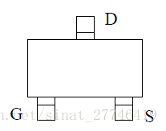
无论是NMOS还是PMOS
按上图方向摆正，中间的一脚为D，左边为G，右边为S。
或者这么记：单独的一脚为D，逆时针转DGS。
这里顺便提一下三极管的管脚识别：同样按照上图方向摆正，中间一脚为C，左边为B，右边为E。

**管脚编号**
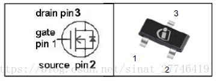
从G脚开始，逆时针123
三极管的管脚编号同样从B脚开始，逆时针123

### 10. 用万用表辨别NNOS、PMOS

借助寄生二极管来辨别。将万用表档位拨至二极管档，红表笔接S,黑表笔接D，有数值显示，反过来接无数值，说明是N沟道，若情况相反是P沟道。

### 11. 画一个MOS管

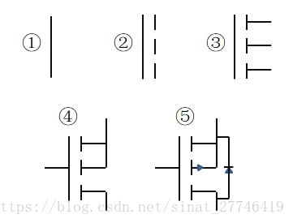