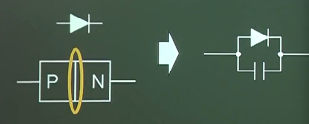
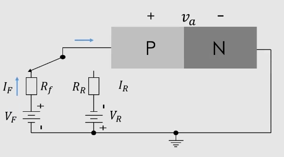
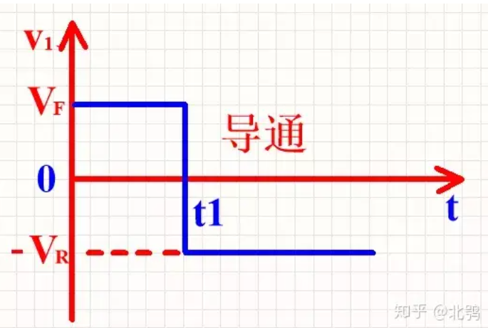
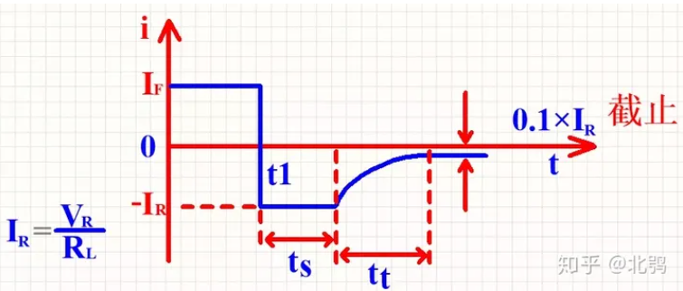
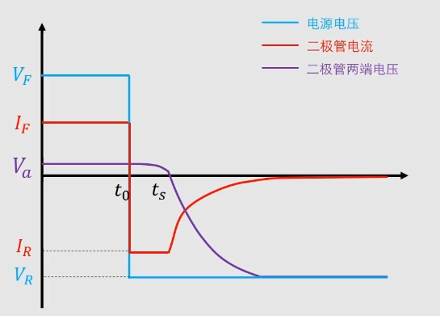
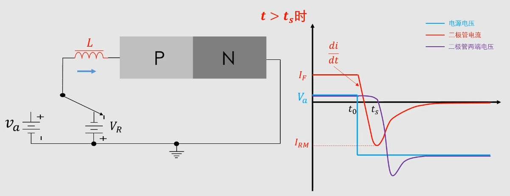
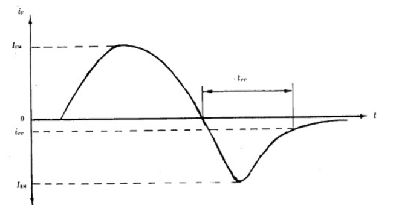

## 电子器件02-----二极管

### 前言

​	二极管的本质是由P型半导体和N型半导体接触形成的PN结

​	PN结除了构成单向到点的二极管外，还存在一个结电容

**结电容会导致‘双向’导电**

### 反向恢复时间

##### 	对于二极管串联电阻的情况

在t~1~时刻，电压反向，但二极管的并**不是立即截止**，而是由正向的I~F~变成一个很大的反向电流 I~R~=V~R~/R~L~(R~L~是与二极管串联的电阻)这个电流维持一段时间t~S~之后才逐渐下降，再经过t~t~后，下降到一个很小的值0.1R，这时二极管才进入反向截止状态。

**把二极管从正向导通转为反向截止所经过的转化过程称为反向恢复过程**

t~S~称为**存储时间**；t~t~称为**过渡时间**；t~rr~=t~s~+t~t~ 称为**反向恢复时间

- 由于结电容的存在，电压不能突变，所以在电压突变之后，且由于之前存储的电荷，电荷没有放完，二极管两端的电压就不会变反向
- 因为电源电压方向，所以电流也会立马反向，需要注意，这时电流的成因是少数载流子反向运动的结果，到了t~s~，少数载流子被消耗光了，二极管恢复反向阻断能力

##### 对于二极管串联电感的情况

电路不同，当没有电阻或者电阻很小的时候，反向电流会非常大，从正向变为反向需要时间，di/dt就非常大，就不能忽略电感了

- t~0~时刻，电源突然反向，此时二极管内充满电荷，相当于导体，压降很小，反向电压全部落在电感上，电流以斜率为di/dt斜率下降
- t~s~二极管恢复阻断能力，此时电流达到最大，随后电流下降
- t>t~s~后，二极管的电流为复合电流，随着载流子越来越少，电流也越来越小，此时电感会阻碍电流变小，因此会产生反向感应电压，这会导致在二极管两侧的反向电压比电源电压还大，也就是会出现**反向电压尖峰V~rm~**

 

##### 总结

- **总的来说，反向恢复时间就是存储的少数载流子耗尽所需要的时间**
- 误区：反向恢复时间与结电容的大小其实没啥关系

