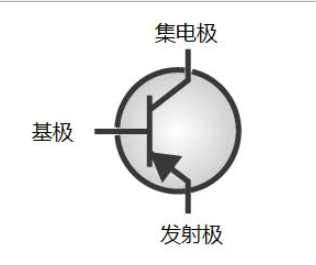
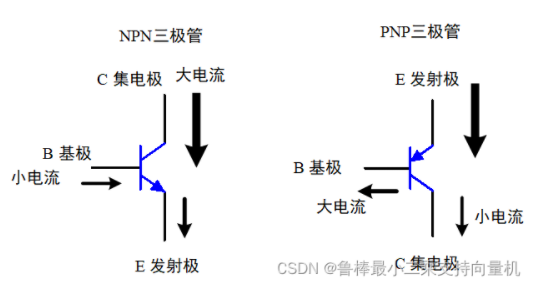
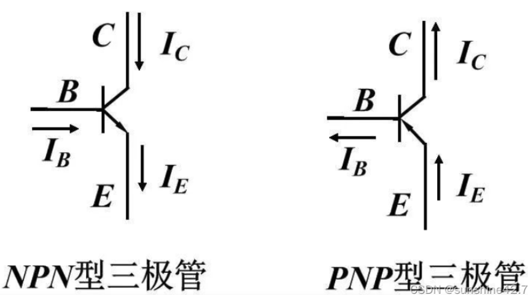
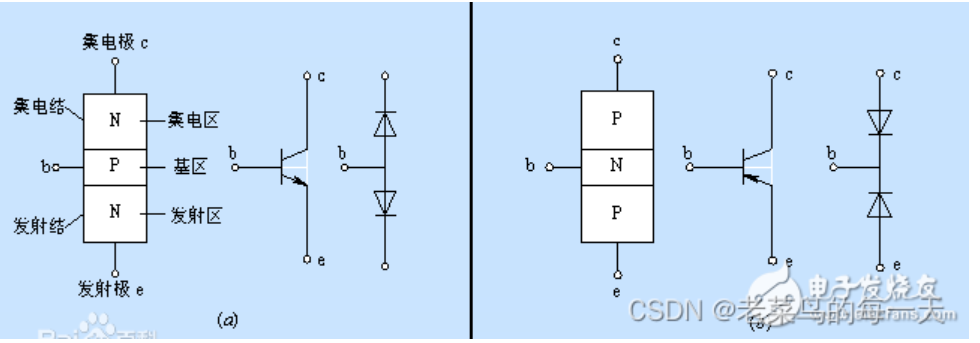
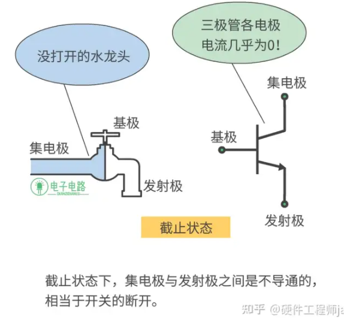

## 电子器件03-----三极管

### 1. 三个极的判定

- B极 基极
- C 集电极，没有箭头
- E 发射极， 有箭头

### 2. N沟道与P沟道判别

- **1.  NPN三极管：**
  **基极加高电压，集电极与发射极短路，即三极管导通；**
  基极加低电压，集电极与发射极开路，即三极管截止。

即高电位（高电平）有效。

- **2.  PNP三极管：**
  基极高电压，集电极与发射极开路，即三极管截止；
  **基极加低电位，集电极与发射极短路，即三极管导通。**

即低电位（低电平）有效。

#### 3. NPN与PNP的区别？

答：NPN：用 B→E 的电流（IB）控制 C→E 的电流（IC）。E极电位最低，且正常放大时通常C极电位最高，即 VC > VB > VE；

PNP：用 E→B 的电流（IB）控制 E→C 的电流（IC）。E极电位最高，且正常放大时通常C极电位最低，即 VC < VB < VE。

#### 4. 三极管导通条件

导通这玩意是不看集电极的，只看基极跟发射极

- NPN型三极管的导通条件是：基极-发射极电压（V_BE）大于其导通电压，一般在0.6V至0.7V之间，同时集电极-发射极电压（V_CE）为正。这意味着基极电流流入，电子从发射极流向集电极，导致三极管导通。
- 对于PNP型三极管，其导通条件是：基极-发射极电压（V_BE）小于负导通电压（通常在-0.6V至-0.7V之间），同时集电极-发射极电压（V_CE）为负值。也就是说，基极电压低于发射极电压，电子从集电极流向发射极，导致三极管导通。

#### 5. 正偏反偏

不知道是不是可以这样理解，已知对于NPN型BJT，当其工作在放大区时，有U~c~>U~B~>U~E~,然后再记住发射结正偏集电结反偏时处于放大区，这下好了~死记硬背了，寄

以NPN为例，集电极与基极之间形成PN结称为**集电结**；发射区与基区之间形成的PN结为**发射结**

- 当C点电位高于b点电位几伏时，**集电结处于反偏状态**
- 当b点电位高于e点电位零点几伏时，**发射极处于正偏状态**

**悟道**

​	联想记忆，是不是可以考虑PN结，NPN，基极为P，那么电压高放前面，PN就是正偏，NP就是反偏，发射极正偏的话就是说PN，基极到发射极，UB>UE

​	再进一步，也就是说，NPN型，正偏的时候肯定是Ub大；反偏肯定Ub小

#### 6. 三个工作区域

##### 截止区

​	三极管的发射结反偏，集电结反偏时，三极管会进入截止状态

Uc > Ub且Ue > Ub 

​	还是得看水龙头，这个基极不过是个开关，流通还得是集电极跟发射极，那么对于一般的三极管，都是集电极输出，意思就是你打开阀门~肯定是集电极那就开始放大了，然后留到发射极，而不是在发射极才放大输出

##### 放大区

​	”当三极管发射结正偏，[集电结](https://www.zhihu.com/search?q=集电结&search_source=Entity&hybrid_search_source=Entity&hybrid_search_extra={"sourceType"%3A"answer"%2C"sourceId"%3A3112575006})反偏，三极管就会进入**放大状态**。”

​	U~E~>U~B~>U~C~;

在放大状态下，基极电流大一点儿~集电极的电流也会跟着变大

##### 饱和区

“当三极管发射结正偏，集电结正偏时，三极管工作在**饱和状态**。”

