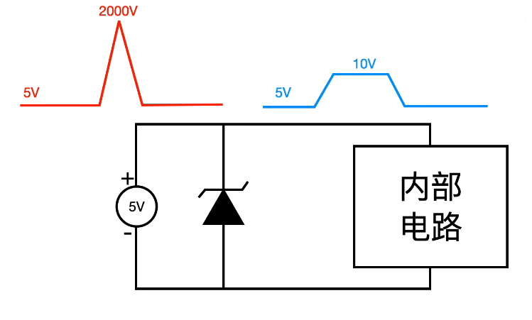
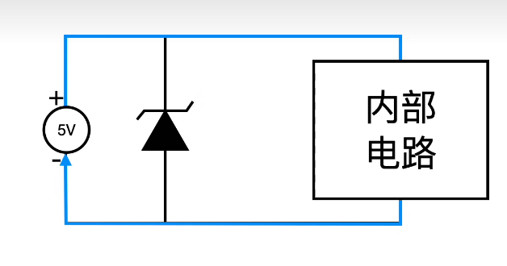
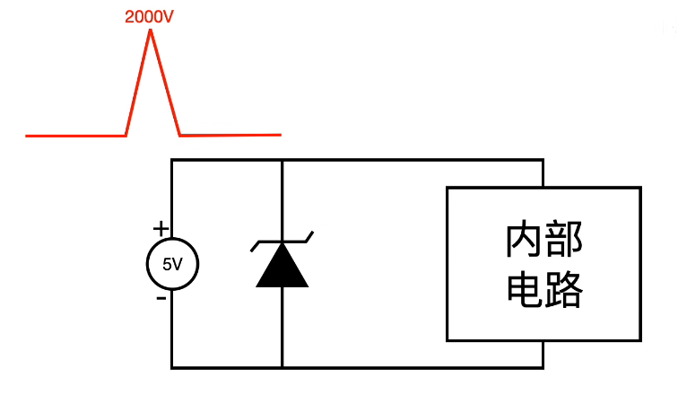
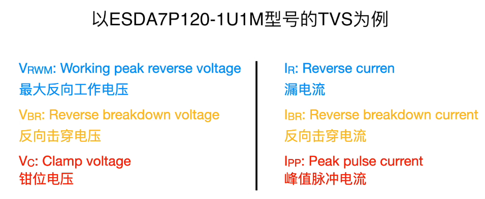
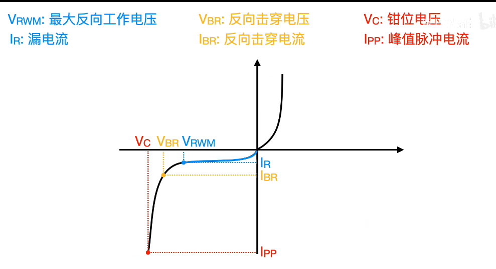
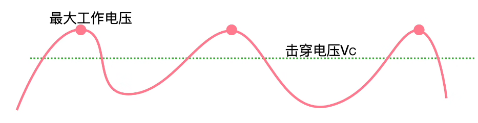

### 电子器件04-----TVS

​	TVS（Transient Voltage Suppression）二极管，也称为**瞬态电压抑制二极管**，是一种用于保护电子电路免受瞬态电压冲击的器件。作用：**抑制电压峰值**

​	比如这里，电源为5V，这时候突然来了个2000V的尖峰电压，如果没有TVS，内部电路会被烧坏，但是经过TVS之后，它的电压波形会变成右边所示， TVS把它的电压钳位在了10V，所以后面的电路就可以免收尖峰电压的冲击

- 当5V的电压工作时，TVS的阻抗非常高，该支路相当于开路状态

  

- 当尖峰电压来临，这个TVS的阻抗变得极低，此时电压尖峰的能量都通过TVS流向了负极，相当于TVS把后面都给短路了

#### 重要参数

下图为它的伏安特性曲线，右边为正向导通，左边为施加反向电压，施加正向时与普通无异，主要就是施加反向电压时的这些参数

- 在达到V~RWM~时，它的电流I~R~及其微弱，只有1.5ua，V~RWM~就是最大工作电压，对应电流为漏电流，设备工作范围就应该在V~RWM~内，当设备电压小于该值时，漏电流较小，当设备电压大于该值的时候，漏电流急剧增大，漏电流过大意味着能耗越大
- 当到达V~BR~时，TVS开始击穿，所以V~BR~叫做反向击穿电压，之后电流增加的更加急剧。但是电压增加的很慢，直到增加到V~C~
- V~C~是钳位电压，此型号的V~C~为11V，代表的意义是，当TVS接收到来自电源的尖端电压后，会将这个尖端电压钳位到11V，设备工作时**最大电压**一定要大于V~C~, 因为V~C~随时都可能出现，如果设备工作的最大电压小于这个值，会导致设备损坏，与之相对的电流就是I~pp~峰值脉冲电流，意思是当TVS处于钳位电压时，他能流过的最大电流，该型号的I~PP~为120A，如果超过这个电流TVS可能会发生损坏
  - 
  - V~c~*I~pp~=P~PP~,就是反向脉冲峰值功率P~pp~那么如果说工作过程可能出现的静电能量是1000w，那么P~pp~>1000w,否则管子也可能击穿