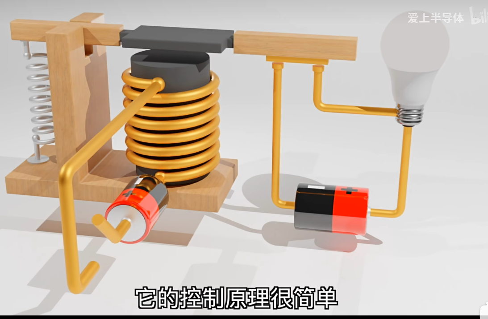
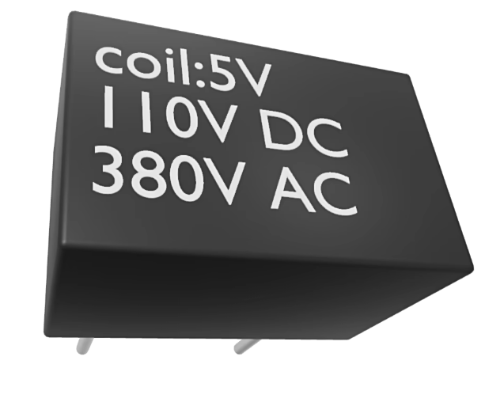
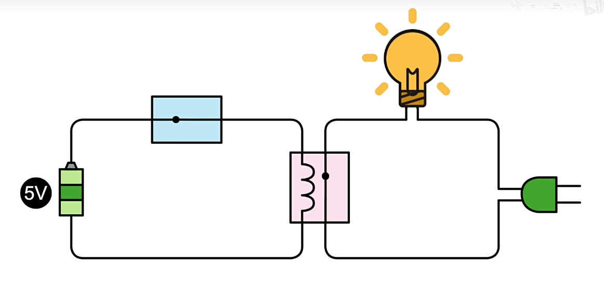
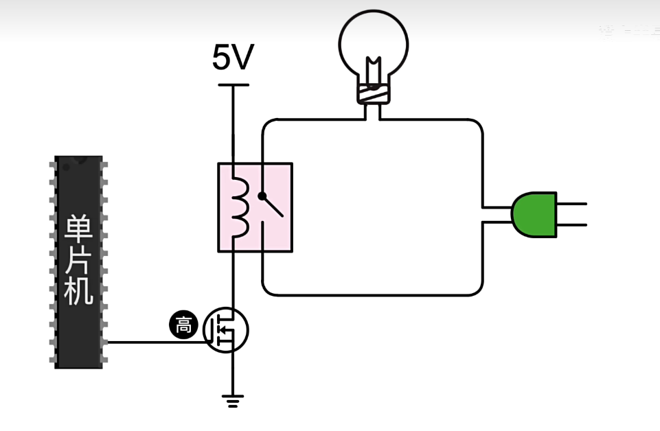
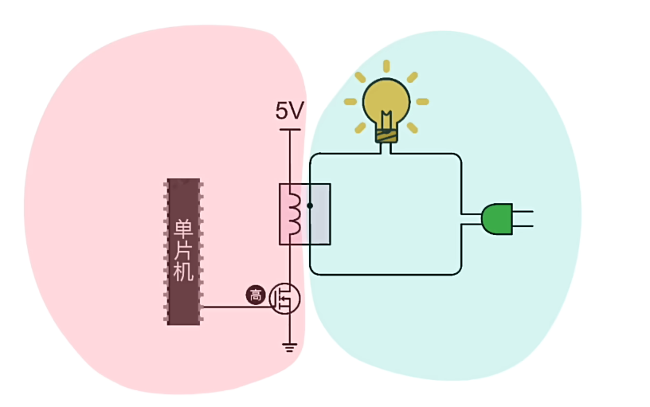

## 电子器件05-----继电器

**控制原理**

​	给线圈接电，线圈有了磁性，它的衔铁会被吸引，这样电灯泡就会被电量

**继电器外壳**

**coil 5V：**当施加5V的电压的时候，继电器的触电就会闭环，灯泡亮

​	当施加电压小于5V的时候，所激发的电磁力不能激发触电动作

​	当施加电压大于5V时，继电器的线圈很可能会直接烧毁

​	给mos管一个高电平，线圈接收到5V的电压，触点闭合，灯泡点亮

**与mos管比，继电器的优缺点：**

**优点**

- 与MOS相比，继电器更能适应大电压大电流，
  - 比如图中的继电器外壳数值，说的是它在直流电压下，最高能承受110V的电压，在给他施加交流电时，能承受380V交流电
  - MOS管是不能施加交流电的
- 继电器具有电气隔离功能
  - 

**劣势**

- 开关次数：10w次，mos不用管开关次数
- 动作时间：10ms，1s开关100次，mos：10ns，继电器吸合一次的时间mos有100w次
- 散热：继电器不需要散热。稍微有点功率的mos得加散热

