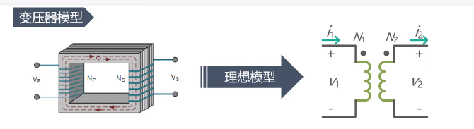
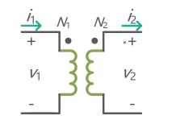
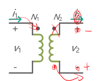
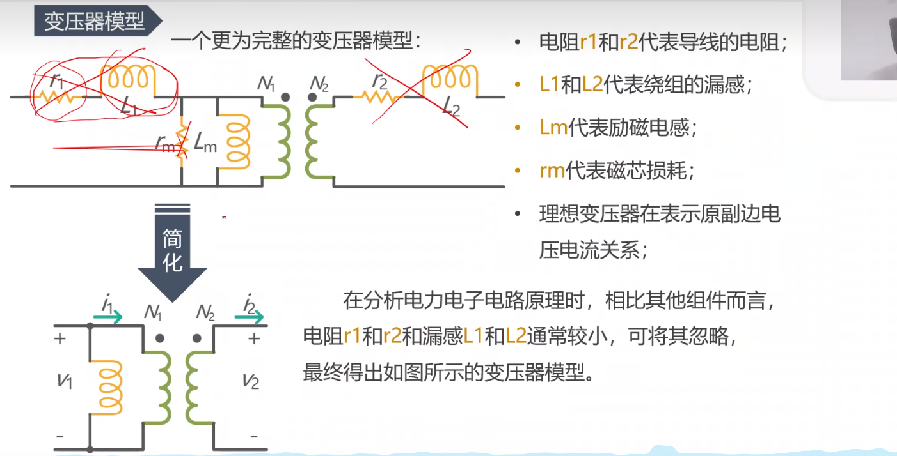
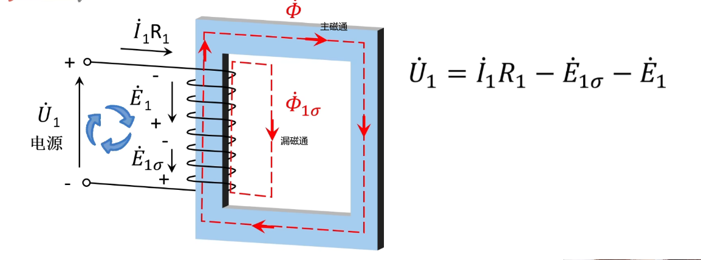
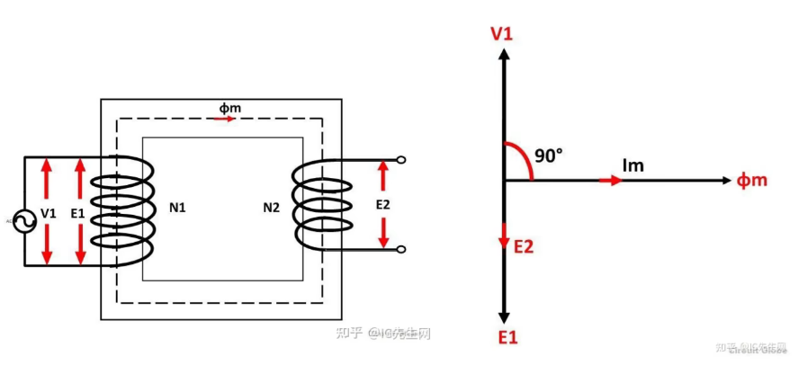
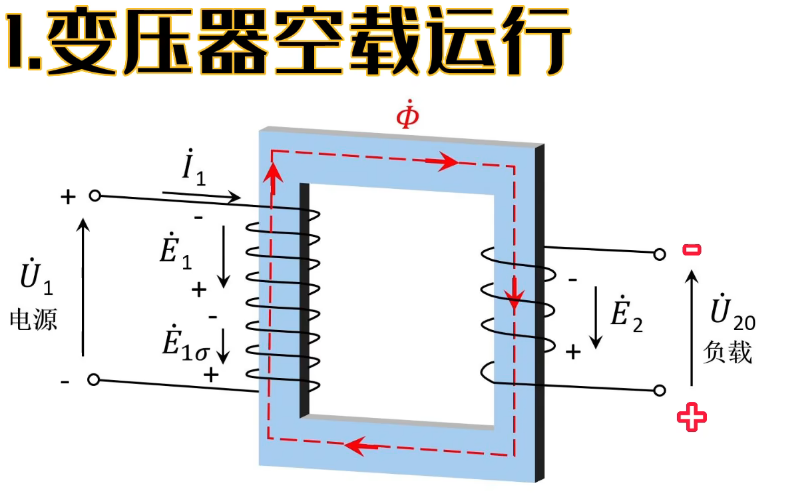
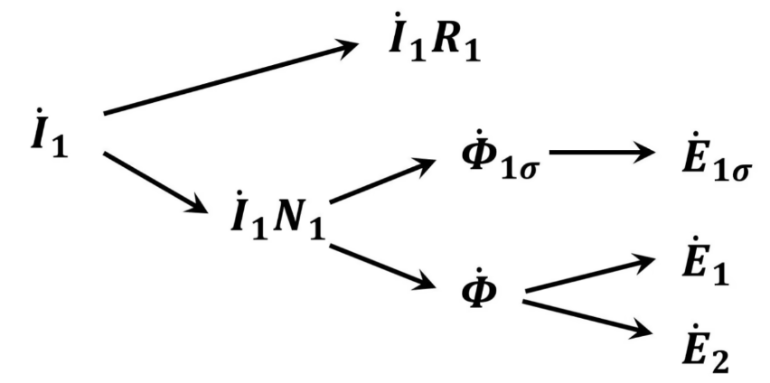
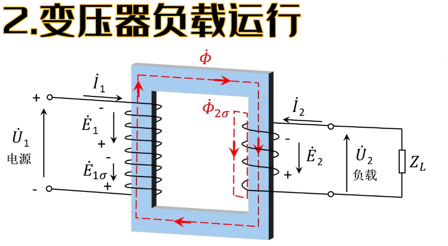
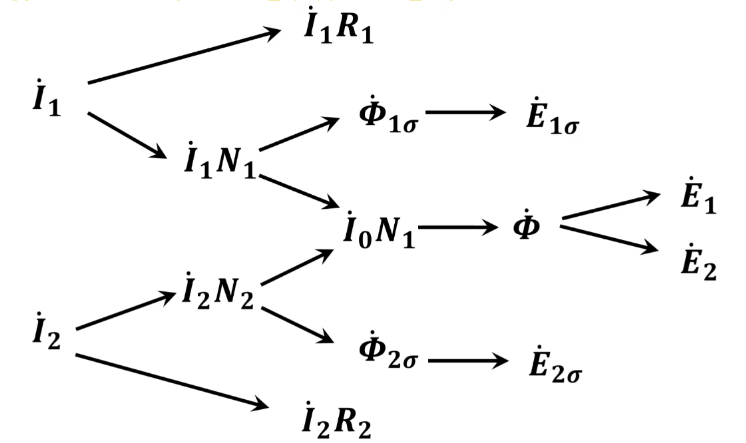

## 电子器件06-----TVS变压器

### 变压器模型

**作用：**

- 电气隔离
- 提高降低电压或电流

$$
\frac{\nu_1}{\nu_2}=\frac{N_1}{N_2}\quad\frac{i_1}{i_2}=\frac{N_2}{N_1}
$$

**两绕组上的点用于指示其相对极性**

对于这种在一起的同边的**同名端**

- 电压
  - 左边上正下负，则右边上正下负
- 电流
  - 左边流入，右边流出

如果不在一起

- 电压
  - 左边上正下负，右边上负下正
- 电流
  - 左边流入，右边从那个圆点流出

​	所以说，在做仿真时，变压器出现的漏感，导线电阻等通通可以不管，只需要考虑Lm跟匝数比

**当变压器电路周期电压电流工作时，各开关周期起止时刻磁链必须相同，否则将导致磁饱和**

+++

- 绕组有电阻，电源电压有一部分会降落在绕组电阻上

- 大部分磁通沿着铁心形成闭环，大部分磁通是这样的，称为主磁通

- 还有一部分，在气隙中形成回路，这部分称为漏磁通

- 两个磁通都会在一次绕组中感应出电动势

- 忽略绕组电阻与漏磁通

- 近似认为一次侧的电压和感应电动势相等

- $$
  \dot{U}_1\approx-\dot{E}_1
  $$

  ### **为啥电源方向与感应电动势方向是反的**

**基于理想变压器的分析**

- 一次侧的线圈相当于纯感性的负载，所以一次侧的电流会滞后于一次侧电压90°
- 一次侧的电流全部用来建立主磁通，磁化电流与主磁通成正比，且没有相位差，也就是说，主磁通的方向是与一次侧电流相位相同，且同样呈正弦规律变化
- 变化的磁通又在一次侧产生感应电动势，感应电动势正比于磁通变化率，且呈阻碍原磁通作用：$e=-N\frac{d\phi}{dt}$
- 所以对于正弦变化的磁通，先取导数再取负号，就相当于一次感应电动势比磁通又滞后了90°

- 电源电流分为两部分
  - 一个作用于绕组电阻，
  - 流过线圈会产生磁动势，这是建立磁通的原因
    - 一部分生成的是漏磁通
      - 它将在一次绕组中感应出漏电势，可以用一次绕组的漏电抗来表示
    - 另一部分磁通经过变压器铁心形成闭合回路，称为主磁通
      - 在一次绕组上产生一次感应电动势
      - 在二次绕组上产生二次感应电动势

- 对于一次侧电流，其实与空载相似，只不过加负载之后吗，一次侧电流要增加
- 那么对于二次侧电流，会产生主磁通与一次侧电流共同作用
  - 此外也会产生漏磁通，也会作用于二次绕组电阻

##### 如何理解漏感

现实变压器不是理想的，像98折的充值活动一样，原边绕组（原边线圈）充了100块钱，但是到副边只剩98块钱了，中介吞了2块钱。这中介便是漏感，漏感通俗的定义是**无法耦合到副边的感量**。

