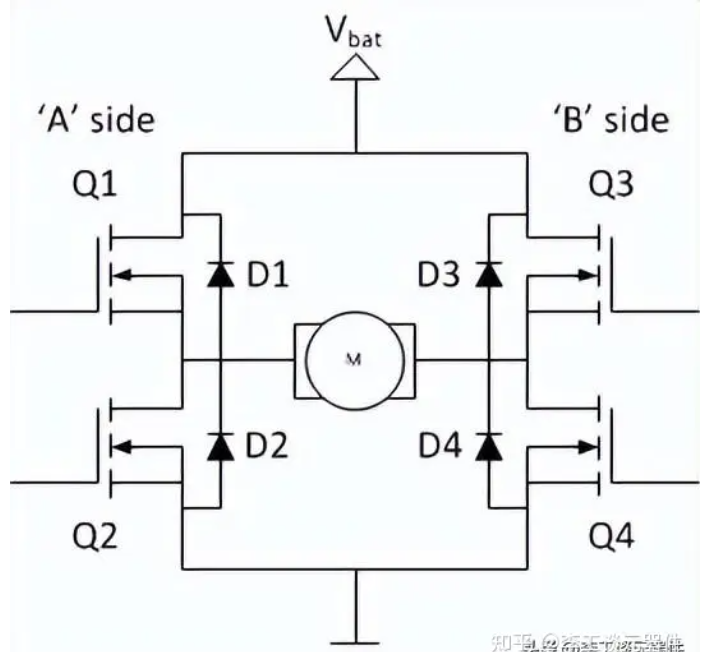
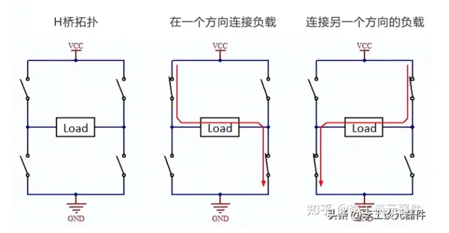
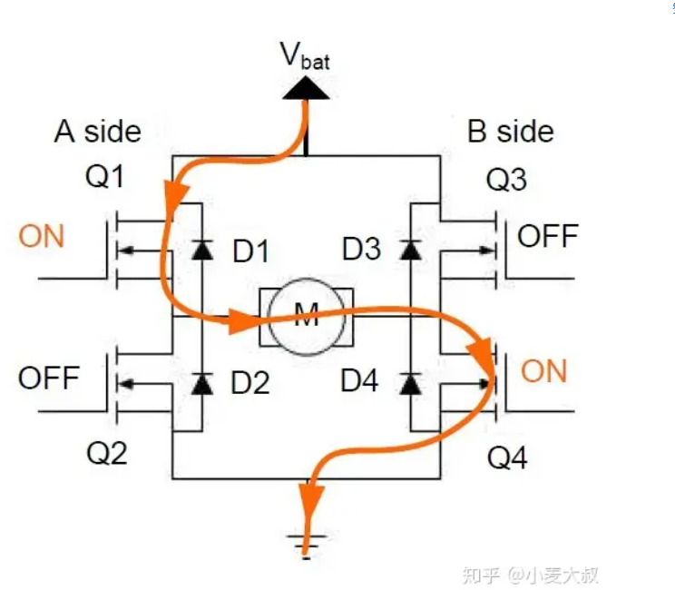
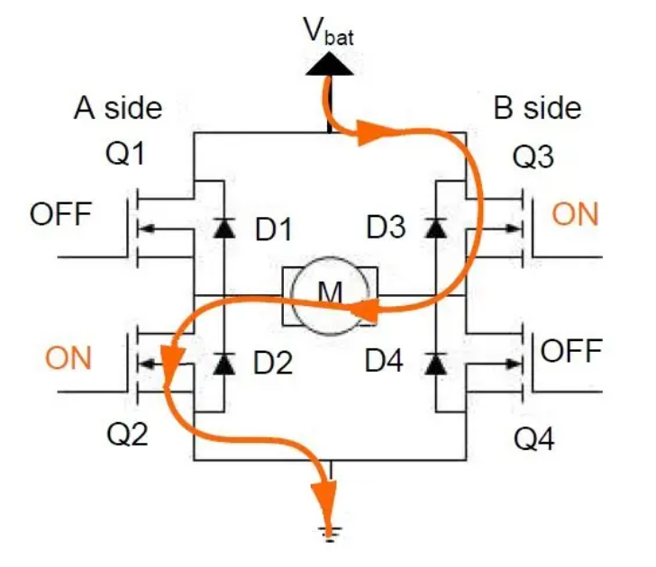
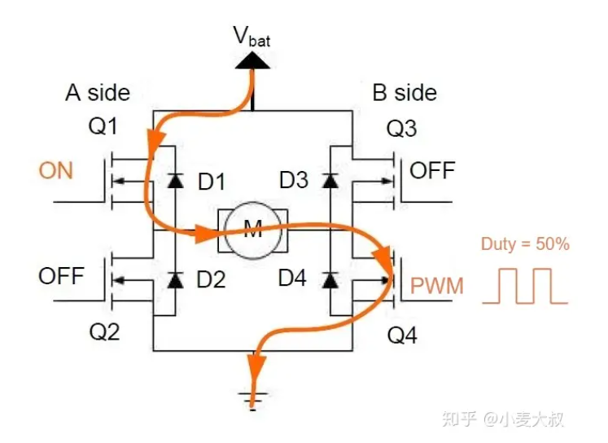
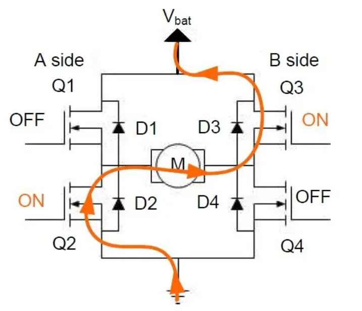
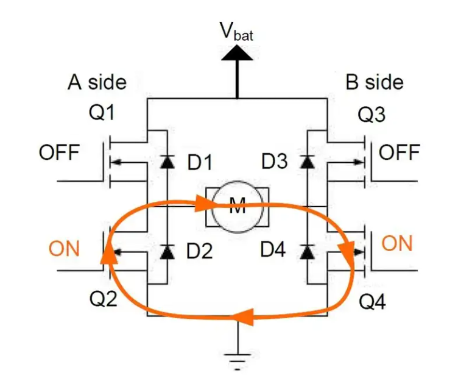

## H桥电路

### 什么是H桥电路

​	一个简单电路，包含**4个开关元件，负载位于中心，呈H型**

**开关元件（Q1-Q4）**通常都是**双极性晶体管**或者**FET晶体管**，在某些高压应用是IGBT。**二级管（D1-D4）**称为**钳位二极管**，通常是肖特基型。

### H桥电路详解

​	可以实现正转与反转

### 工作状态分析

#### 正转

- Q~1~, Q~4~ 导通
- Q~2~  Q~3~ 截止

#### 反转

#### 调速

- Q~1~  Q~4~  给它输入50%占空比的PWM波形，就达到了降低转速的效果
- 增加转速则将输入PWM的占空比设置为100%

#### 停止状态

这里以电机从正转切换到停止状态为例；

- 正转情况下；`Q1`和`Q4`是打开状态；
- 这时候如果关闭`Q1`和`Q4`，直流电机内部可以**等效成电感，也就是感性负载，电流不会突变**，那么电流将继续保持原来的方向进行流动，这时候我们希望电机里的电流可以快速衰减；

**这里有两种方法**

第一种：

​	关闭Q~1~  Q~4~  这时候电流仍然会通过反向续流二极管进行流动，此时短暂打开Q~1~ 和Q~3~ 从而打算快速衰减电流的目的

第二种：

​	关闭Q~1~,打开Q~2~  这时候电流不会衰减的很快，电流循环在Q~2~， M  Q~4~之间流动，通过MOS管内阻将电能消耗掉

