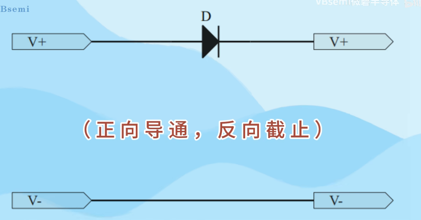
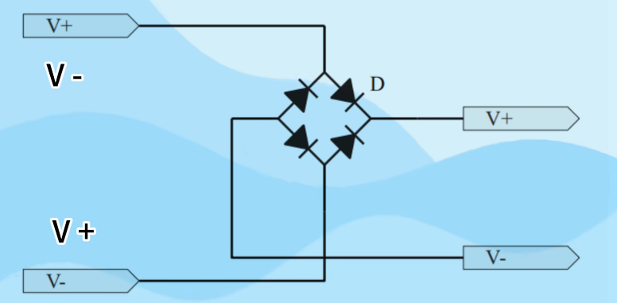
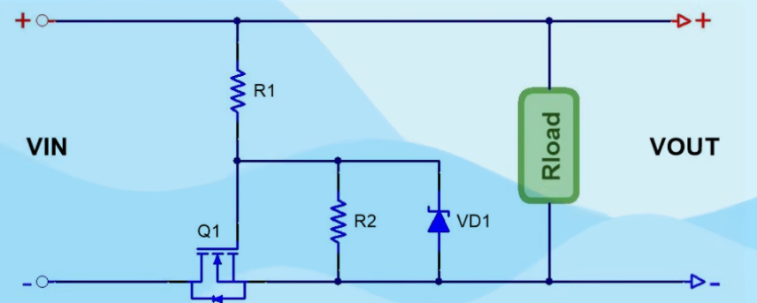
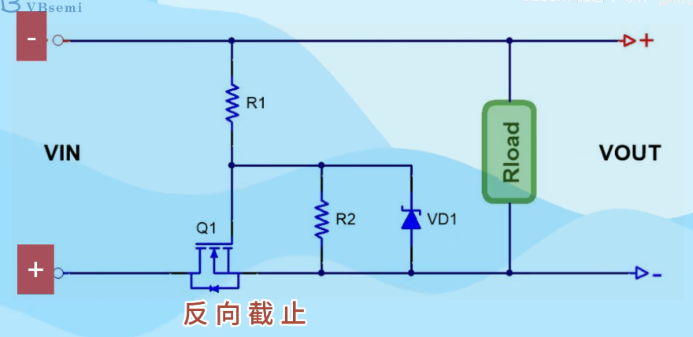
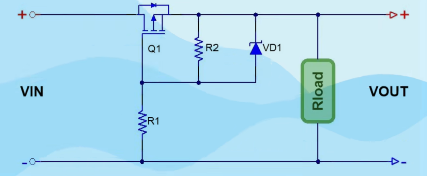

### mos管防反接电路

**why**

反接会导致许多电子器件烧毁

**常见的放反接电路有四种**

- 二极管串联
  - 
  - 问题是功耗过大
- 整流桥
  - 可以实现无论正反接电路都能导通
  - 
  - 不管是一个二极管还是多个二极管，都会产生管压降并消耗电能
- NMOS
  - 
  - 当输入端为上正下负的时候，电流经过R1,R2，以及mos管的寄生二极管到地，经过电阻分压之后，G S两极之间的电压大于MOS管的导通电压V~gs~，随后mos管导通（G是最上面的，S是两条线回合的，D是另外一边）
  - 
  - 当下正上负的时候，电源反接，这时候电流路径会被mos管的寄生二极管反向截止，那么GS由于没有用了电压而截止，电路回路被切断
  - 这里加电阻，是怕
- PMOS
  - 与nmos是一样的，区别在于nmos接负极，pmos放上面，接正极
  - 

看的另外一个视频的长这样，它的g极与一个电阻串联

- 加入电阻的目的：为了保护MOS管不被过高的栅极电压击穿。电阻的作用是给G极提供导通电压的同时，给稳压管提供工作电流。
- 能保证稳压管正常工作的前提下，阻值可以大一点，这样可以减小电流消耗。
- 接G极的小阻值电阻，要求不高的情况下，可以去掉不用。如果工作电压低于Vgs，也可以不用电阻和稳压管保护。

## 注意在Nmos跟PMOS防反接电路中，电流方向与一般相比是反的，比如在NMOS中，正常是D-S，但是这里是S-D

​	对于S,D，其实应该是一个沟道的两端，他可以从D-S也可以从S-D，跟PN结的单向导电还是有区别的