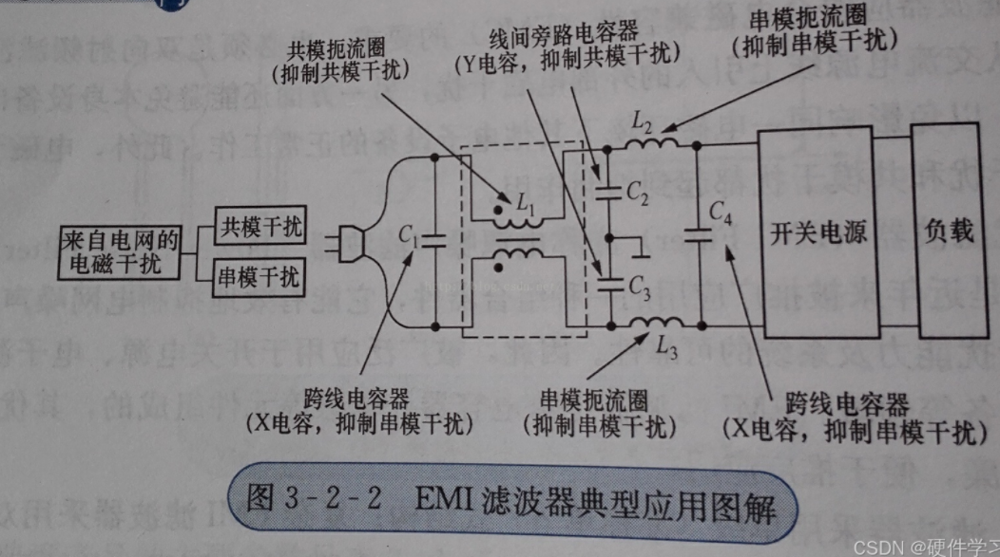
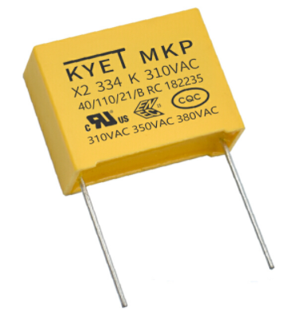
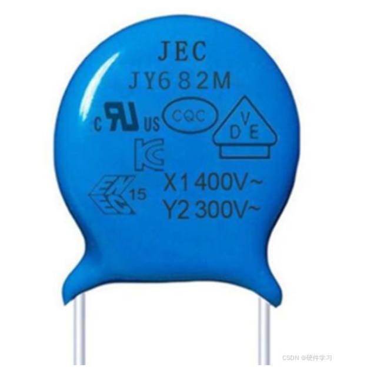
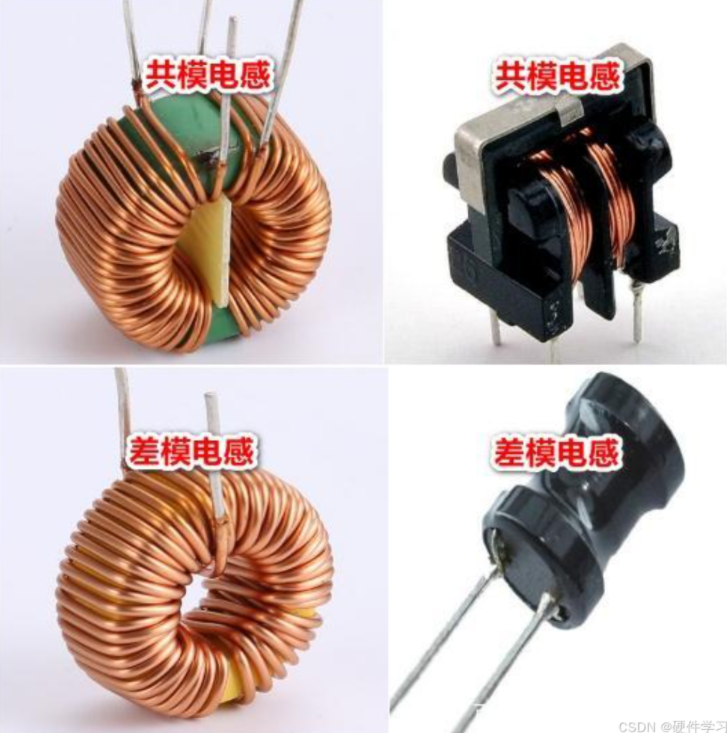
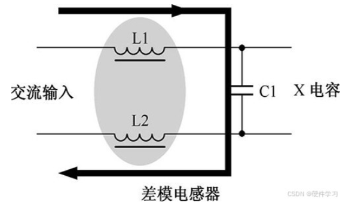
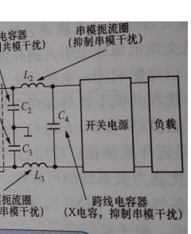
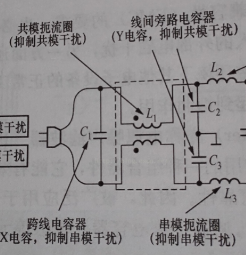
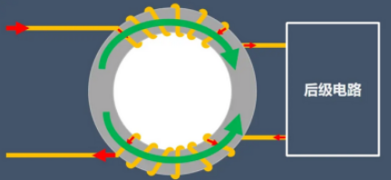
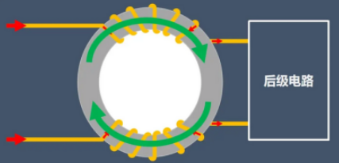
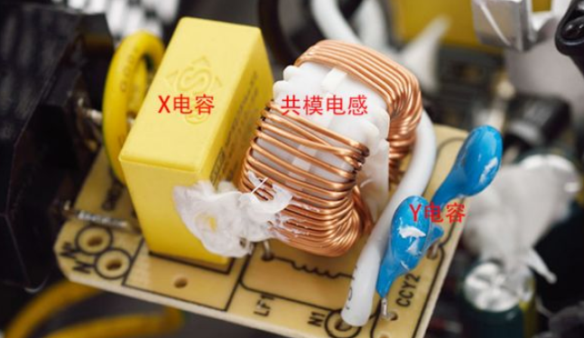

### EMI滤波

**EMI的作用：**（EMI是电磁干扰，EMC是电磁兼容）消灭EMI, 实现EMC

#### 1. 什么是EMI

​	EMI->电磁干扰   指的是电磁波与电子元器件相互作用后而产生的电磁干扰现象

**啥是EMI滤波器：**电磁干扰滤波器，主要用来抑制电磁干扰

#### EMI滤波器的作用

- 抑制高次谐波
  - 首先，所谓**谐波**是指基波频率的整数倍的频率成分
  - 高次谐波指的是基波频率的高倍数谐波，这些谐波的频率比基波高，但并不一定是高频
  - **频率范围：**比基波高，但通常低于几千赫兹（kHz）
- 抑制高频谐波
  - 高频谐波通常指频率非常高的谐波成分，它们可以是基波的高倍数，也可以是其他源产生的高频成分
  - **频率范围：**通常在几十kHz到GHz的范围
- **抑制电磁干扰**

#### 2. EMI滤波器的组成

##### 电磁干扰

- **共模干扰**是指在同一电路中，多条信号线或电源线在共用接地或电源时，容易产生相对于地（或电源）的共模电压
- **差模干扰（也称串模干扰）**在两个或者多个导线之间由于信号耦合而产生的干扰。

首先要了解什么是共模信号，什么是差模信号

- **差模信号：**从一个系统的一对输入端看，如果信号的极性相反（电流方向相反），把这种信号称为差模信号
- **共模信号：**如果信号的极性相同，则称其为共模信号

​	正常信号都是差模形式的，而噪声（干扰）二者都有

**他们是如何产生影响的**

- 差模干扰信号会叠加在原有的正常差模信号上，造成原有信号失真
- 对于共模干扰信号
  - 共模信号两端同相位同幅度，无法在系统中形成回路，只能与地之间形成一个分布电容；
  - 共模干扰信号对原有正常差模信号没有影响，但由于共模信号电流方向相同，因此会形成两个方向相同的电磁场，两个磁场叠加在一起，会对附近的磁性元器件造成干扰
  - 也会通过电磁场将干扰传递到其他线路，并转化为差模干扰，影响其他线路的信号

##### X、Y电容

**X电容**

​	用于抑制电源线之间的EMI，通常连接在交流电源的两条线之间，主要用于消除差模干扰

X电容分为X1,  X2

- X1: 耐高压大于2.5kV，小于等于4kV
- X2:耐高压小于等于2.5kV

​	图中为X2，表示这是一个X电容，最高耐压2.5kV， 334表示其电容值为330nf， K表示误差为10%， 310AC： 表示交流电压最大耐压为310V

**Y电容**

​	Y电容是一种三端式电容，通常由两个电容相反连接而成，中间还有一个接地端。 

​	Y电容属于安规电容，符合安全规定，即使失效后也不会导致电击，不危及人身安全（X电容不属于安规电容？x好像也属于，gpt一会说属于，一会说不属于）

​	Y电容通常用于抗干扰电路中的滤波作用，主要对共模干扰起滤波作用

##### 差模电感、共模电感

- 差模电感：应用在大电流的场合，由于一个铁心上绕的一个线圈，当流进线圈的电流增大时，线圈中的铁心会饱和，因此市场上用的最多的铁心材料是金属粉心材料。
- 共模电感：同一铁心上的两组线圈的绕向相反，所以铁心不怕饱和。市场上用的最多的磁芯材料是高导铁氧体材料。

**区别：** 共模电感有4个引脚，差模电感有2个引脚。

#### 3. 工作原理

**差模电感的工作原理**：

​	下图所示是差模电感器电路，差模电感器L1、L2与X电容串联构成回路，因为L1和L2对差模高频干扰的感抗大，而X电容C1对高频干扰的容抗小，这样将差模干扰噪声滤除，而不能加到后面的电路中，达到抑制差模高频干扰噪声的目的 。

**共模电感的工作原理**：

- 当差模信号进入共模电感时，一个线圈电流是流入，另一个线圈电流是流出，电流方向是相反的，这时这两个线圈形成的磁场方向是相反的，又因为这两个线圈是完全一样的，所以磁场强度是相等的，两个磁场相互抵消，这时这两个线圈基本可以看成导线，对差模信号没有阻碍作用。具体看下图：

- 当共模信号进入共模电感时，如果两个线圈电流都是流入的，他们的电流方向是相同的，这时这两个线圈形成的磁场方向我们根据右手定则可以知道方向是相同的，两个磁场叠加成一个更强的磁场，从而两个线圈都具有很大的电感量，会阻止这个共模信号的变化，从而对共模信号有很强的抑制作用。

**共模电感总结：**

​	共模电感串联在供电线路上，同时抑制每根导线对地的共模高频噪声，而对于差模电流则没有影响。

​	正常差模信号流过共模电感时，在同相绕制的电感线圈中产生反向磁场而相互抵消，因此对差模信号不起阻碍效果；

​	而对共模信号，由于其同向性，会在线圈产生同相的磁场从而增大线圈的感抗，使线圈产生较强的阻尼效果，达到衰减共模干扰的目的。

#### 4. 实物对照

​	PC电源的一级EMI滤波电路主要由X电容和Y电容组成，X电容和Y电容都属于安规电容（存疑），

- X电容并接在火线和零线之间，块头通常比较大，负责滤除差模干扰;
- 而Y电容则是在火线与地线之间以及零线与地线之间并接的电容，通常以成对的形式出现，负责滤除共模干扰。

#### 5. EMI滤波器与EMC滤波器的区别

​	严格意义上来讲，这两个真的没啥区别，只是同一个产品的不同叫法而已。

​	EMI是电磁干扰的意思，EMC是电磁兼容的意思，消灭了电磁干扰，就是为了实现电磁兼容。

​	如果非要将两者进行区分的话，有人这么区分EMI滤波器和EMC滤波器，那就是EMI滤波器一般泛指用于谐波源电源侧的滤波器，如MLAD-V-SR变频器专用输入滤波器等；而EMC滤波器则泛指用于谐波源输出侧的滤波器，如MLAD-V-SC变频器专用输出滤波器等。