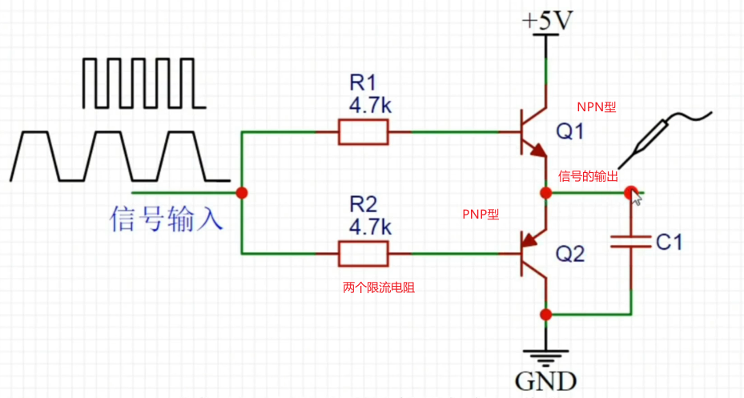
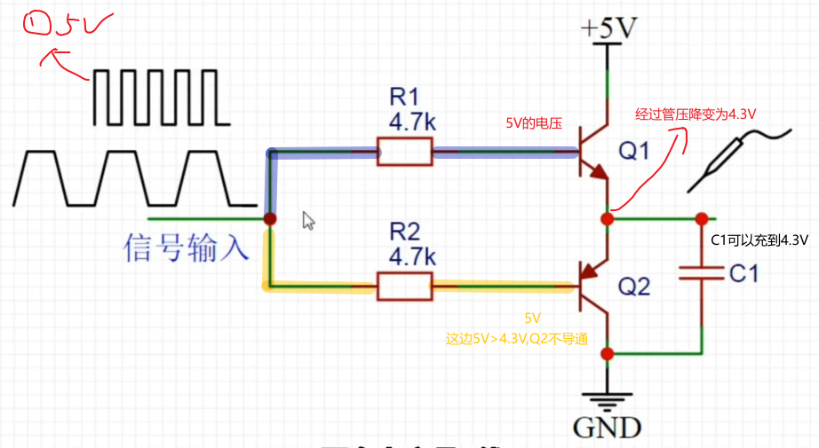
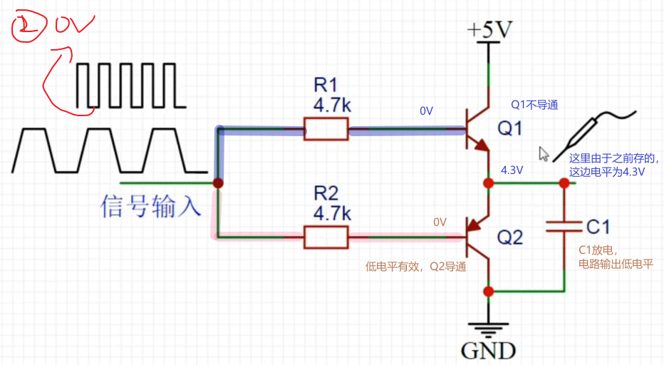
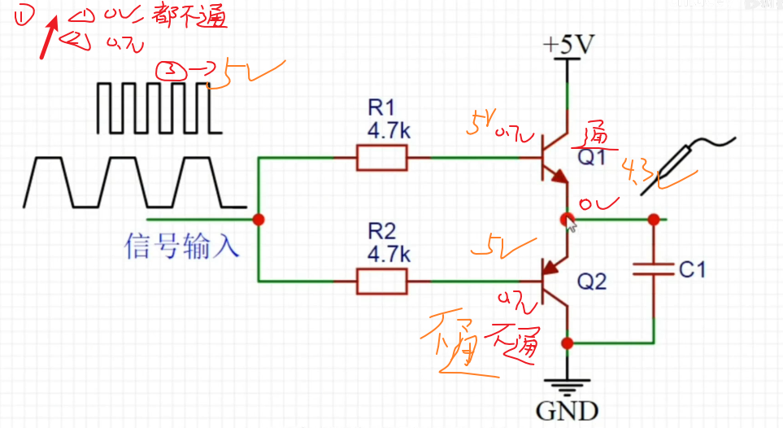
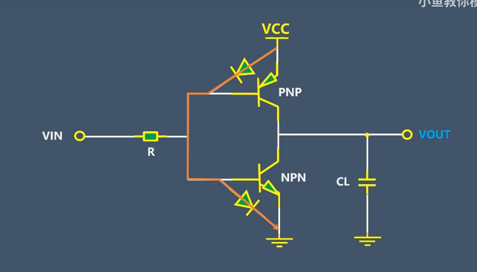
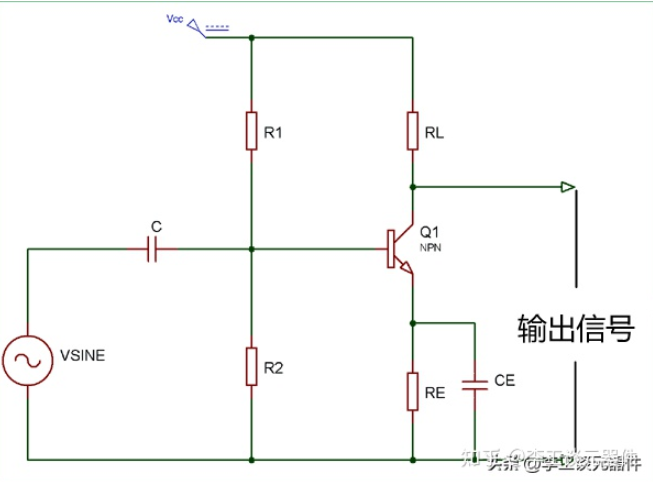
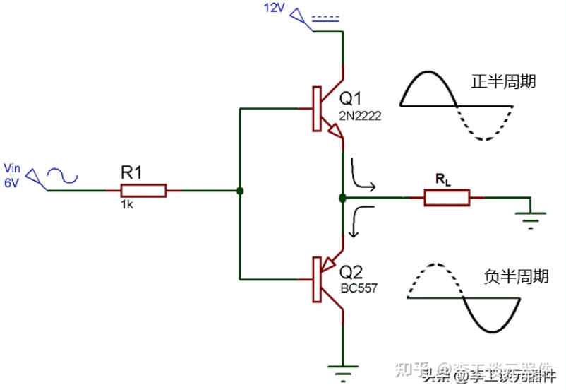
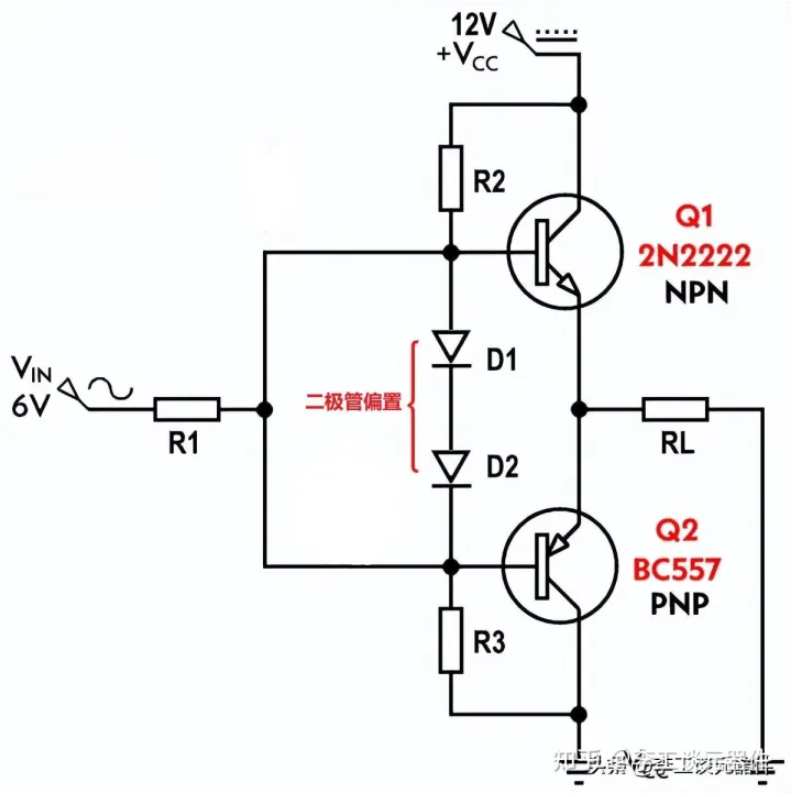

## 三极管推挽电路

### 三极管推挽电路

​	功率放大电路，虽然电压可能不会显著增大，但是其对电流的放大作用会使得总功率变大

​	电流驱动能力不足，加一个推挽电路，用于驱动后续电路

#### 原理分析

上面的三极管为npn三极管，下面的是pnp管，前面是限流电阻，两个三极管的中间位置是信号的输出

**分析方波**

​	对于Q2，它的基极电压为5V，发射极电压4.3V，对于PNP来说，导通要求基极电压需要低于发射极0.7V，因此它反向偏置不导通，Q1为NPN型，基极电压大于0.7V，集电极-发射极电压为正，可以导通，经过管压降为4.3V（输出）

​	由此，实现了上方三极管导通的时候下方断，输出高电平，上方断的时候下方导通，输出为低电平。这里最后输出的是0.7V

**分析实际方波，存在斜率**

  **分析上升过程**

下降过程不再赘述，在实际中，也不会出现Q12同时导通的情况

##### 输入输出

- 高电平情况下
  - **V输出= V输入– V BE1**

- 当输入信号为负时，Q1 关闭，Q2 开始导通并在输出端产生负输入的复制品。
  - **V OUT = V IN + V BE2**

**为啥都是上面是NPN，下面是PNP**

​	为啥会有这个问题，因为一般的三极管都是集电极输出，但是在这里，两个三极管都是发射极输出

对于三极管，BE之间可以视为二极管，如果上面是PNP，下面是NPN，就会直接导通，容易烧坏三极管

#### 定义特性啥的

推挽放大器由**2个晶体管**组成，其中一个是**NPN型**，另外一个**PNP型**。**一个晶体管在正半周期推动输出，另一个在负半周期拉动输出，因此被称为推挽放大器。**

主要优点是当没有信号时，输出晶体管没有功耗。推挽放大电路有多种类型，但**通常将B类放大器视为推挽放大器。**

#### A类放大器

​	仅由一个设置为**始终保持导通状态的开关晶体管**组成，产生**最小的失真**和**最大幅度的输出信号**。

​	A类放大器的效率很低，接近30%。即使没有连接输入信号，A 类放大器的级也允许相同数量的负载电流流过它，因此输出晶体管需要大散热器。

#### B类放大器

​	**B类放大器**是实际的**推挽放大器**。B 类放大器的效率高于 A 类放大器，因为它由两个晶体管 NPN 和 PNP 组成。

​	B 类放大器电路**每个晶体管将在输入波形的一个半周期内工作**。因此，这类放大电路的导通角为180度。一个晶体管在正半周期推动输出，而另一个在负半周期拉动输出，这就是它被称为**推挽放大器**的原因。

##### 交叉失真

​	B 类通常会受到称为**交叉失真**的影响，其中信号在 0V 时失真。我们知道，晶体管需要在其基极 - 发射极结处提供 0.7v 的电压才能将其打开。因此，当交流输入电压施加到推挽放大器时，它从 0 开始增加，直到达到 0.7v，晶体管保持关断状态，我们没有得到任何输出。PNP 晶体管在交流波的负半周也会发生同样的事情，这被称为死区。为了克服这个问题，二极管用于偏置，然后放大器被称为 AB 类放大器。

#### AB类放大器

​	交叉失真缺陷可以通过使用两个在晶体管位置导通的二极管来校正。修改后的电路现在称为 **AB 类放大器电路**。

​	从 0V 到 0.7V，**二极管偏置在导通状态，此时晶体管在基极没有信号。这解决了交叉失真问题。**

