## 上拉电阻与下拉电阻

### 什么是上下拉电阻

​	上拉下拉电阻统称为拉电阻，**作用**是将状态不确定的信号线通过一个电阻将其钳位至高电平（上拉）或低电平（下拉）

**啥是状态不确定的信号**

​	在数字电路中，通常有三种状态：**0（低电平） 1（高电平） 浮空（不确定）**

### 如何辨别拉电阻

- 上拉电阻与电源串联
- 下拉电阻与地串联

### 拉电阻原理

**并联外接电阻，提高输出电平**、

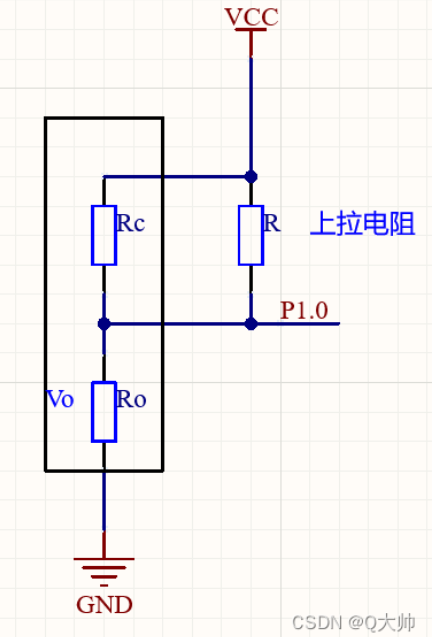

下拉电阻同理

### 上拉电阻

**引出**

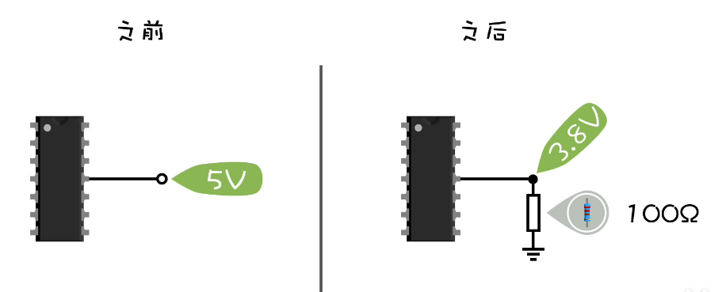

单片机GPIO输出高电平，这时候给他个下拉电阻，发现电压变为了3.8V，

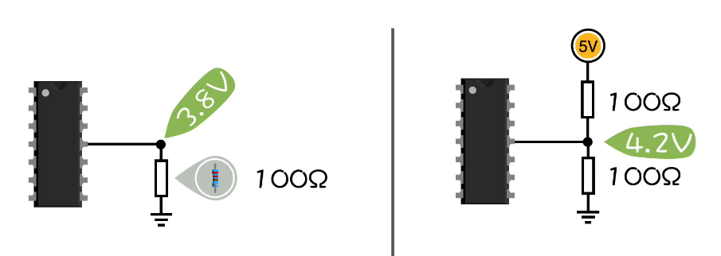

再给他加一个上拉电阻，发现该点电压变为了4.2V

这里得看**内部**

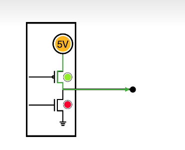

想让他输出高电平时，上面的MOS导通，下面的截止，该点电压为电源电压，

加入100Ω的下拉电阻变为3.8V

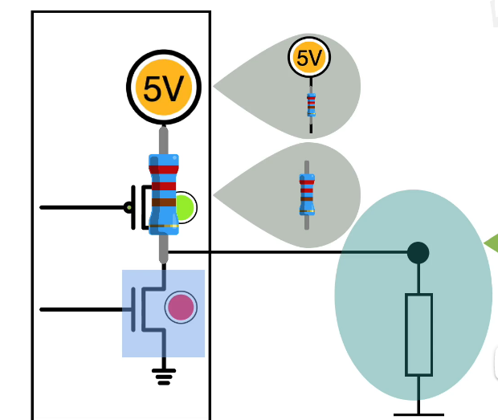

电源内部是有电阻的，上面的MOS管也是有内阻的，当下面MOS截止时，可以视为其阻抗无穷大，电路可以等效为

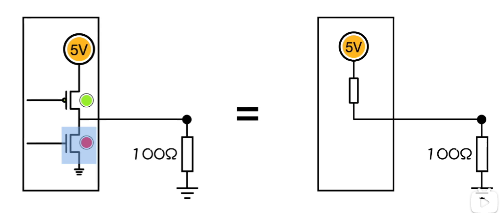

所以测量的电压为3.8V   串联分压了

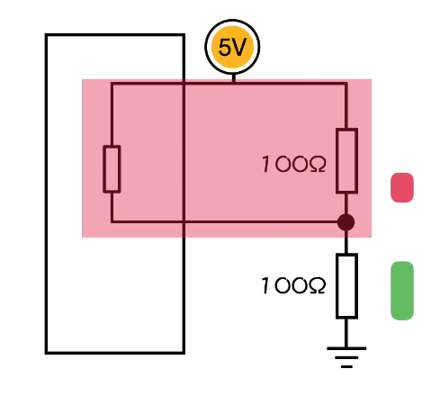

加入上拉电阻，上面俩电阻并联，电阻值变小，下面的电阻会分到更多的电压，所以电压会回升为4.2V，**提供更高的驱动能力**

**上拉电阻最本质上就是让上拉电阻与单片机里面的内阻并联**

**上拉电阻还可以将一个不确定的信号钳位在高电平**

为啥会有不确定信号

​	比如当引脚处于开漏输出时，上面的MOS永远是断开的，相当于连着一个无穷大的电阻，如果想让他输出高电平，下面的MOS也得断开，就相当于两个无穷的电阻串联了，所以它的输出信号是不确定的

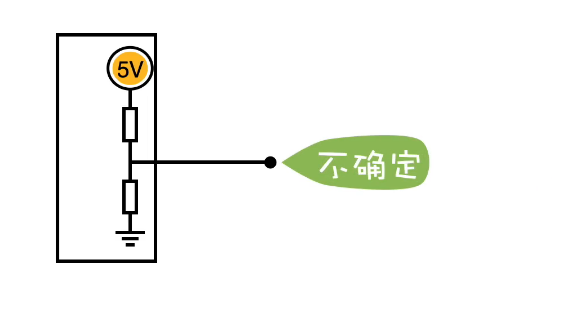

这时候给他加个上拉电阻

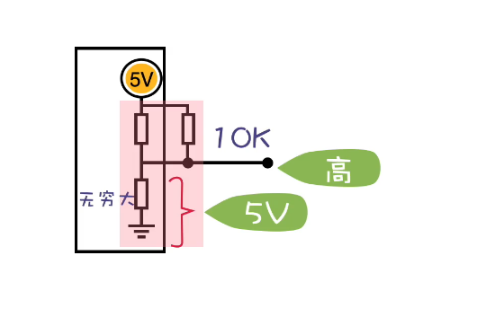

相比于无穷大的电阻，上面的电阻并联后电阻变低，相比于无穷大忽略，电压全部落在下面的电阻上，即可输出为高电平

### 下拉电阻

**作用** 将不确定信号转化为低电平信号

**为啥信号是不确定的**

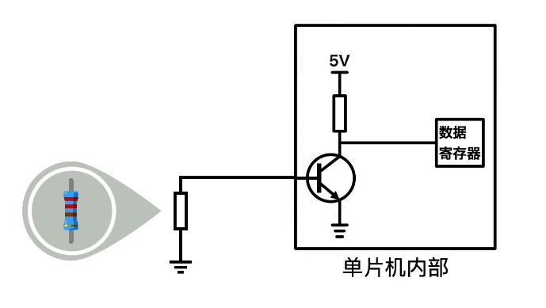

​	这是当单片机处于数字输入时，单片机的内部电路，是简化过的，本来三极管应该是触发器

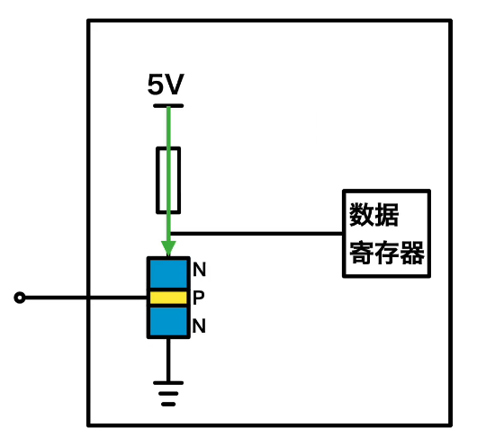

​	两块半导体的阻抗太大了，所以P点的电压是飘忽不定的

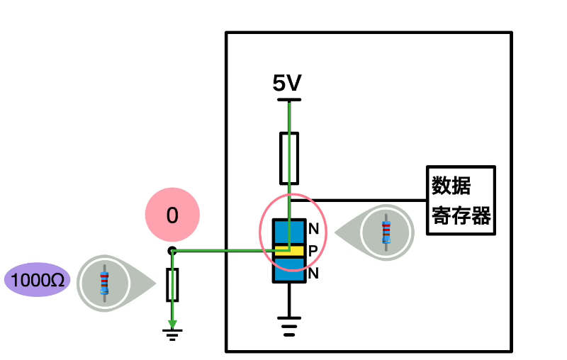

​	三极管内阻非常大，这三电阻串联，根据串联分压，下拉电阻的电压就近乎为0，

​	如果直接接地，也可以实现低电平，但是没办法实现高电平

​	比如再直接加个5V的电平，但是输出还是低电平

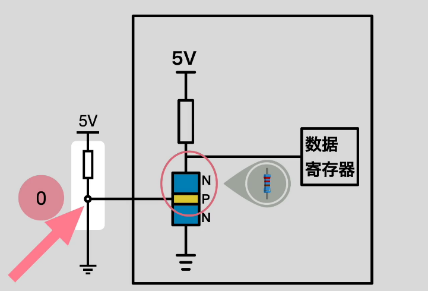

直接加个5V，但是电源是有内阻的，电压全部落在内阻上，该点位电压仍为0V

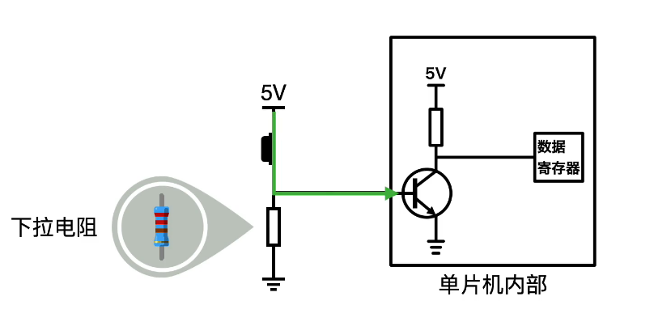

​	实现高电平了