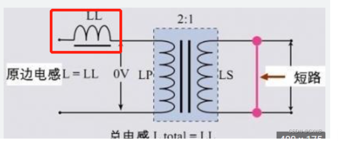
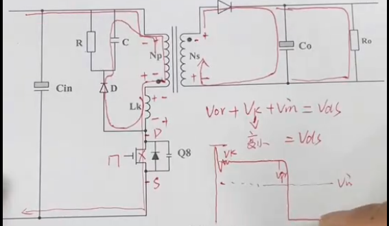

## 吸收电路

### 为啥要用吸收电路

场景：

- 电感反向电动势
- 变压器

#### 反激电路里为啥要用吸收电路

​	反激常用RCD，这里就用RCD电路来概述

​	**RCD的出现是为了解决原边MOS关闭时，漏感能量造成原边MOS应力过高的问题**

- 现实变压器不是理想的，像98折的充值活动一样，原边绕组（原边线圈）充了100块钱，但是到副边只剩98块钱了，中介吞了2块钱。这**中介便是漏感**，漏感通俗的定义是**无法耦合到副边的感量**。
- 顾名思义，**测量**也非常简单，通过短路输入绕组，再测量原边的感量，由于输入绕组短路，磁芯磁路被短路，耦合到副边的能量都被短路了，还能测量出来的便是漏感。如下图表示：
- **漏感的存在会造成什么问题**
  - 感和原边的电感是串联关系，假定给原边的电感充入100块的电流，原边电感也只能得到98，漏感还得有两块钱，且由漏感的定义为**无法耦合到副边的感量**+电感电流不能突变
  - 假设MOS关断的时候，漏感上的电流为1A，MOS关断，阻抗视为无穷大，可假定他为10MΩ，此时MOS上的电压为I*R=10MV，“pong“炸了

##### 还要注意一个问题

​	尖峰吸收电路所需吸收的能量是变压器漏感产生的尖峰电压，而不是开关管关断后主线圈中产生的反向电动势

​	初级线圈的反向电动势是向二次供电线圈和次级线圈传递能量的，绝对不能让尖峰吸收电路吸收它产生的能量，否则的话次级线圈回路和二次供电回路就没有电压产生。

### RCD吸收电路

- 当MOS关断的时候，漏感的能量通过二极管，到电容C里存储能量
- 当漏感能量耗尽，电容C放电，通过电阻消耗能量

**RCD吸收一般不适合对二极管反压尖峰的吸收，因为RCD吸收动作有可能加剧二极管反向恢复电流**