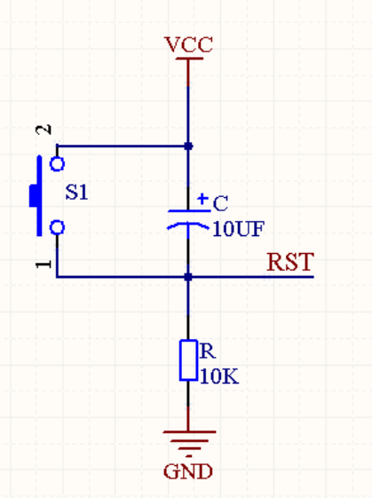
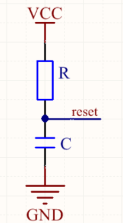
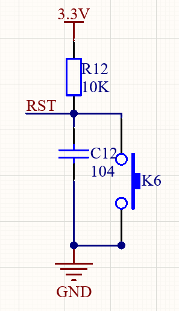

## 复位电路

### 为啥要复位

- 程序逻辑错误，复位可以把所有逻辑状态恢复到初始值
- 电源接通到电源稳定期，是一个缓慢的爬坡过程，这时候单片机不能正常工作，需要复位电路延时到电压稳定后才正常执行程序

### 高低电平复位

​	单片机属于数字电路，数字电路里只有0（低电平）和1（高电平）之分，因此，单片机要么是高电平复位，要么是低电平复位，

​	单片机中，小于1.5V的电压为低电平，大于1.5V的电压为高电平

#### 高电平复位

- 上电复位电路的本质就是RC串联充电电路
- 上电后，电容两端的电压不能突变，上电一瞬间电容等效为短路，RST为高电位，电位等于VCC，复位
- 之后通过电阻R1对电容进行充电，此时电阻两端电压开始减小，根据时间常数τ=RC，对于上图中的电路而言，大概需要4τ-5τ，也就是0.4s-0.5s左右可近似认为电容充电完毕，此时电容两端电压差近似为VCC，电阻两端电压差为0V，RST为低电平，近似为0V，单片机正常工作
- 按下按钮，电容被短路，电容放电，电阻上开始有点压，RST变为高电平，复位

#### 低电平复位

- 上电后，电容两端电压不能突变，上电一瞬间RST端口近似为GND，即低电平，复位
- 经过4τ-5τ的时间后，电容充电完毕，电容两端电压差近似为VCC，电阻两端电压差为0V，相当于导线，RST端电位近似为VCC，后正常工作