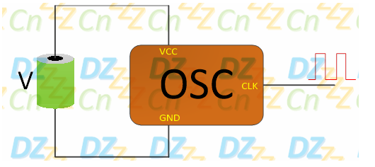
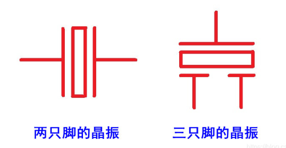
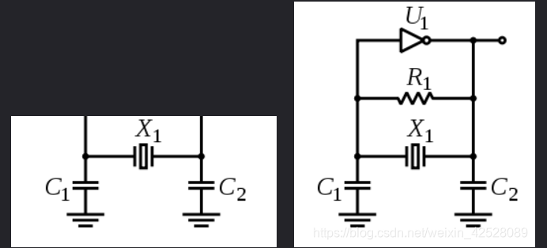
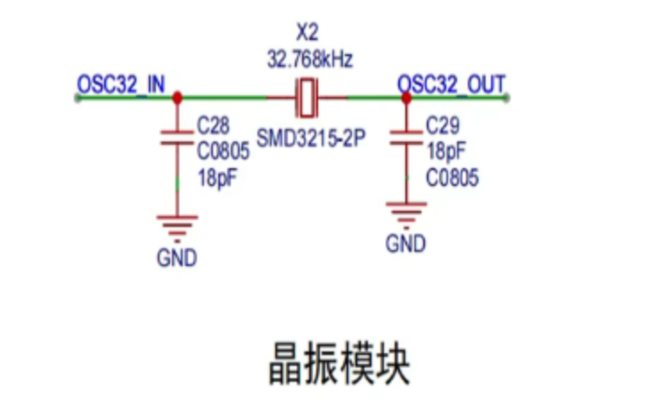
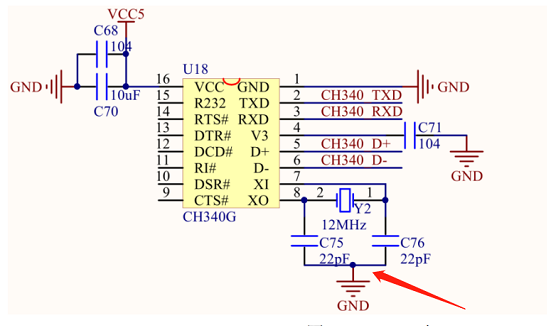
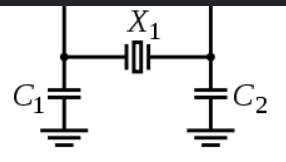

## 晶振电路

### 作用

​	单片机的正常运行需要时钟信号，可以简单的理解为单片机收到一个脉冲，就执行一次或多次指令。晶振电路就是用来产生时钟信号的

比如像这样，在外部施加适当的电压后，就可以输出预先设置好的周期性时钟信号

### 简介

​	**晶体振荡器**用一种能把电能和机械能相互转化的晶体在共振的状态下工作，以提供稳定，精确的单频振荡。晶振提供的时钟频率越高，单片机的运行速度也就越快。

**晶振的封装**

​	下图左边为原理图，右边为等效电路图，生成的是**正弦波**

​	**晶振连接单片机的OSC32-IN跟OUT**

- 不同频率的晶振有着不同的作用, 例如：32.768K晶振通常用于时间显示，16MHZ、26MHZ等用于传输信号的
- 下面这两个电容叫**匹配电容**C~L1,2~;有点多，另起了

#### 关于晶振电路的电容

-  **负载电容C~L~**
  - 首先，这个晶振跨接晶体两端的总有效电容称为**负载电容**，
  - 也就是说，你选了这个型号，数据手册上写了，它的负载电容是多少。
  - **它主要影响负载谐振频率和等效负载电阻，与晶体一起决定振荡器电路的工作频率**，
  - 然后就可以根据这个负载电容来调整外界电容值的大小，来微调晶振电路工作中输出频率的精度

- **匹配电容C~L1~C~L2~**
  - 接地的那两个电容
  - 一般外接这两个电容是为了使晶振两端的等效电容等于或接近负载电容
  - 一般晶振两端所接电容是所要求的负载电容的两倍。这样并联起来就接近负载电容了。
  - 电容值的大小影响谐振频率（也就是会发生频偏），一般情况下，**增大电容会使震荡频率下降，减小电容会使震荡频率升高**。

##### 匹配电容的计算

​	为了保持晶体的负载平衡，在实际应用中，一般要求$\mathrm{C_{L1}=C_{L2}}$,所以进一步可以得到下式
$$
\mathrm{C_{L1}=C_{L2}=2\times(C_L-C_{ic}-\triangle C)}
$$
$\mathrm{C_{ic}+\triangle C}$​​一般为3---5pf

- C~L~为晶振负载电容，查手册

- Cs为引线电容，可通过查询芯片数据手册获取
- C~i~为引脚电容，可以通过查询芯片数据手册获取

比如当负载电容取6pF时，当C~stray~=2pF
$$
\mathrm C_{\mathrm L1}=\mathrm C_{\mathrm L2}=2\times(6-2)\mathrm p\mathrm F=8\mathrm p\mathrm F
$$

### 分类

#### 有源振荡

- **自身就可以产生振荡信号，不依赖外部电路**
- 一般四个引脚。一个电源，一个接地，一个信号输出，一个NC（空脚）
- 

#### 无源振荡

- 借助时钟电路产生振荡信号
- 一般俩引脚，输入跟输出