## 滤波电路

### 滤波原理

- **单向脉动性直流电压**

​	整流电路输出的电压时单向脉动性电压，不能直接给电子电路使用，所以要对输出的电压进行滤波，消除电压中的交流成分

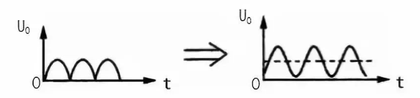

​	如左图所示，电压的方向性都是一致的，但是在电压幅度上是波动的，就是在时间轴上，电压呈现出周期性的变化，所以是脉动性的

​	该电压可以分解为一个直流电压跟一组频率不同的交流电压，如右图所示

- **电容滤波原理**

​	利用电容器**隔直通交**原理

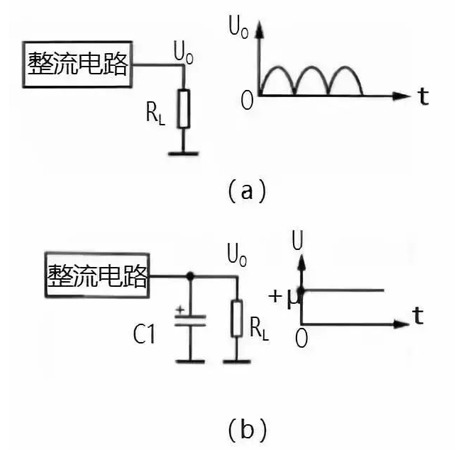

​	电容C对于直流电相当于开路，所以直流电只能找负载玩；交流电通过电容接地流出了，这是因为电容C的容量较大，容抗较小，

​	滤波电容C的容量越大，对交流成分的容抗越小，使残留在负载R上的交流成分越小，滤波效果越好

- **电容滤波原理**

​	电感**通直隔交**

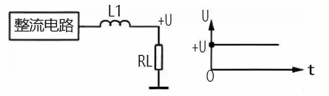

​	对于整流电路输出的交流成分，因 L1 电感量较大，感抗较大，对交流成分产生很大的阻碍作用，阻止了交流电通过 C1 流到加到负载 RL。这样，通过电感 L1 的滤波，从单向脉动性直流电中取出了所需要的直流电压 +U。

​	滤波电感 L1 的电感量越大，对交流成分的感抗越大，使残留在负载 RL 上的交流成分越小，滤波效果就越好，但直流电阻也会增大。

### RC滤波

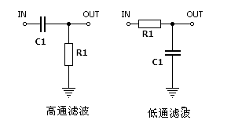

​	其实这里可以看做是RC串联，然后输出电阻跟后面的那个元器件并联，所以输出电压就是后面的器件的电压

​	那么感觉就可以理解为一个分压电路了，并且下面的器件应该是分担绝大部分电压，分压看阻抗，即应该选择阻抗相比要很大的器件在下面。电阻的阻抗是个常数，跟频率无关，那么电容呢，$Z_{C}=\frac{1}{j\omega C}$,其中$\omega=2\pi f$。

##### 如何记忆区分

​	当我们想通低频信号的时候，频率低，容抗高，那么输出电压就应该是电容两端的电压，所以低通应该是电容在下面

​	想通高频信号的时候，频率高，容抗低，那么输出电压应该是电阻两端的电压，所以高通电容在上面

**进一步的理解**

**低通滤波**	

- 低频信号
  - 容抗大，电流更多的通过R
  - 大部分电压降在电容C上，即输出电压近似于输入电压
  - V=V称之为信号容易通过
- 高频信号
  - 容抗低，电容接近于短路，大部分（高频）电流直接流过电容器并流入地
  - 输出电压小，
  - 输出跟输入比小的一，称之为信号不容易通过
- 低通就是，低频信号时，输出等于输入；高频信号时，会被衰减，在极限情况下，输出为零，这样不就只保留有用的低频信号了

**高通滤波**

- 低频信号
  - 容抗大，电压都在电容上，输出电压非常小
  - 这里电容就给低频信号拦住了，不让他去输出端
- 高频信号
  - 容抗小，电压都在电阻上，输出电压等于输入电压

### LC滤波

- **低通滤波器**：Low Pass Filter（简称：LPF）

​	仅提取低频（Low）侧频率的滤波器。因为是让低于阻断频率的频率通过的滤波器，所以被称为低通滤波器。

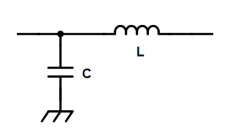

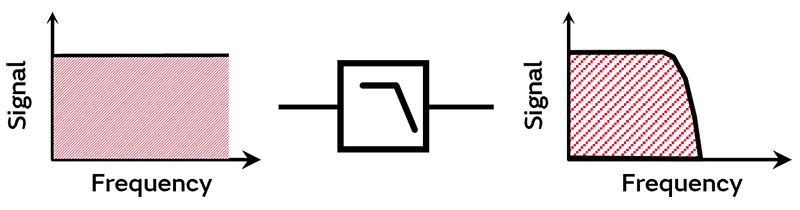

- **高通滤波器**：High Pass Filter（简称：HPF）

​	仅提取高频（High）侧频率的滤波器。因为是让高于阻断频率的频率通过的滤波器，所以被称为高通滤波器。

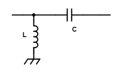

- **带通滤波器**：Band Pass Filter（简称：BPF）

​	仅提取特定频率范围的滤波器。因为是只让所设定频率范围通过的滤波器，所以被称为带通滤波器。

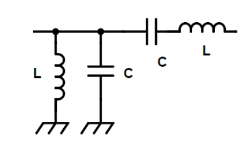

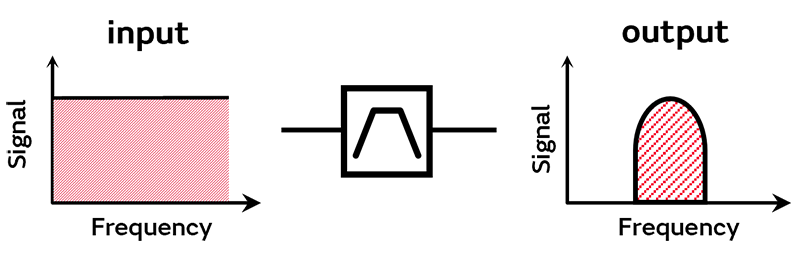

- **带阻滤波器**：Band Elimination Filter（简称：BEF）

​	因为是只阻断特定频率范围的滤波器，所以被称为带阻滤波器。

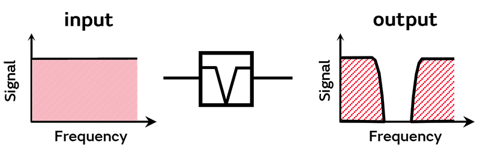

#### 低通滤波器的种类

- L型滤波器(1)
  应用场景：输入阻抗 ⇒ 高；输出阻抗 ⇒ 低 时

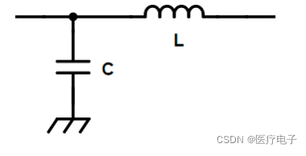

- L型滤波器(2)
  应用场景：输入阻抗 ⇒ 低；输出阻抗 ⇒ 高 时

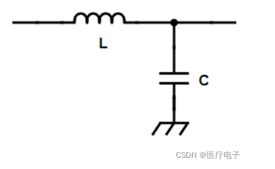

-  π型滤波器
  应用场景输入阻抗 ⇒ 高；输出阻抗 ⇒ 高 时

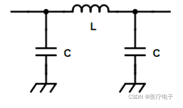

- T型滤波器
  应用场景：输入阻抗 ⇒ 低；输出阻抗 ⇒ 低 时

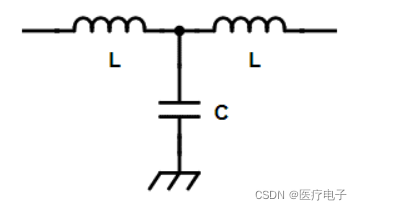

​	相比L型滤波器，π型和T型滤波器的噪声去除效果更好，因而还要考虑这方面的因素来选定电路。

