## 采样保持电路

### 简介	

​	采样保持电路，有时表示为S/H电路或S&H电路，通常与模数转换器一起使用来采样输入模拟信号并保持采样信号，因此得名为采样保持电路。

​	典型的采样保持电路的简单框图

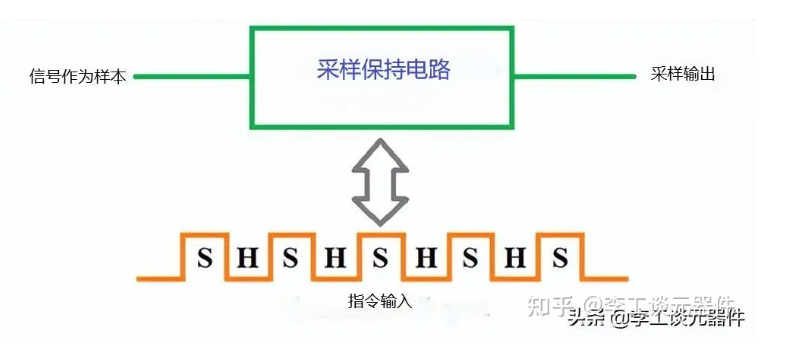

​	PWM控制mos，开关闭合时，信号被采样，打开时，电路保持输出信号

### 基本采样保持电路

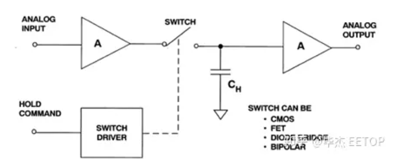

主要包括四个主要部分：输入放大器，电容，输出缓冲器和开关电路

​	核心是**电容**

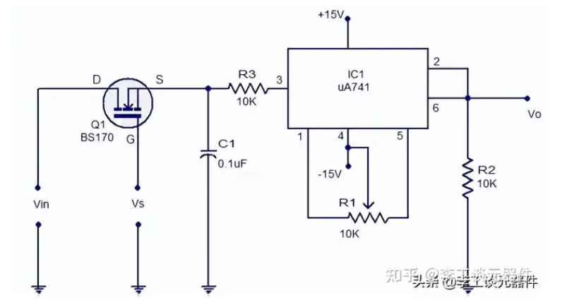

**当 MOSFET 作为闭合开关工作时，通过漏极端子提供给它的模拟信号将被馈送到电容器，然后电容将充电至其峰值。**当释放开关时，电容停止充电。由于电路末端连接了高阻抗运算放大器，电容将因此而产生高阻抗，因此无法放电。

### 电压采样电路

- 隔离型
  - 互感器采样
  - 光耦采样
  - 霍尔采样
- 非隔离型
  - 分压采样
  - 运放直接采样

##### 非隔离型电压采样电路

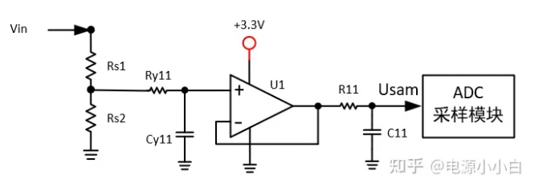

​	输入电压经过电阻分压，然后经过输入侧滤波接入运算放大器，再经过输出端滤波(RC)接入ADC采样模块，这里的运算放大器起电压跟随作用，

​	ADC采样在单片机里，但是单片机的IO口输入电压范围时0-3.3V，所以要把测量电压保持在这个范围

​	其实感觉就是一个分压，不过不止分压，还有运放的隔离，滤波等

**为啥说电容是核心**

- **采样阶段**：在电压信号的采样阶段，开关（通常是 MOSFET 或类似的半导体开关）闭合，将输入电压连接到电容器上。此时，电容器的电压将充电到输入电压的值。这个过程在采样阶段持续发生，确保电容器电压与输入信号保持一致。
- **保持阶段**：在采样阶段结束后，开关断开，电容器与输入信号隔离。电容器上的电压（即采样电压）被保持在一个稳定的值，直到 ADC 读取这个电压值。电容器的特性使得它可以在保持阶段内存储电压值，以便提供稳定的输入信号给 ADC 进行转换。

**运放**

​	电压经过运行（跟随器）之后，输入到MCU的ADC模块

​	由于运放具有**输入电阻无穷大**，而**输出电阻无穷小**的特点。等效电阻与运放的输入电阻相比较，可以忽略。输入到运行正极的电压等于Uin+，这样Uout=Uin+。

##### 隔离型电压采样电路

**霍尔电压采样**

​	霍尔元件的采样原理：霍尔传感器内部包含垂直于磁场方向放置的半导体薄片，根据霍尔效应，当有电流流过半导体薄片时会产生电动势，该电动势称为霍尔电势，可以通过测量电动势的大小得到留过电流的大小。

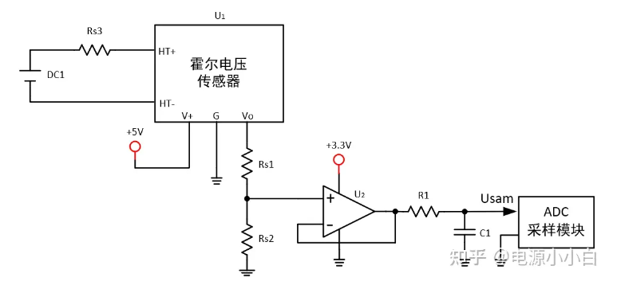

​	待测电压通过采样电阻Rs3接入霍尔电压传感单元U1，得到一个幅值在0~V+的输出电压Vo。

​	Vo经过分压电阻Rs1与Rs2后接入运算放大器U2，分压电阻的作用是调整霍尔电压传感器的输出电压幅值，以适应ADC采样模块的输入电压范围。

​	运算放大器U2起到电压跟随的作用。U2的输出再经过低通滤波器（R1、C1）后接入ADC采样单元。

**隔离运放电压采样**

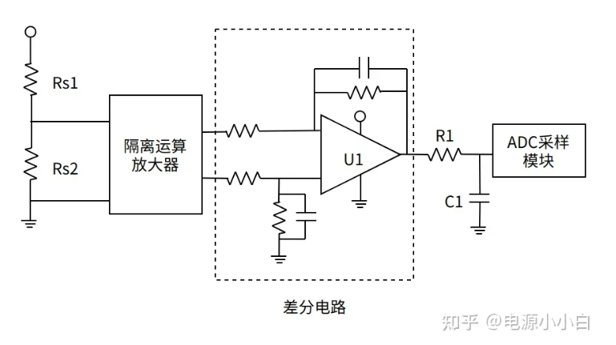

​	输入电压经过Rs1与Rs2分压后接入隔离运算放大器，随后接入差分运放电路中，运放U1的输出电压经过滤波器（R1、C1）后接入ADC采样模块。

### 电流采样电路

##### 非隔离型电流采样电路

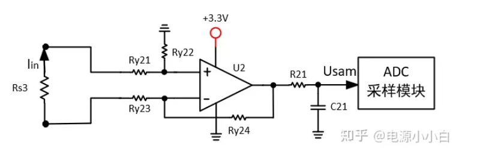

​	在待测支路中串联采样电阻Rs3，并将电阻两端电压接入运算放大器U2中。

​	电路中U2以及电阻Ry21-Ry24构成的差分电路。

​	差分电路的输出经过滤波器（R11、C11）后接入ADC采样模块。

##### 隔离型电流采样电路

**霍尔电流采样电路**

​	霍尔电流采样电路一般由霍尔传感元件、运算放大器和滤波器构成。

以单电源闭环霍尔电流采样为例：

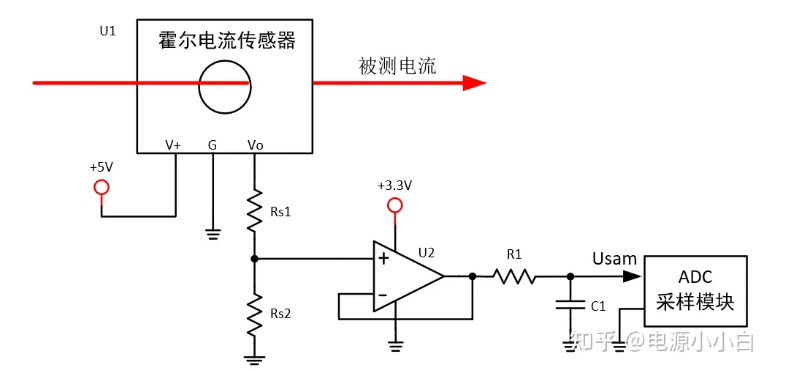

​	待测电流穿过霍尔电流传感器U1会产生一个幅值在0~V+之间的输出电压值Vo。

​	Vo经分压电阻Rs1与Rs2后接入运放U2，随后经低通滤波器（R1、C1）后接入ADC采样单元。U2、Rs1与Rs2作用可参考霍尔电压采样电路。

### 电压采样电路设计

**要求：**采集一个输出范围为20V-28V的Uo电压信号到0-3.3V的AD。
**设计思路：**将20v到28v中的8v压差全部映射到0-3.3v的范围内，才内能更好的利用AD模块，所以首先将Uo与20V做差分，将电压抬低到0-8v（注：有时碍于仪放信号输入电压的范围较小会先分压再抬低见形式二），然后通过电阻分压将8v映射到3.3v的范围内。
**形式一**

- 利用现有的电压产生20v的基准电压

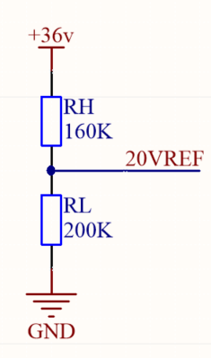

- 通过运放将Uo与20V做差分

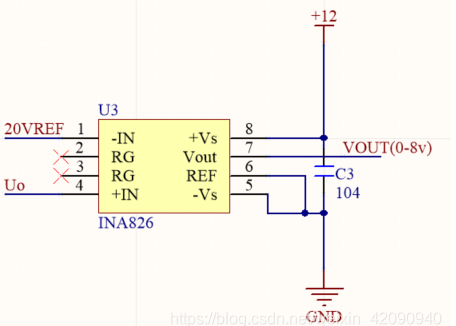

- 分压及输出阻抗匹配（电压跟随器）

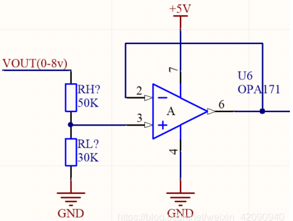

- 输出钳位保护

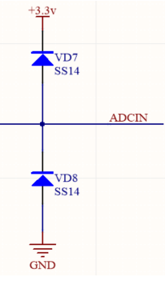

**形式二**

- 将Uo分压7倍，即将0-28v映射到0-4v，同理将20v也分压7倍即要产生2.857v的电压基准

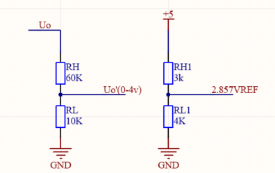

- 差分并放大2.887倍及钳位电路（计算方法：3.3/（4-2.857），差放直接输入给AD不需要阻抗匹配）

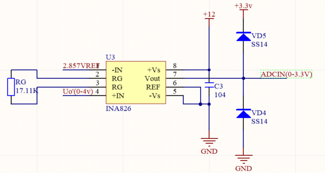