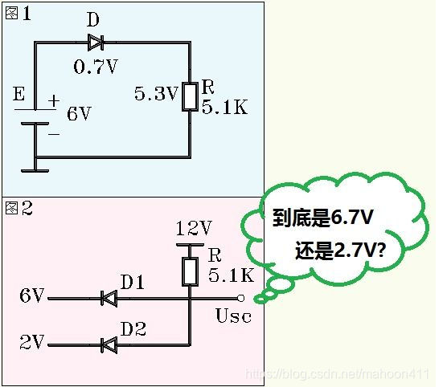
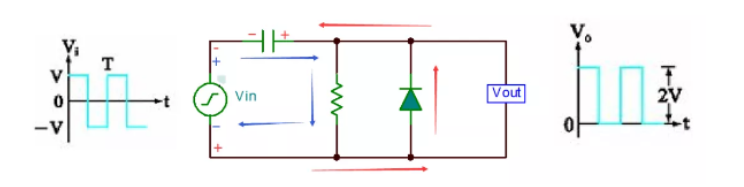
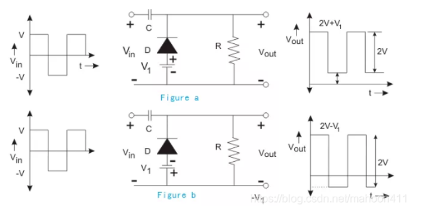
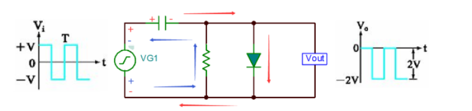
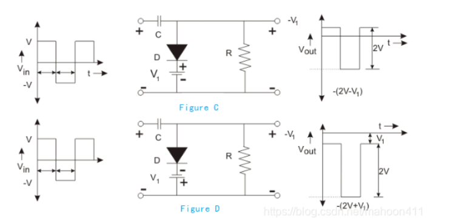
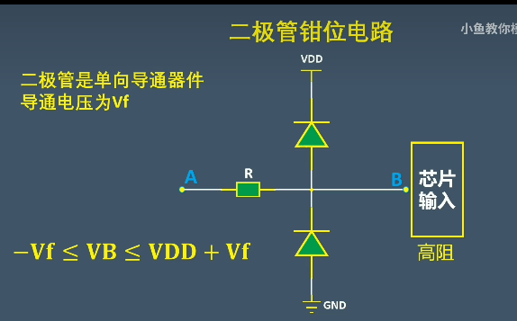

## 钳位电路

### 什么是钳位

​	钳位就是把位置卡住，在电路里就是限制电压

​	钳位二极管就是把输入电压变成峰值钳制在某一预定的电平上的输出电压，而不改变信号

### 二极管钳位电路工作原理

- 图1：二极管正向接法，管压降0.7V，因此电阻上的电压为5.3V

- 图二：问是输出6.7V还是2.7V

  假设U~sc~为6.7V，6.7>2.0V，所以D~2~正向导通，产生0.7V的管压降，即D~2~的阳极被钳制在2.7V，即输出电压U~sc~被钳制在2.7V，此时2.7V<6.0V，D~1~将处于反偏状态

**哪个电压低，电路的输出电压就是低电压再加上0.7V**

### 常见二极管钳位电路

#### 正钳位电路

​	由电容，负载，二极管组成

##### 简单正钳位电路

- 输入电压在正半周期时，电流如蓝色箭头所示，二极管截止，输出电压等于电容电压加上正版周期电压，V~out~=2V~in~
- 输入电压在负半周期时，电流如红色箭头所示，二极管导通，电容充电至+V（注意这里电容方向定义为左负右正，所以输出电压为+V而不是-V），V~out~=0V

##### 偏压型正钳位电路

​	通过在电路中加入偏置电压来提高或降低钳位值

- Figure a为正向偏压型，所加的偏压与二极管导通方向一致时，波形向上，即钳位值会提高V1
- Figure b为反向偏压型，所加的偏压与二极管导通方向相反时，波形向下，即钳位值会降低V1。

#### 负钳位电路

##### 简单型负钳位电路

- 输入Vin在正半周时（Vin上正下负），二极管导通，电流如红色箭头所示，电容两端压差充电至+V（左正右负），Vout=0V；
- 输入Vin在负半周时（Vin上负下正），二极管截止，电流如蓝色箭头所示，Vout电压等于负的（电容电压+负半周电压），即Vout=-2V；

##### 偏压型负钳位电路

​	偏压型负钳位同偏压型正钳位类似，在电路中加入偏置电压来提高或者降低钳位值。

- Figure C为反向偏压型，所加的偏压与二极管导通方向相反时，波形向上，即钳位值会提高V1
- Figure D为正向偏压型，所加的偏压与二极管导通方向相同时，波形向下，即钳位值会降低V1。

##### 双二极管钳位电路

- A点电压大于VDD，上面的二极管导通，B点电压为Vdd+0.7V
- A点电压小于VDD，不满足导通条件，大于GND，下面的二极管导通，B点电压为-0.7V
