## 限幅电路

### 什么是限幅电路

​	限幅，也就是把电压限制在某个范围，去除交流信号的一部分，但不会对波形的剩余部分造成影响

### 分类

​	基于二极管的限幅电路主要分为两类，一是串联二极管限幅电路，二是并联二极管限幅电路

#### 串联二极管限幅电路

​	二极管与输出串联，输出电压为负载两端的电压

​	当二极管正向偏置导通时，输入信号在输出断，相反，当二极管反向偏置时，串联限幅电路会传递输入信号。分为正/负限幅电路

##### 正限幅电路

​	串联正限幅去除波形的正半部分，如下所示，二极管处于反向偏置与输出串联

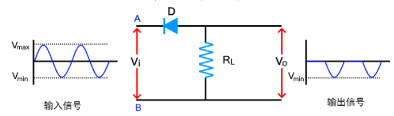

​	正半周期，二极管不导通，负载上没有压降

###### 带偏置的正限幅电路

​	带偏置的正限幅电路用于限制正半周期的一部分，而不是整个半周期，使用具有正偏压或负偏压的串联正限幅器来产生所需的波形

**正偏差**

​	电池的正极接到二极管的P侧

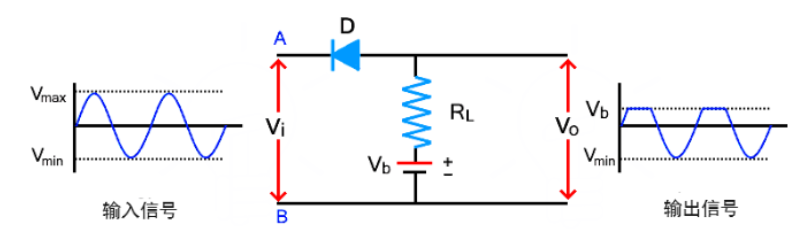

- 正半周期，一开始Vi很小，小于V~b~，二极管在V~b~的作用下导通，信号出现在输出端
- 当输入电压增加到电池电压以上时，二极管变为反向偏置，不传导输入信号，因此，电池电压V~b~出现在输出端
- 在负半周期，二极管由于输入电压和电池电压而正向偏置。因此，输入电压通过二极管并出现在输出端

**负偏差**

​	电池与二极管反向连接

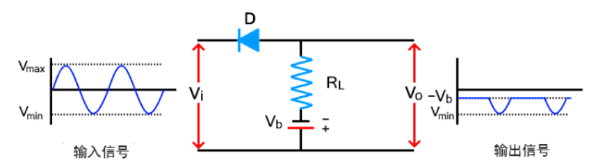

##### 负串联限幅电路

​	串联负限幅电路对输入周期的负半部分进行限幅

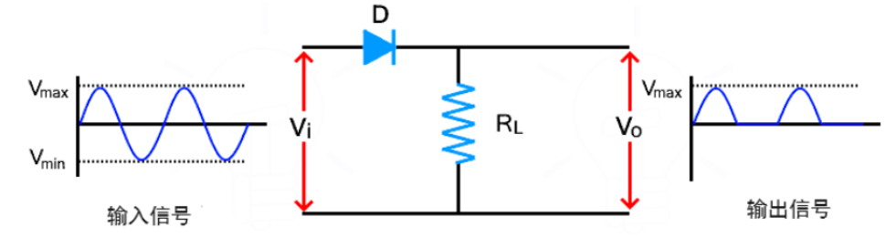

###### 带偏置的串联负限幅电路

**正偏差**

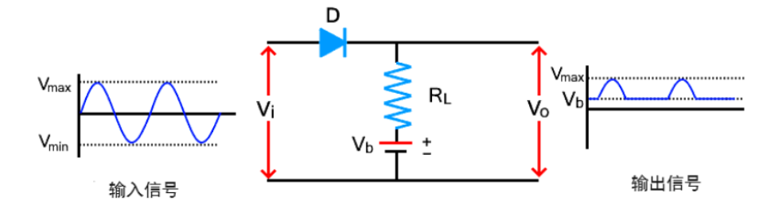

**负偏差**

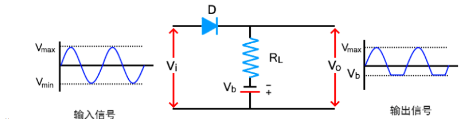

#### 并联限幅电路

​	二极管与输出并联，当二极管阻断时，输入信号出现在输出上，并联限幅电路分为正向和负向

##### 正向并联限幅电路

​	对正半周期进行限幅

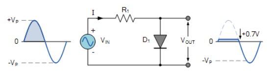

- 正半周期，且Vin大于0.7V时，二极管导通，Vout被钳位在0.7V
- 在负半周期，和Vin电压小于0.7V时，二极管是截止状态，所以Vout=Vin

###### 正偏压限幅

​	当Vin的电压大于等于Vbias+0.7V时，二极管导通，Vout被钳位

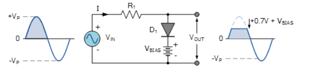

##### 负向并联限幅电路

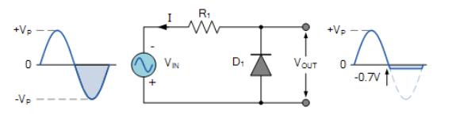

- 正半周期，二极管截止，Vout=Vin，即波形跟随
- 在负半周期，Vin<=-0.7V，二极管导通，Vout被钳位在-0.7V

###### 负偏压限幅

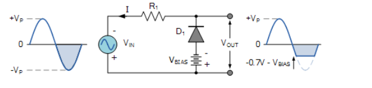

Vin<=-0.7-Vbias时，二极管导通，Vout被钳位

#### 双向偏压限幅

​	双向偏压限幅是两个二极管加两个偏置电压，正半周大于等于4.7V时，D1导通，超出部分被钳位在4.7V；负半周小于等于-6.7V时，D2导通，超出部分被钳位在-6.7V。

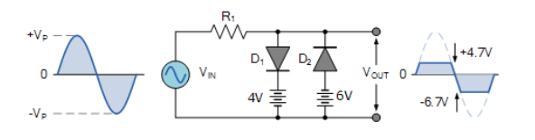

### 限幅电路与钳位电路的区别

- 限幅消掉输入波形的一部分而对剩余波形不做任何改变
- 钳位对波形不做改变而仅进行一定数值的偏移
