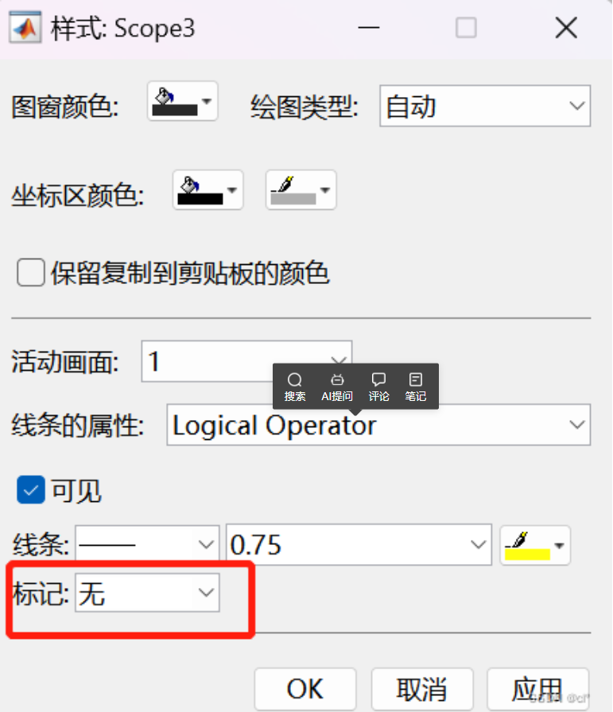
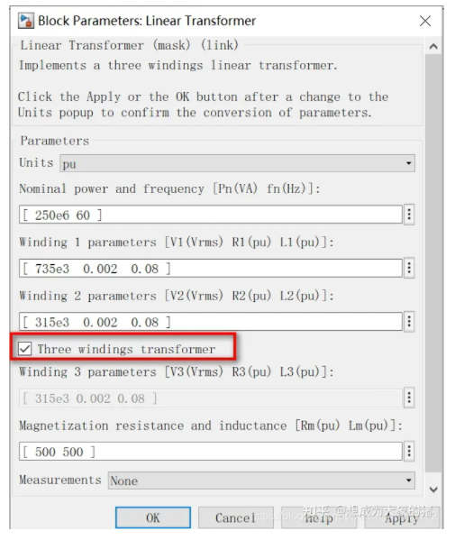
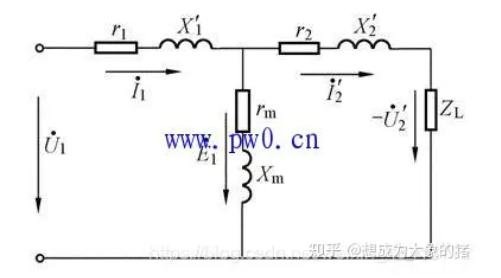
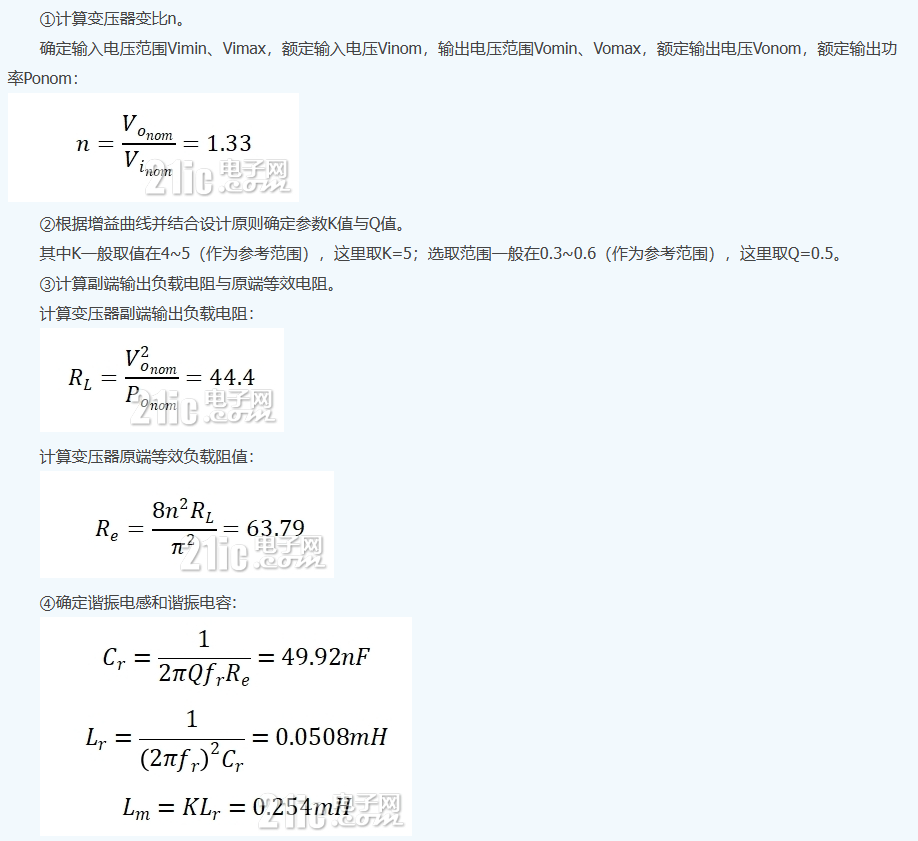
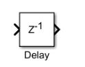
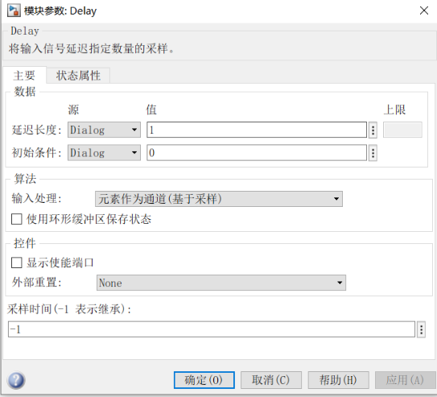

## simulink使用中遇到的问题

#### 1. 旋转

ctrl + R = 旋转90°      ctrl + I = 左右旋转

#### 2. SCOPE显示的波形带圆圈

打开示波器-视图-样式-标记（maker）-修改为无（none）

#### 3. 谐振器中的变压器

**器件名称：**linear transformer

​	取消框选，变为单相变压器，这样就只有两个铁芯了

**参数设计：**

- units那里有两个选项，默认是pu，你学过电机或者电力系统应该就知道这是**标幺制**，所以我就不解释啥是标幺制了。另一个选项是SI，也就是国际单位制。
- 如果选的是国际单位制，那么units下面的nominal power and frequency就不用管了。这个是用来设置变压器的额定容量和额定频率的，只在标幺制的时候才用的到，
- Winding 1 就是一次侧绕组，Winding 2 就是二次侧绕组。
- V1 V2肯定知道，是一二次侧的电压。注意人家写的是Vrms，也就是电压的有效值。

- R1，R2，L1，L2是一二次侧的电阻和电感。就是那个变压器的等效电路，图里X1，X2就是电感的电抗值，对应的就是L1和L2，

- Rm、Lm就是励磁电阻和[励磁电感](https://zhida.zhihu.com/search?q=励磁电感&zhida_source=entity&is_preview=1)。在上面的图上就是中间的rm和Xm。（怎么写下标来着。。）

上面提到的就是它能设置的全部参数了。如果你想要的是**理想型变压器**，没有损耗的那种，咋设置嘞。就把R1,L1,R2,L2都设置成0，Rm和Lm设置成inf就行了。像我这样。这时候，我这个变压器的变压比就是V1 / V2了。

#### 4. 死区时间--Delay模块

延时模块

+ 总的延迟时间由延迟长度和采样时间共同决定

延迟时间 = 延迟长度 * 采样时间

例如，延迟长度为5，采样时间设置为0.2，则模块的输出将在1s时开始更新，在0~1s之间，模块的输出值由**初始条件**中指定的初始值决定。