## 初识图纸

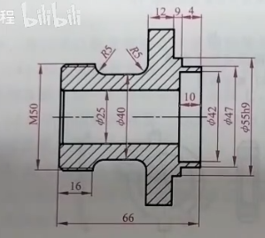

- φ：直径
- R：半径
- M50：普通外螺纹；M代表的是普通螺纹，50代表螺纹的大径，也就是公称直径
  - 螺纹式双线，这个外螺纹，螺纹的牙顶线就是大径粗直线，里面的小径是细直线
  - 在左视图里呢，外是牙顶圆，里面是牙底圆

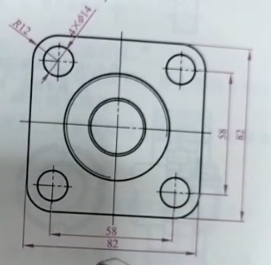

- 外面有圆角，半径为R12
- 4*φ14： 4个直径为14的孔

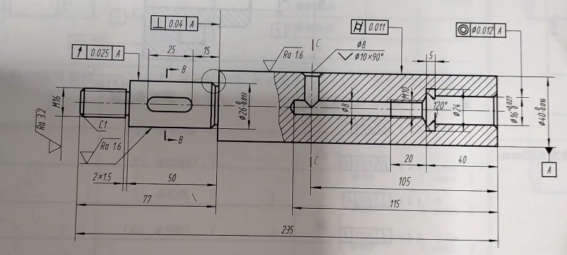

分为

- 形状公差
  - 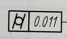圆柱度
- 位置公差
  - 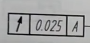圆跳动
  - 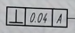垂直度
  - 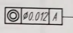同轴度

**区别：**有三个格，最后有个大写字母的是位置公差，其是一个相对于另一个，有一个基本代号，形状公差，第一个格是项目符号，第二个是公差数值，，位置公差多的那个叫基准符号

**基准符号：**去图纸里找，有个黑色三角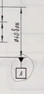就这儿

**圆跳动：**（但其实好像是属于跳动公差）

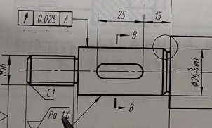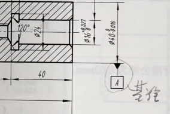

- 公差方格连接的叫被测要素，指向的是φ26圆柱表面
- 对
- 基准要素，要注意他是轮廓要素还是中心要素：看引线位置跟尺寸线是否对齐，对齐则为中心要素，这里指的是轴线，
- **φ26圆柱面对φ40圆柱轴线的圆跳动公差为0.025**

**垂直度**

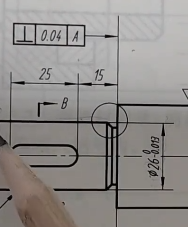

**φ40左端面 对 φ40圆柱轴线的垂直公差为0.04mm**

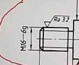

- M16-6g
  - M：普通螺纹也就是常说的三角形螺纹
  - 16代表螺纹大径
  - 里面的细直线也就是小径=0.85大径
  - 6g是公差代号，g是小写字母代表外螺纹，大写字母代表外螺纹

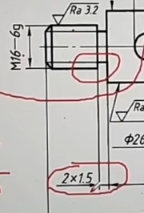

- 两个之间的连接叫做退刀槽
- 2*1.5，横长为2mm，1.5是深度，这个深度就是从M16的外面往里走了1.5，所以可以得到直径为13mm

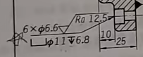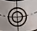

- 6个直径为6.6个小孔，外面加上直径为11大孔，深度为6.8，在这里也就是大孔在第一个图里的宽度，根号下的是粗糙度为12.5um

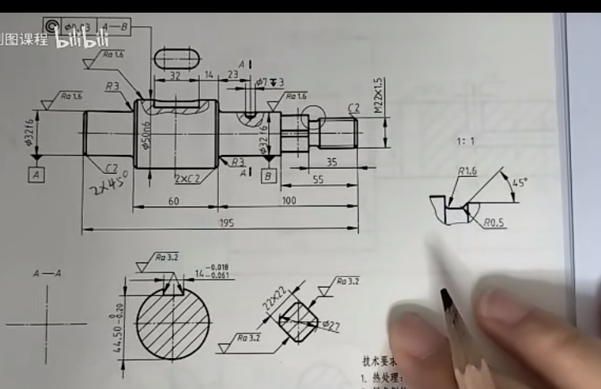

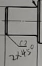

- C2 :2*45°的倒角，C表示45°倒角
- 这里看左侧的φ32，那么对应上图右侧的直径就是32，左侧的因为C2，所以线长应该是28

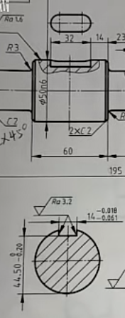

- 把上面这个玩意引出来了，叫移出断面图
- 下面剩了多少，根据上面的减去就是他的深度

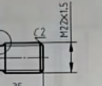

- 细牙普通螺纹
- 因为有螺距：*1.5，粗牙普通螺纹不带螺距

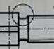这种细直线的圆圈是要画局部放大图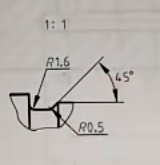

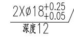

- 两个直径为18，允许的公差范围为0.05-0.25，

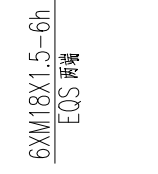

- **6XM18×1.5**: 这表示图纸上有6个M18的螺纹孔，螺距为1.5毫米。M18表示螺纹的公称直径为18毫米
- **6H**: 这部分表示螺纹的公差等级，6H是螺纹内孔的常见公差等级，表示螺纹的精度和公差范围。

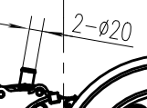

- 表示有两个直径为20的零件