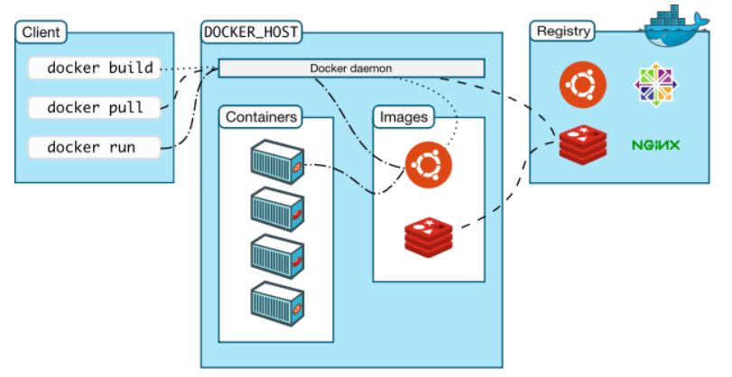

## 初识容器

### 1. 如何理解Docker

​	Docker利用‘’容器‘’技术，将应用程序及其所有依赖项打包在一个可移植的容器，封装成一个整体了，直接打开就能用

### 2. Docker架构

- 镜像：也就是容器的模版
- 镜像仓库：用于存储和管理镜像，（上传下载）
- 容器：容器=镜像+读写层，
  - 镜像只是一个只读的模板，容器就是镜像的一个运行实例了，为了运行它，在镜像的基础上添加了一个可写的读写层，
  - 容器运行时的任何修改都是发生在读写层，不会影响底层的镜像
  - 当停止或删除该容器时，读写层也被删除，下载创立新容器的时候，不会包含之前的修改

### 3. 大体步骤

- 首先安装docker

- 下载镜像

  - 镜像这玩意是多层的，比如基础的：java环境，这属于一个镜像了，有了它才能运行后级代码
  - 应该说他是分层的，且上面一层依赖着下面的镜像来运行

- 在本机搞了个东西，就可以打包一下赛到仓库里，然后在第二台电脑下载镜像，就能用了，没有环境差异

- 关于端口暴露问题

  - Docker容器默认是隔离的，跟VM有类似这玩意跟主机是隔离的，那么就有一个问题，我们如何通过主机访问
  - 这就是暴露端口的过程：将容器内部的端口映射到主机上的端口；这里容器就是个分封闭的房子，端口就是门，暴露端口就是开门迎客，端口映射就是指路牌

  

