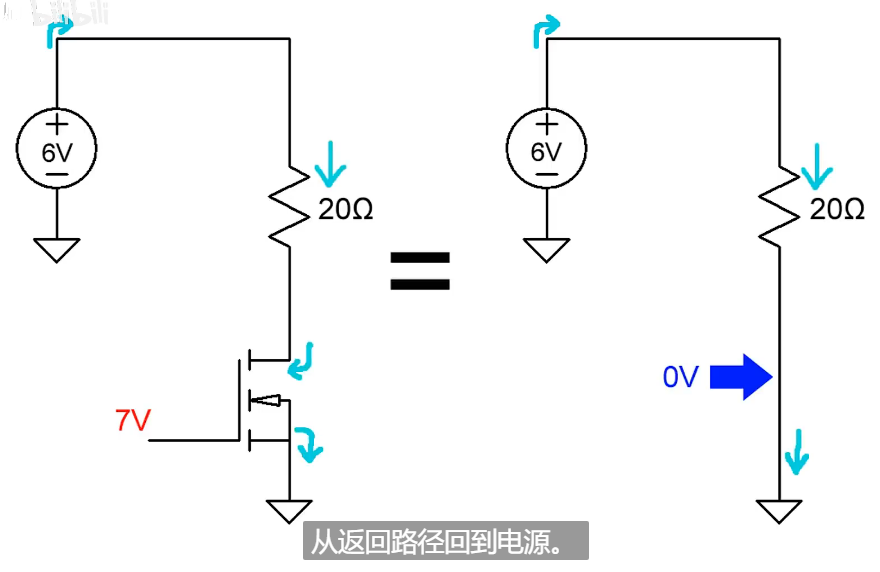
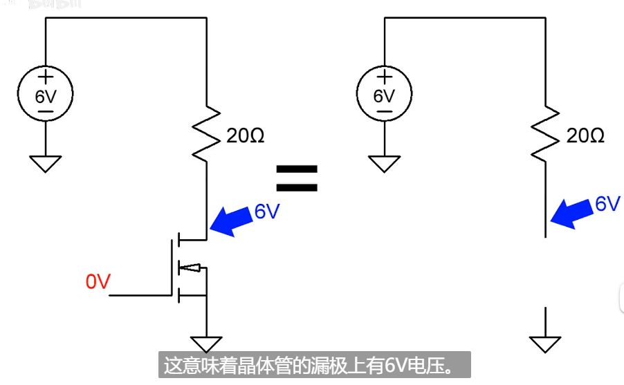
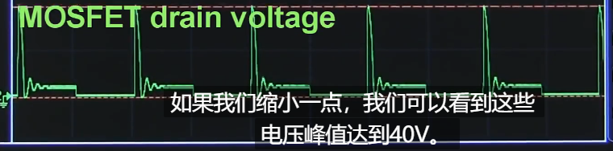
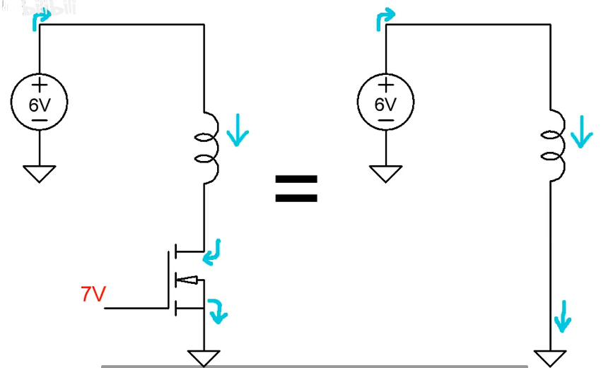
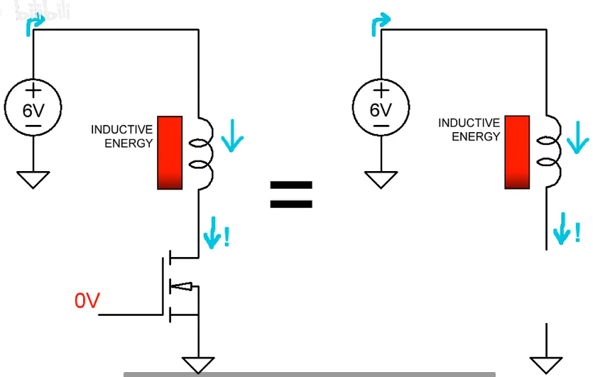
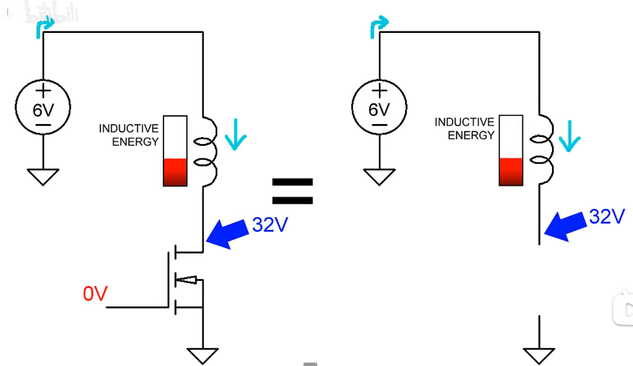
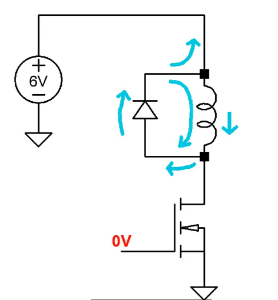

## 电感反向电动势

电阻上面没有压降，所以施加在MOS管漏极上的电压就有6V

那么将电阻换成电感会发生什么

当mos管截止的时候，MOS管的漏极电压峰值高达40V

**电感电流不能突变**

MOS关断了，但是电流还需要一段时间才能停止流动，但是电流没地儿去了，不断积累直到所有存储的感应能量都转化回电能，所以MOS管的漏极上会得到巨大的电压尖峰

**解决办法**

##### 为啥说是反向的

​	首先理解**反向**，反向的意思就是说，你想减少，我不乐意，给你施加个能量，让你缓慢减少，你想增加，我还是不乐意，给你施加个能量，让你缓慢增加

​	对此做出如下理解，电感储存的能量转化成反向电动势用于减缓电流减为0的过程，这不就是电感电流不能突变