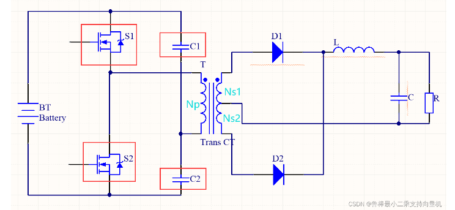
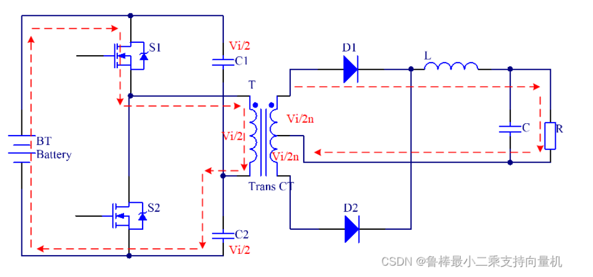
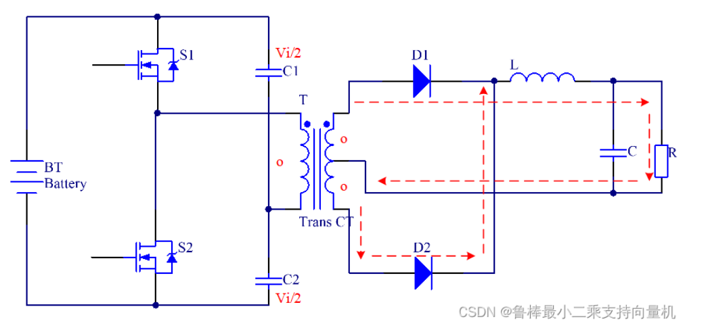
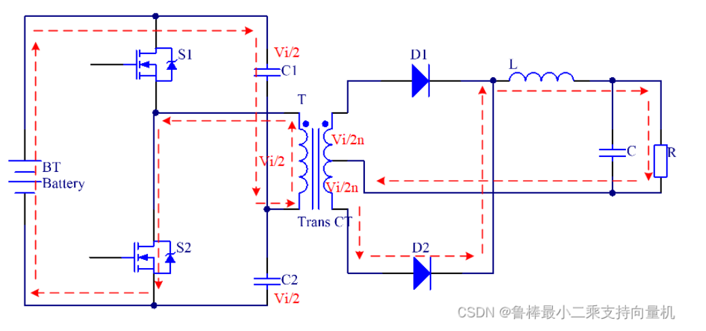
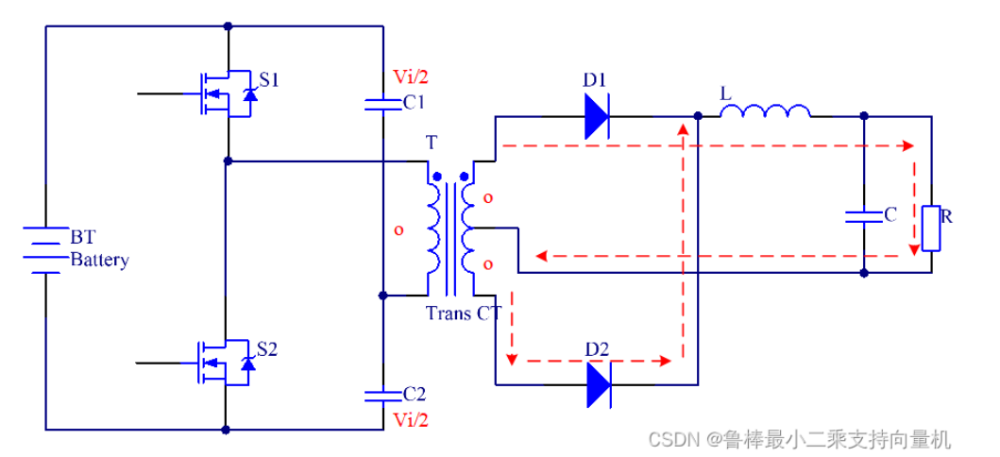

### 半桥变换器

#### 拓扑结构

- 分隔电容C~1~, C~2~
- 变压器T
- 原边线圈圈数 N~p~
- 副边线圈圈数 N~s1~  , N~s2~
- 储能电感 L
- 滤波电容 C

#### 工作原理

10  00  01  00

**S1导通，S2关断**

- **左边：**电流由输入电压端流经S1、变压器原边线圈与C2形成电流回路。此时**变压器原边线圈两端压降为Vi-Vi/2=Vi/2**
- **变压器**原边线圈因电流流过而产生磁力线，磁力线透过铁芯传到副边线圈1，**副边线圈1产生感应电势**
- **右边：**副边线圈1两端感应电压Vi/(2*n)，使得理想整流二极管D1导通，电流形成回路，通过D1、输出储能电感与输出电容
- 副边储能电感两端固定压降VL，使得电感线圈上产生电流，此增加的电流于电感铁芯内累积磁力线，直到S1关闭为止

**S1关断，S2关断：**

- 原边线圈因S1关断，原边无电流回路产生，变压器停止传输能量，此时变压器副边线圈1和线圈2，端点电压皆为0
- **副边电流方向由储能电感到输出电容，经过两线圈共同连接点，各一半电流到D1与D2，回到储能电感**
- 电感产生反电势致使D1与D2同时导通，储能电感在开关关断时续流，电感上压降与输出相同
- 储存电感将导通时间储存在铁芯内的磁力线，透过电感上的感应线圈以电流形式进行释放

**S1关断，S2导通时：**

- 电流由输入电压端流经C1、变压器原边线圈与S2形成电流回路，此时变压器原边线圈两端压降为Vi-Vi/2=Vi/2
- 变压器原边线圈因电流流过而产生磁力线，其磁力线透过铁芯传到副边线圈2，**副边线圈2产生感应电势**
- 副边线圈2两端感应电压Vi/(2*n)，使得理想整流二极管D2导通。电流形成回路，通过D2、输出储能电感与输出电容
- 副边储能电感两端固定压降VL，使得电感线圈上产生电流，该增加的电流在电感铁芯内累积磁力线，直到S2关闭为止

**S1关断，S2关断时：**

- 与上一次00是一样的

**总结**

- 10与01的区别：上管导通的话，副边就是上面线圈起作用了，下管导通寄宿下面的线圈作用，主要看变压器，一个是流入变压器，一个电流流出变压器，所以电流方向不同，根据二极管，所以导通不同回路

