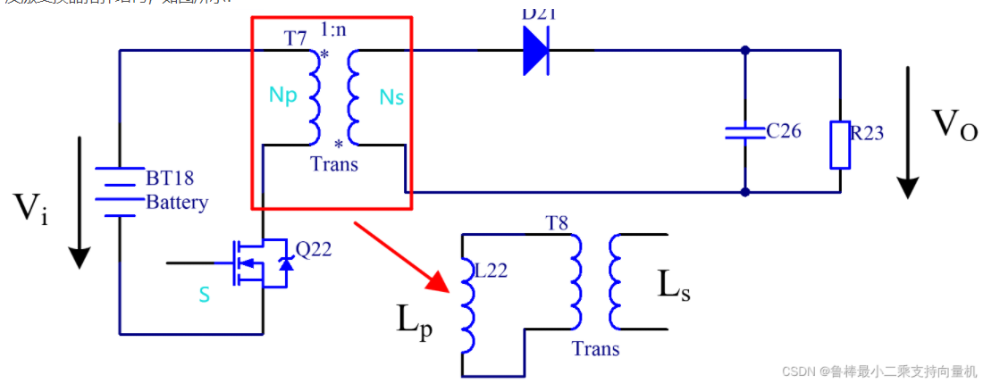
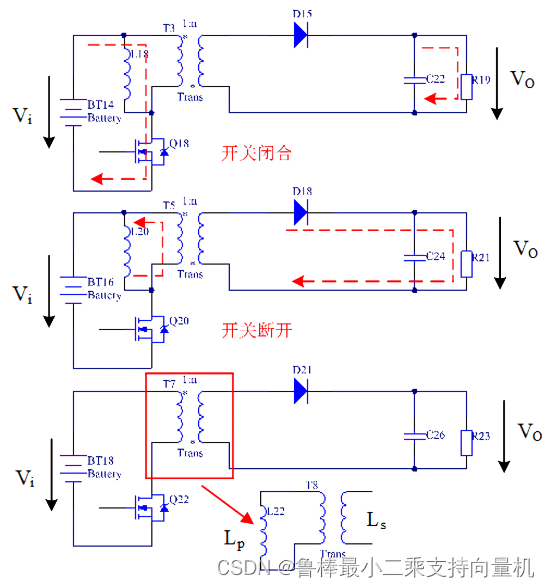

## 反激变换器

### 反激变换器拓扑结构

### 工作原理

**S导通(开关管导通)时：**

- 电流由输入电压端流经变压器原边线圈与开关形成电流回路。此时变压器原边线圈两端压降为Vi
- 副边线圈两端感应电压Vi/n，因回路上二极管不导通，**副边回路上无电流**
- 变压器原边线圈因电流流过而产生磁力线于变压器铁芯内，其数量会随流通电流的时间增加而增加
- 因副边线圈无电流流通，原边电流增加使得**原边能量累积于原边线圈中**，直到开关断开为止

**S关断(开关管关断)时：**

- 原边线圈两端电压因磁力线累积储存在变压器铁芯内，因而产生反电势
- 原边线圈两端反电势由铁芯内累积的磁力线，使得副边线圈两端电压产生相对感应电势
- 二极管导通(理想二极管)，副边线圈两端电压为Vo，原边线圈两端电压为Vo*n
- 电流 由副边线圈开始经二极管与输出电容形成回路，并将变压器的能量释放，直到下一次开关导通为止

**总结**

​	特点:变压器的一次和二次绕组的极性相反

- 当开关管**导通**时，变压器原边电感电流开始上升，此时由于次级同名端的关系，输出二极管截止，变压器**储存能量**，负载由输出电容提供能量。
- 当开关管**截止**时，变压器原边电感感应电压反向，此时输出二极管导通，变压器中的能量经由输出二极管向负载**供电**，同时对电容充电，补充刚刚损失的能量。

+++

考虑到原边漏感的能量可能会造成开关S两端过压，损坏S，因此一般要加入吸收电路