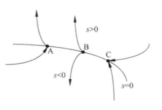
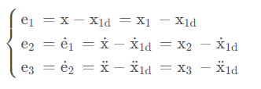
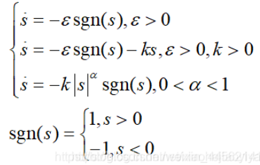
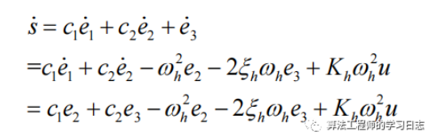
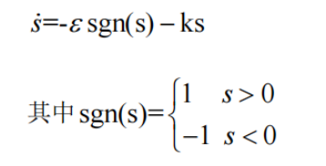
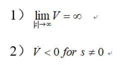

## 滑模控制

#### 原理	

**特点：** 滑模控制本质上是**非线性控制**的一种，简单的说，它的非线性表现为控制的不连续性，即**系统的“结构”不固定**，可以在动态过程中根据系统当前的状态有目的地不断变化，迫使系统按照预定“滑动模态”的状态轨迹运动。

​	滑模控制的**核心思想**是建立一个**滑模面**，将被控系统**拉取到滑模面上**来，使系统沿着滑模面运动。一旦系统状态达到该滑模面，它们将保持在滑模面附近运动。

​	这里只需要将系统视为在滑动曲面上滑动。不过实际系统的实现是用**高频切换**来让系统近似在滑动曲面上滑动，高频切换的控制信号让系统在很邻近滑动曲面的范围内切跳，**这种信号高频切换所导致输出信号会出现振荡**，系统状态在所选取的滑模面附近来回颤动，这种颤动是无法消除的

滑模控制分为两个阶段：趋近阶段和滑动阶段

- **趋近阶段：**系统状态从任意初始状态趋近滑模面（从状态空间的任意位置有限时间到达滑模面s=0)
- **滑动阶段：**一旦系统状态达到滑模面，它们将在滑模面上运动，对外部扰动和不确定性不敏感。(在滑模面上可以收敛到原点（平衡点)）

​	系统状态在处于滑模面等于0（或附近）系统是稳定的，所以设计的目标就是如何使s趋近于0，从而系统稳定，比如令s的导数<0.当s>0时，s^.^<0,反正s<0,s^.^>0，这样s最终趋近于0

#### 优缺点

**优点：**

- 克服系统的不确定性
- 对干扰和未建模动态具有很强的鲁棒性（不灵敏），尤其是对非线性系统的控制具有良好的控制效果
- 调节的参数少，响应速度快

**缺点：**

- 硬件无法适应高频的信号切换

- 当状态轨迹到达滑动模态面后，难以严格沿着滑动模态面向平衡点滑动，而是在两侧两会穿越地趋近平衡点，从而产生抖振

#### 构建滑模面

​	滑模面*S(x)*通常被设计为状态变量的线性组合：
$$
S(x)=Cx
$$
其中 C 是设计矩阵。对于跟踪控制问题，可以定义滑模面位误差状态的函数：
$$
S(x)=e(t)=x(t)-x_d(t)
$$
目标是使得 
$$
\text{}e(t)\to0
$$
即系统状态x(t)跟踪期望状态x~d~（t）。

以一个三阶系统为例：
$$
\left.\left\{\begin{array}{ll}\dot{\mathrm{x}}_1&=\mathrm{x}_2\\\dot{\mathrm{x}}_2&=\mathrm{x}_3\\\dot{\mathrm{x}}_3&=\mathrm{f}(\mathrm{x})+\mathrm{g}(\mathrm{x})\mathrm{u}\end{array}\right.\right.
$$
其中g(x)是u前面的系数公式，大多情况下是常数表达式，也存在一些g(x) 为x的函数的情况。下文中把f(x)和g(x)略写为f和g。

立即设计**滑模面**，这玩意s也叫滑模切换函数
$$
\mathrm{s=c_1 e_1 + c_2 e_2 + e_3 = \sum_{i=1}^3 c_i e_i = 0}
$$
其中e~3~前系数为1.

找到s和u的关系，对s求导，**滑模面s的导数：**
$$
\begin{aligned}
\dot{s}& =\mathrm{c}_1 \dot{\mathrm{e}}_1 +\mathrm{c}_2 \dot{\mathrm{e}}_2 + \dot{\mathrm{e}}_3 \\
&\mathrm{=c_1 e_2 + c_2 e_3 + \dot{x}_3 - x_{1d}^{(3)}} \\
&\mathrm{=c_1~e_2~+c_2~e_3~+f~+gu-x_{1d}^{(3)}} \\
&=\Gamma+\mathrm{f}+\mathrm{gu}-\mathrm{x}_{1\mathrm{d}}^{(3)}
\end{aligned}
$$
并设计**李雅普诺夫函数**
$$
\mathrm{V} = \frac{1}{2} \mathrm{s}^2
$$
并对其求导
$$
\begin{aligned}
\dot{\text{V}} &= s \dot{s} \\
&= \dot{s} \left( \Gamma + \text{f} + \text{gu} - \text{x}_{1\text{d}}^{(3)} \right)
\end{aligned}
$$
考虑到**控制量u是需要进行设计的**，先在上式中将u单独列出来
$$
\begin{aligned}
\dot{V}& =\mathrm{s}\left(\Gamma+\mathrm{f}+\mathrm{g}\mathrm{u}-\mathrm{x}_{1\mathrm{d}}^{(3)}\right) \\
&=\mathrm{s}\left(\Gamma+\mathrm{f}-\mathrm{x}_{1\mathrm{d}}^{(3)}\right)+\mathrm{sgu} \\
&=\text{s}\left[\left(\Gamma+\text{f}-\text{x}_{1\text{d}}^{(3)}\right)+\text{gu}\right] \\
&=\mathrm{sg}\left(\frac{\Gamma+\mathrm{f}-\mathrm{x}_{1\mathrm{d}}^{(3)}}{\mathrm{g}} +\mathrm{u}\right)
\end{aligned}
$$
该式右侧第一项与控制量u无关，第二项只含u本身

设计u具有以下形式（控制率）
$$
\mathrm u=-\mathrm k\cdot\mathrm s\mathrm g\mathrm n(\mathrm s)
$$
代入上式可得：
$$
\begin{aligned}
\dot{V}& =\mathrm{sg}\left(\frac{\Gamma+\mathrm{f}-\mathrm{x}_{1\mathrm{d}}^{(3)}}{\mathrm{g}} +\mathrm{u}\right) \\
&=\mathrm{sg}\left(\frac{\Gamma+\mathrm{f}-\mathrm{x}_{1\mathrm{d}}^{(3)}}{\mathrm{g}} -\mathrm{k}\cdot\mathrm{sgn}(\mathrm{s})\right) \\
&=\mathrm{s}\left(\Gamma+\mathrm{f}-\mathrm{x}_{1\mathrm{d}}^{(3)}\right)-\mathrm{kg}|\mathrm{s}|
\end{aligned}
$$
到此，右侧第二项已经满足≤0了，现在只要看第一项即可

对于第一项有：
$$
\mathrm{s}\left(\Gamma+\mathrm{f}-\mathrm{x}_{1\mathrm{d}}^{(3)}\right)\leq\left|\mathrm{s}\right|\left|\Gamma+\mathrm{f}-\mathrm{x}_{1\mathrm{d}}^{(3)}\right|
$$
因此
$$
\begin{aligned}
\text{V}& =\mathrm{s}\left(\Gamma+\mathrm{f}-\mathrm{x}_{1\mathrm{d}}^{(3)}\right)-\mathrm{kg}|\mathrm{s}|\leq|\mathrm{s}|\bigg| \Gamma+\mathrm{f}-\mathrm{x}_{1\mathrm{d}}^{(3)}\bigg| -\mathrm{kg}|\mathrm{s}| \\
&=|\mathrm{s}|\left(\left|\begin{array}{c}\Gamma+\mathrm{f}-\mathrm{x}_{1\mathrm{d}}^{(3)}\end{array}\right|-\mathrm{kg}\right)
\end{aligned}
$$
所以只要右侧括号内≤0，就有V的导数≤0，从而达到稳定

#### 滑模控制器设计

对于滑模变结构控制器的设计如下： 

u=u~eq~+u~sw~

u~eq~是等效控制，能够实现系统状态的跟踪，即将系统的状态一直保持在滑模面上；

 u~sw~是切换控制，使系统状态趋近于滑模面，削弱系统的抖振，常用的趋近率有三种：（一般用第二种指数趋近律）

​	还记得前面提到的两个运动过程嘛。在第一段运动过程也就是趋近运动中，所谓驱动运动是指s趋向于0的过程，在这个过程中趋近律一般有如下几种设计

本节将采用指数趋近律,

等效控制部分，对s=c1*e1+c2*e2+e3求导得

根据s'=0可得到等效控制：

假如eta过小，那么趋近的速度很慢，调节的过程太慢；相反，若eta太大，那么系统到达切换面的时候，具有比较大的速度，引起较大的抖动。对于 k，能够加快调节时间，能够快速到达滑模面的过程，还可以削弱抖振，改善系统的品质。本文中，指数趋近律的参数 k 为 20， eta为 5。所以切换控制为：
$$
\mathbf{u}_{sw}\text{=-}\boldsymbol{\varepsilon}\operatorname{sgn(s)-ks}
$$
综上所述，滑模变结构的控制器设计为
$$
\begin{aligned}\text{u}&=u_{eq}+u_{sw}\\&=\frac{1}{K_{h}\omega_{h}^{2}}\begin{bmatrix}(c_{1}-\omega_{h}^{2})e_{2}+(c_{2}-2\xi_{h}\omega_{h})e_{3}\\+\varepsilon\operatorname{sgn}(\mathrm{s})+\mathrm{ks}\end{bmatrix}\end{aligned}
$$

##### 补充：为什么控制率这么设计能保证s=0

在控制原理中，用Lyapunov函数来判断系统的稳定性，对于系统状态方程s˙=cx~2~+u（目标已经变成s=0，因此现在写成s的状态方程），对于平衡点s，如果存在一个连续函数V满足

那么系统将在平衡点s=0处稳定，即$\operatorname*{lim}_{t\to\infty}s=0$ 令$V(s,t)=1/2s^{2}$)，很明显满足第一个条件，第二个条件$\dot{V}=s\dot{s}=-s\varepsilon \mathrm{sgn}(s)=-\varepsilon\left|s\right|<0$也满足。满足Lyapunov函数的条件，s最终会稳定滑模面，也就是s=0。

讲到这里，我们可以稍微总结一下滑模控制的设计步骤。首先根据被控对象的状态方程**设计滑模面**，状态一旦到达滑模面，将以指数趋近方式达到稳定状态。然后**设计趋近律求出控制器的表达**，李雅普诺夫函数作为稳定性的保证，即**保证s=0可达**，（相平面中的其他点能到达滑模面）。

