## 自抗扰控制器

自抗扰控制器的设计分为三部分：

- **安排过渡过程：**就是用跟踪微分器（TD）合理提取微分
- **估计状态和总扰动：**用状态扩张观测器（ESO）估计状态和总扰动
- **计算控制量：**不局限于比例、微分和积分的线性组合

#### 原理

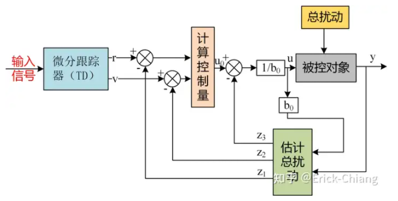

**工作过程：**输入期待电压v，经过TD，对V进行平滑处理，V~2~是对V的求导，然后同时对给定信号与给定信号的微分做了一个误差，然后再送到nlsef里面，这玩意是非线性状态误差反馈，也就是常说的补偿器环节。下面这个是状态扩张观测器（ESO)，这玩意是核心环节，它的作用是可以估计出实际的控制对象和我们状态观测器内部标称控制对象的误差值，这个误差值叫做Z~3~这样的话就可以把这个部分给他化简成我们的控制标准型，这里选择的是积分器串联型。

​	它在外界扰动/自身扰动发生前补偿该扰动，并将系统变为简单的双积分器进行控制

**ADRC是PID的改进版**，韩先生认为**PID的缺点**为：

- 误差的取法不合理
  - PID的误差是以e=v-y的方式产生的，但是这里的控制目标v在过程中是可以跳变的，而对象输出y的变化是有惯性的，不可能发生跳变（也就是输入信号阶跃，但是输出电压还是有过程的变化，而不是突变）所以要求让缓变的变量y来跟踪能够跳变的变量v本身就不合理会产生**’‘快速性’‘**和**’‘超调’‘**之间的矛盾
- 由误差提取其微分的办法不合理；常用$y=\frac{v(t)-v(t-\tau)}{\tau}$实现，但是当输入信号v（t）被噪声n（t）污染时，$y=\frac{v(t)-v(t-\tau)+n(t)}\tau $，输出y中的近似微分信号$\frac{v(t)-v(t-\tau)}\tau $会被放大的噪声分量$\frac{n(t)}\tau $所淹没，无法利用
- 线性加权的策略不一定最好
- 积分反馈有许多副作用；会使得闭环变得迟钝，容易产生振荡，积分饱和引起的控制量饱和

为此提出了以下**解决办法**：

- 安排合适的过渡过程
- 合理提取"微分"--“跟踪微分器”（TD）
- 探讨合适的组合方法--“非线性状态误差反馈"（NLSEF）
- 探讨“扰动估计”办法--“扩张状态观测器”（ESO）

假定模型控制的是电机速度，则其具体含义如下图：

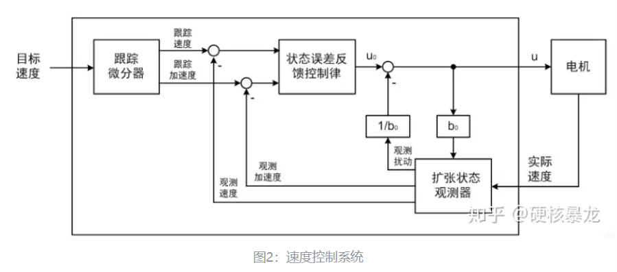

​	上下两图结合，我们就能明白 ADRC 控制系统的**工作流程**，首先给定目标速度，由 TD 得到实际模型跟踪的速度和加速度，扩张状态观测器根据电机的控制输入和实际输出得到观测的速度，加速度和扰动，与跟踪速度和加速度做差得到误差，由非线性状态误差反馈系统将误差进行非线性组合，减去扰动即为实际的控制输入。

#### 跟踪微分器（TD）

​	跟踪微分器-Tracking differentiator：分为线性和非线性两种，本质上是一种**低通滤波器**，作用是平滑指令以及减少闭环传递函数的超调（将闭环传递函数的峰值压低到0dB以下）。

**目的：**解决由不连续或带随机噪声的量测信号，合理提取连续信号（跟踪给定）及微分信号的问题

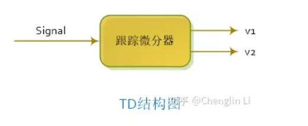

**输入**

- **期望信号（设定值）**：比如我们的期望输出电压

**输出**

- **平滑的期望轨迹**：TD生成的平滑轨迹，使得系统能够跟踪期望信号而不会出现突变
- **期望轨迹的导数：**期望电压的变化率

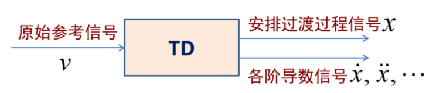

通过TD，依据微分输出与最速综合函数，可以来安排过渡过程

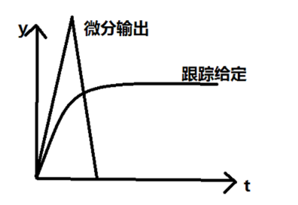

**特点：**

- 使**误差反馈增益和误差微分增益**选取范围扩大
- 使**给定的反馈增益所适应的对象参数**范围扩大

**数学表达形式**

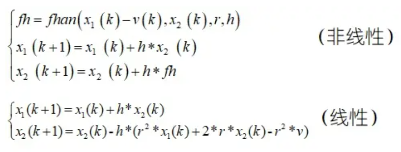

​	r： 跟踪速度因子；它与跟踪速度正相关，但是过大会放大噪声，因此引入滤波因子h   对噪声进行抑制，h越大滤波效果越强

#### **扩张状态观测器（ESO)**

**状态观测器**

​	根据测量到的系统输入（控制量）和系统输出（部分状态变量或状态变量的函数）来确定系统所有内部状态信息的装置就是状态观测器

​	ADRC是一种单输入单输出的控制，因此只能适用于**非耦合**的情况，（非耦合可以理解为独立性，互不影响）

​	如何理解ESO哩，对控制过程中真实存在的扰动进行补偿，达到抗干扰，鲁棒性好，对模型依赖性降低的效果，所谓扩张，则是将扰动项视为新的状态变量，所以是对状态向量的一种扩张

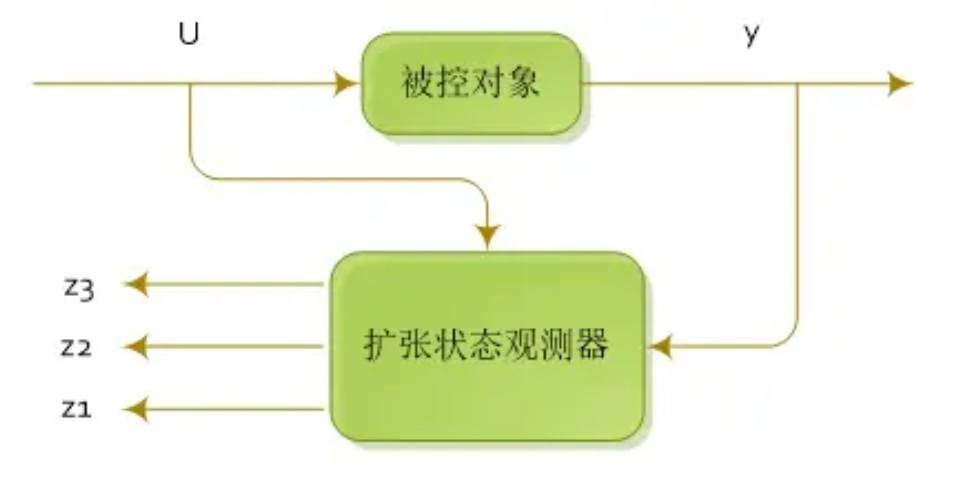

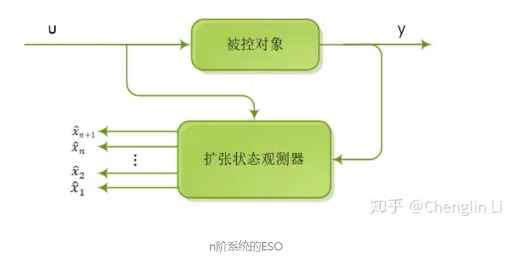

对于以下二阶系统：
$$
\begin{aligned}&x_{1}^{\prime}=x_{2}\\&x_{2}^{\prime}=f(x_1,x_2)+bu\\&y=x_1\end{aligned}
$$
我们将耦合项$f(x_1,x_2)$看作扰动，将其扩张为新的状态变量$x_3$故有如下式子：
$$
\begin{aligned}
&x_1^{\prime} =x_{2} \\
&\text{.} x_{2}^{\prime}=x_{3}+bu \\
&x_3^{\prime}=w(t) \\
&y=x_{1}
\end{aligned}
$$
对于这样的系统，ESO的形式如下：
$$
\begin{aligned}
&e_1=z_1(k)-y(k) \\
&z_1(k+1)=z_1(k)+h(z_2(k)-\beta_1e_1) \\
&z_2(k+1)=z_2(k)+h(z_3(k)-\beta_2fal(e_1,\alpha_1,\delta)) \\
&z_3(k+1)=z_3(k)-h\beta_3fal(e_1,\alpha_2,\delta)
\end{aligned}
$$
另一文中写到：
$$
\begin{aligned}&e=z_1-y,fe=fal(e,0.5,\delta),fel=fal(e,0.25,\delta)\\&z_1=z_1+h\left(z_2-\beta_{01}e\right)\\&z_2=z_2+h\left(z_3-\beta_{02}fe+bu\right)\\&z_3=z_3+h\left(-\beta_{03}fe1\right)\end{aligned}
$$
​	参数$\beta_{01},\beta_{02},\beta_{03}$是由系统所用采样步长来决定的不管什么样的对象，采样步长一样，都可以用相同的$\beta_{01},\beta_{02},\beta_{03}$

对于**ESO的参数整定**方法，有一些经验公式：
$$
\beta_{01}=\frac1h,\beta_{02}=\frac1{3h^2},\beta_{03}=\frac2{8^2h^3},\beta_{04}=\frac5{13^3h^4},\cdots 
$$

#### 非线性反馈控制器

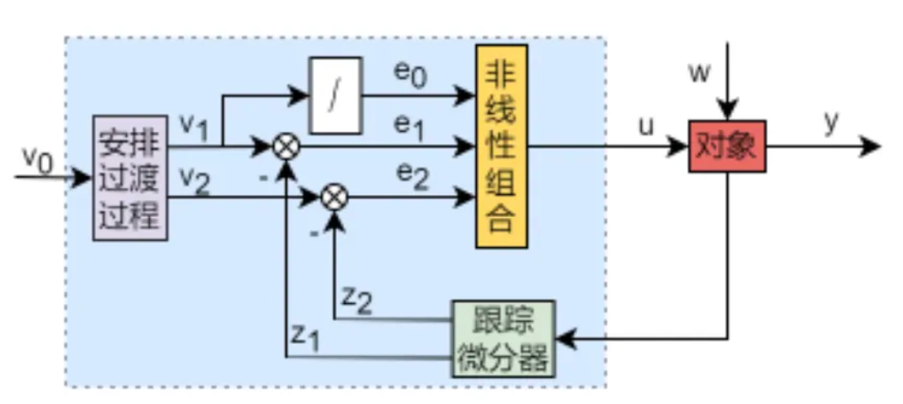

所以这里其实是又回到PID控制了，只不过e~1,2,3~发生了变化，过渡过程产生的误差信号$e_1=v_1-z_1$；误差微分信号：$e_2=v_2-z_2$ ，及根据误差信号生成的积分信号：$\mathrm{e}_0=\int_0^te_1(\tau)d\tau $；只不过这里结合的时候不是采用的线性组合，通常采用的非线性组合有如下两种形式：
$$
u_{0}=\beta_{0}fal\left(e_{0},\alpha_{0},\delta\right)+\beta_{1}fal\left(e_{1},\alpha_{1},\delta\right)+\beta_{2}fal(e_{2},\alpha_{2},\delta),\alpha_{0}<0<\alpha_{1}<1<\alpha_{2}\\u_{0}=k_{0}e_{0}-fhan\left(e_{1},ce_{2},r,h\right)
$$
其中
$$
fal(e,\alpha,\delta)=\begin{cases}|e|^\alpha\operatorname{sign}(e),|e|>\delta\\\frac{e}{\delta1-\alpha}&,|e|\leq\delta\end{cases}\\\begin{cases}d=rh^2\\a_0=hx_2\\y=x_1+a_0\\a_1=\sqrt{d(d+8|y|)}\\a_2=a_0+\operatorname{sign}(y)\left(a_1-d\right)/2\\fsg(y,d)=(\operatorname{sign}(y+d)-\operatorname{sign}(y-d))/2\\a=(a_0+y-a_2)fsg(y,d)+a_2\\fsg(a,d)=(\operatorname{sign}(a+d)-\operatorname{sign}(a-d))/2\\\mathrm{~fhan~}=-r\left(\frac ad-\operatorname{sign}(a)\right)f\operatorname{sg}(a,d)-r\operatorname{sign}(a)&\end{cases}
$$
由于ADRC具有扰动估计能力及较强的抗干扰性，所以无需依赖积分补偿来消除扰动的影响。故积分项可不添加
$$
u_0=\beta_1fal\left(e_1,\alpha_1,\delta\right)+\beta_2fal(e_2,\alpha_2,\delta),\alpha_0<0<\alpha_1<1<\alpha_2\\u_0=-fhan\left(e_1,ce_2,r,h\right)
$$
将ESO估计的扰动$z_3$补偿到控制器的输出$u_0$上，b是控制器的增益，可得到以下两种形式：
$$
u=u_0-\frac{z_3}b\\u=\frac{u_0-z_3}b
$$
最终跟踪微分器（TD），扩张状态观测器（ESO），非线性反馈控制器组成了ADRC算法：

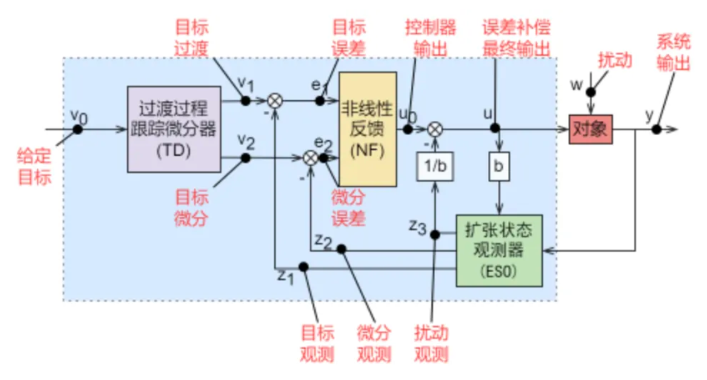

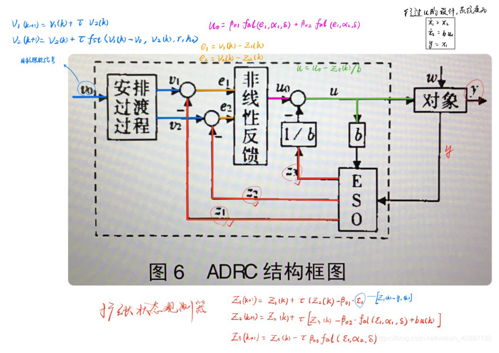

#### ADRC的一些问题与局限性

##### TD的局限性

**线性TD**的本质其实就是一个阻尼比为1的标准二阶系统，并且没有任何零点。对于一个标准的二阶系统，将其写成状态空间的形式，其中的两个状态就分别对应为滤波后的输入以及滤波后输入的微分

**TD减小超调的原因**

​	闭环系统超调的本质原因，其实可以总结为以下两点：

- 系统相位裕度不足，即开环系统在截止频率（开环增益0dB）处的相位滞后太多，导致系统阻尼太小，从而引起超调
- 尽管系统具有足够的相位裕度，但是某些高频模态引起的振荡也会造成超调

**TD的局限性1：减小超调**

​	因为采用了二阶系统，并且没有零点，必然导致有较大的相位滞后，从而会降低响应速度。

**TD的局限:2：作为滤波器（微分器）**

​	TD作为滤波器的一大缺陷就是难以接受的相位滞后。

##### ESO的局限

​	太多字了，不想看了https://zhuanlan.zhihu.com/p/156228260?utm_id=0