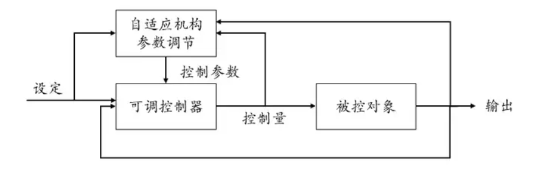
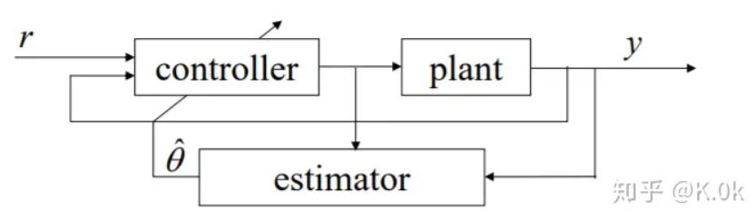
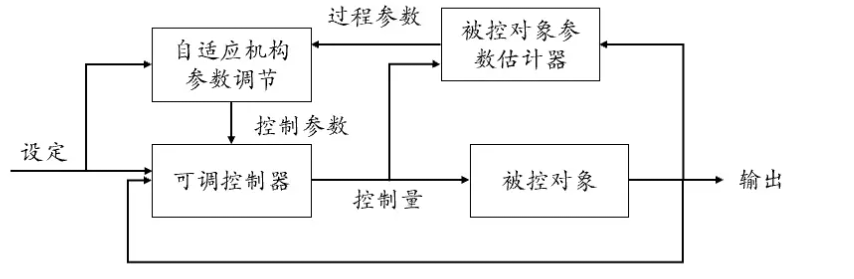
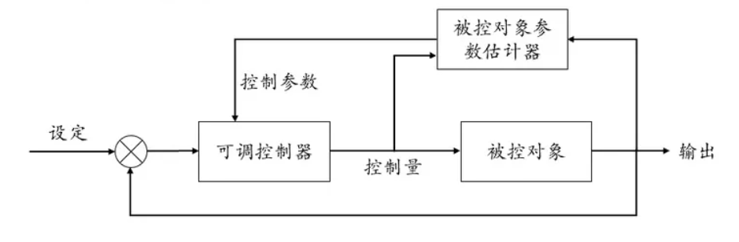
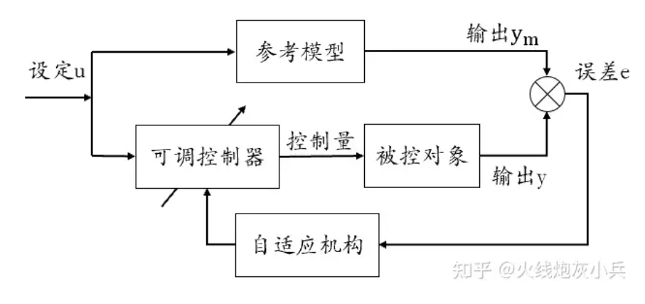
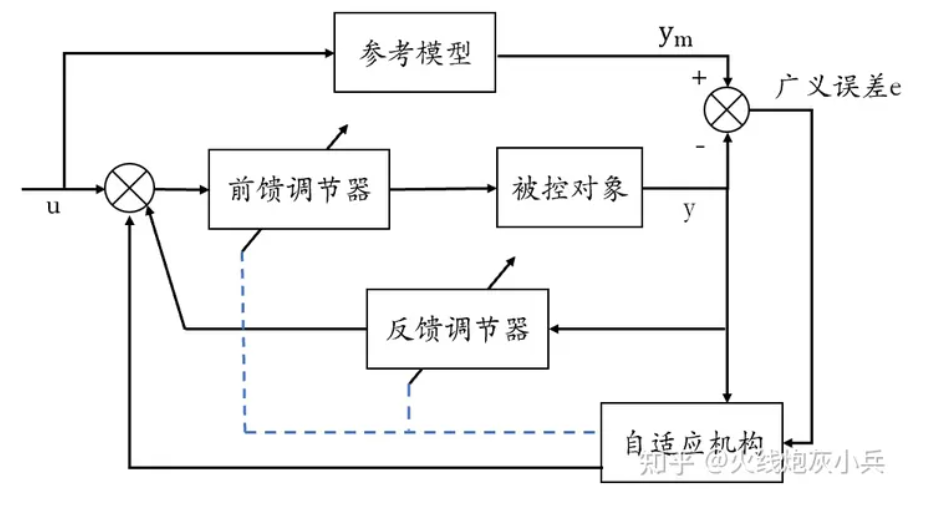
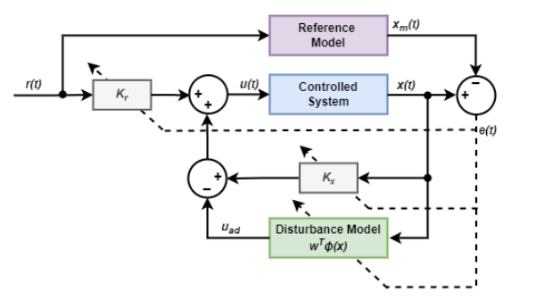
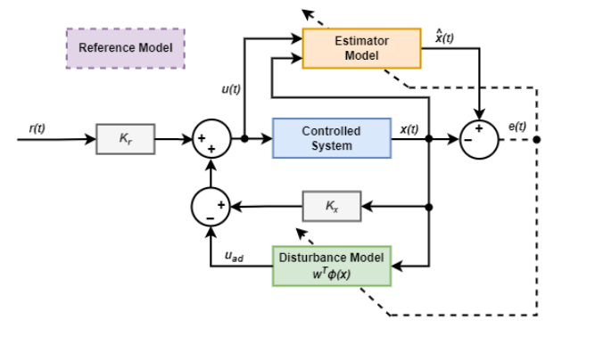

## 自适应控制

#### 什么是自适应控制	

​	自适应控制（APC）是一种带有在线参数识别的控制方法，自适应控制可以看做是一个  **能根据环境变化**  **智能调节自身特性**  的**反馈控制系统**。

​	自适应控制的研究对象是具有不确定性的系统。能**修正自己的特性**以适应对象和扰动的动态特性的变化；**不确定系统**：数学模型不完全确定的系统，阶次确定参数1不确定，或者阶次参数都不确定，这种不确定性有时表现在内部，有时表现在外部

- 内部不确定：结构或参数不能确切知道，如散热系统，化学反应速度
- 外部不确定：工序改变，环境改变，静摩擦，随机干扰

**自适应控制要解决的问题**

​	面对的这些客观的各式各样的不确定性，**如何综合出适当的控制规律，使得某一性能指标达到最优和次最优**，

**核心思想**

​	通过在线估计系统不确定参数并及时调整控制系数来实现系统的稳定控制，简而言之，**自适应控制是一种带有在线参数识别的控制方法。**

**核心概念**

- **系统不确定性：**在实际应用中，系统的参数通常是不确定的，APC的目标就是在面对这种不确定的情况下实现系统的稳定控制
- **在线估计：**通过在线估计不确定参数的值来实现系统控制。这种估计方法通常是基于观测值和系统模型的预测，并使用某种优化方法来更新估计值
- **控制系数调整：**控制系数通常是根据不确定参数的估计值来调整的。这种调整方法通常是基于某种优化目标，例如最小化控制误差或最小化控制能量
- **稳定性验证：**通过验证系统在不同参数情况下的稳定性来确保系统的稳定控制。这种验证方法通常是基于某种稳定性分析方法，例如R-H准则（劳斯-赫尔维茨稳定性判据）或Bode图分析

**分类**

​	主要可以分为模型参考自适应控制（MRAC）、自校正控制器（STC）、参数自适应控制（PAC）、智能自适应控制系统（专家控制、模糊控制、神经网络控制、遗传算法等）

#### 自校正控制器（STC）

在线参数估计--->控制器改变

​	外环为一个控制器参数估计器，控制根据历史数据估计未知参数然后再设计控制器的为**间接校正控制系统**；直接根据历史数据估计控制器参数的为**直接自校正控制系统**

可调节器接收：测量输出、设定输入以及自适应机构提供的参数估计

自适应机构（参数调节器）接收：测量输出、设定输入以及控制量进行参数估计

可以将STC看做是参数估计器+控制器

常见的参数估计器可利用如下方法构成：递推最小二乘法（RLS）、快速仿射投影算法（FAP）、最小均方误差（MSE）、卡尔曼滤波（KF）、扩展卡尔曼滤波（EKF）。

构成STC的常见控制器：比例积分微分控制器（PID）、滑模控制（SMC）、模糊控制、神经网络、遗传算法、预测控制（PC）、二次型最优控制（LQR）、时间延迟控制（TDC）、基于不确定扰动估计器（UDE）的控制器。

**间接自校正控制**

​	”参数估计器“先辨识被控对象（过程）参数

**直接自校正控制**

​	“控制器参数计算器”直接可以估计可调控制器参数

​	参数估计方法：最小二乘法，随机逼近法，极大似然法

​	控制策略：极点配置、PID、最小方差

#### 模型参考自适应控制MRAC

自适应率--->控制器改变

​	在该控制框架中，可以人为构造一个所谓的“参考模型”，用以表征希望的闭环系统控制性能。而模型参考自适应控制则是希望求得一种动态调整的反馈控制律，使得系统的闭环控制性能与参考模型的性能可以保持一致。 

**自适应机构的作用**：调节控制器的参数使误差e减小直至为零时停止调节

**自适应机构设计方法：**基于稳定性理论的方法和局部参数最优化方法

系统由参考模型、可调系统、自适应机构三部分构成。

- 可调系统包括被控对象、前置控制器和反馈控制器。
- 参考模型实际上是一种理想控制系统，其输出代表了期望的性能。
- 当参考模型与实际被控对象的输出有差异时，经比较器检测后，通过自适应机构做出决策，改变调节器（包括前置和反馈控制器）参数或生成辅助输入，以消除误差，使过程输出和参考模型输出一致。

**分类**：直接模型参考自适应控制(直接估计控制器参数)、间接模型参考自适应控制(先估计模型参数，后调整控制器参数)

##### 关于模型参考自适应控制系统的假定

- 参考模型是时不变系统
- 参考模型和可调模型是线性的，有时为了分析方便，还假设它们的阶次相同；
- 广义误差可测
- 在自适应控制过程中，可调参数或辅助信号仅依赖于自适应机构

##### 基于局部参数最优化的设计方法（MIT方案）

​	局部参数最优化方法的**设计思想：**系统包含若干可调参数，当被控对象的特性受外界干扰而变化时，自适应机构对这些可调参数进行调整，以补偿外界环境或其他干扰对系统性能的影响，从而逐步使得参考模型和控制对象之间的广义误差所构成的性能指标达到或接近最小值。

​	因此它的设计原理就是构造一个**由广义误差和可调参数组成的目标函数**，并把它视为可调参数空间的一个超曲面，利用参数最优化方法使这个目标函数逐渐减小，直至目标函数达到最小火位于最小值的某个领域为止

**MIT法则特点**

- 使用的是输出偏差e，而不是状态偏差，所以自适应率所需要的信号都是容易获取的
- 设计过程并未考虑稳定性问题，在得到自适应率后需要进行稳定性校验，以保证误差e在闭环回路中能收敛于某一容许值
- 对于一阶系统，按照MIT法则设计的闭环自适应系统总是稳定的，跟踪速度或者自适应速度是按照指数规律进行的，理论上仅当时间趋于无穷时误差才为0，所以实际中并不要求e完全为0，当$|e|\leq\delta $时，认为系统就跟踪上参考模型了，在此意义上，自适应调节时间是有限的

##### 直接MRAC

**间接MRAC**

**参考模型的设计**

假设被控对象的状态方程和输出方程如下所示：
$$
\begin{aligned}&\dot{x}(t)=Ax(t)+Bu(t)\\&y(t)=x(t)\end{aligned}
$$
那么参考模型的状态方程和输出方程可构造为如下所示：
$$
\begin{aligned}&\dot{x}_m(t)=A_mx_m(t)+B_mc(t)\\&y_m(t)=x_m(t)\end{aligned}
$$
**自适应律的设计（重头戏）**

​	控制器$u(t)$方程可以表示为：$u(t)=ac(t)+bx(t)$，然而参数$a、b$未知

​	由于控制器$u(t)$中的参数啊，b未知，便有了自适应率的出现。自适应率的设计目的就是为了在线辨识出控制器中的两个未知参数。自适应率的设计一般可以分为两种方法，梯度法和稳定性理论分析法。

**方法1： 梯度法（MIT rule)**

​	假设 MRAC控制器中含有一个未知可调节的参数${\boldsymbol{\theta}}$,定义参考模型和被控对象的状态变量偏差如下：$e=x_m-x$，目标是通过调节参数${\boldsymbol{\theta}}$来令偏差$e$最小，即$e\to0$。

这里引入一个损失函数：$J=\frac12e^2$

如果令$e\to 0$，则$J\to 0$。也就是需要求得$J$的最小值

于是采用**梯度下降算法**即**沿着$J$的负梯度方向变化参数${\boldsymbol{\theta}}$，（由于梯度的正方向是损失函数$J$上升最快的方向，我们要最小化$J$,即让参数沿着梯度相反的方向前进一个步长，因此参数${\boldsymbol{\theta}}$变化的反方向与$J$的负梯度方向一致，可以获得$J$的极小值）即：
$$
\Delta\theta=-\kappa\frac{\partial J}{\partial\theta}=-\kappa e\frac{\partial e}{\partial\theta}\\\dot{\theta}=-\gamma\frac{\partial J}{\partial\theta}=-\gamma e\frac{\partial e}{\partial\theta}
$$
其中，$\Delta\theta $为两个步长的差值，$k$为学习步长，$\gamma $为调整速率。上式中第二行也可被单独成为MIT rule

**方法2：稳定性理论分析法（李雅普诺夫第二法，波波夫超稳定性法）**

