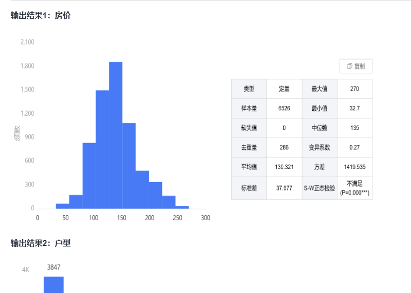

## 数据分析--01. 描述性分析

### 频数分析

​	分类为a,b,c,d,,看每个类别出现的频次

### 列联（交叉）分析

​	用于描述两个或多个分类变量之间的关系，

例如在市场调研中，用于分析不同消费者群体对产品偏好的差异；在医学研究中，用于探索不同治疗方法在不同人群中的效果；在社会科学研究中，用于分析社会群体中不同特征的分布和关联。

### 描述性统计

​	比如找一群数据的，最大，最小，平均，方差等等

### 分类汇总

​	在分类完成的基础上对各类别相关数据分别进行求和、求平均数、求个数、求最大值、求最小值等方法的汇总。

### 正态性分析

​	一种对称的概率分布，其特点是均值、中位数和众数相等，而且数据围绕均值对称分布，形成一个钟形曲线。

​	许多经典的推断统计方法，如 t 检验、ANOVA（方差分析）、线性回归等，都基于数据服从正态分布的假设。

### 数据概述

