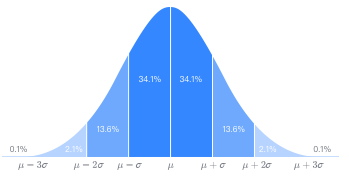
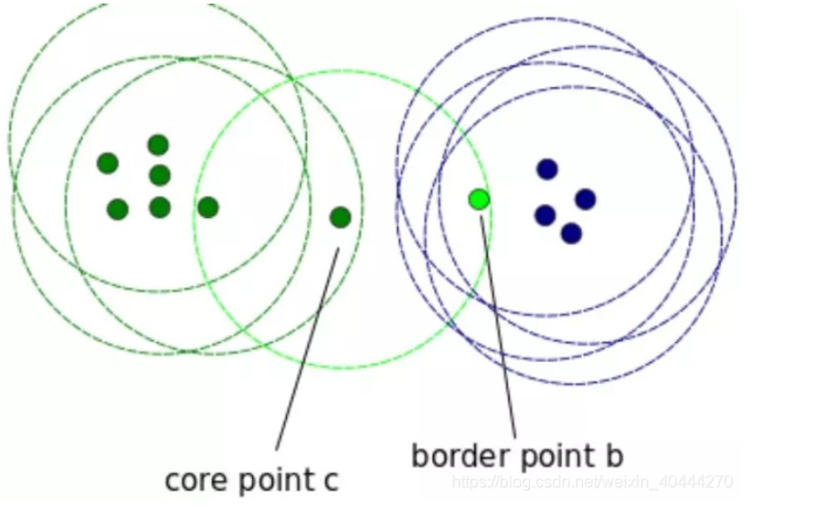
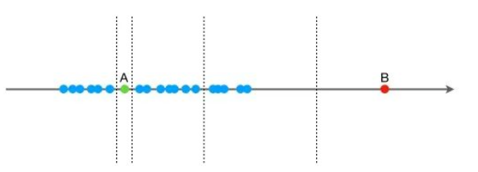

## 数据处理

### 数据标签

​	男为0，女为1，数字化处理

### 数据编码

​	0-100的数，规定50以下为0,50以上为1，将变量数再次编码，进一步浓缩整合

### 异常值处理

- 3σ准则的，超过这3σ就属于异常值了，进行置空或者填补为其他有效值
  - 
  - **前提**：数据分布需要服从正态分布或者近似正态分布
  - 若不服从正态分布，可以使用原理n倍标准差来描述
- 基于聚类的异常检测
  - 一个对象是基于聚类的离群点，如果该对象不属于任何簇，那么该对象属于离群点
  - **DBScan**
  - 
- 孤立森林
  - 一种无监督学习算法，属于组合决策树，
  - 先在最大，值和最小值之间随机选择一个值 X，然后按照 <X 和 >=X 可以把数据分成左右两组，在这两组数据中分别重复这个步骤，直到数据不可再分。
  - 相对聚集的点需要分割的次数较多，比较孤立的点需要的分割次数少，孤立森林就是利用分割的次数来度量一个点是聚集的（正常）还是孤立的（异常）。
  - 

### 数据标准化处理

- **量纲化**
  - 1-10跟1000-10000，感觉可以理解为归一化
- **一致性**
  - 正向评价指标跟负向评价指标不能直接相加，取反或其他方法进行一直化处理

### 虚拟变量转换

​	常用在回归分析中

- 将类别进行0 1 变换
- **哑变量化** 比如有三种，那么第三种就是哑变量的参考，前两者都为0则是第三者

### 特征筛选

​	降维

### 特征降维

​	将多维数据合并为更少维度的数据集

### 缺失值处理

​	空缺的用中位补

### 时序数据滑窗转换

- 将**连续的时间数据**分割成多个**小窗口**的方式，就像你从一段长视频中截取多个小片段一样。通过这些“窗口”，我们可以用过去的一段时间的数据，预测未来的一个或多个时间点。

### 样本均衡

​	某一类别有995个数据，另一类别有5个数据时，此时属于严重的数据样本分布不均衡，模型很难从中提取规律，所以当发现样本不均衡时，需要做样本均衡处理，通过以下三种方法使得因变量不同类别的样本数量相差不大：

1. 过采样（oversampling）即增加样本量较少的类别样本；
2. 2.欠采样（undersampling）即减少样本量较多的类别样本；
3. 3.混合采样（mixed sampling），即结合过采样和欠采样的方法调整两类别的样本数量。

### 缩尾截尾处理

​	对变量数值进行从小到大排列后，处理超出变量特定百分位范围的数值（被称作极端值）。缩尾是将这些极端值替换为其特定数值，截尾是直接删除这些极端值。

### 数据变换

​	对原始数据进行转换或处理

- BOX-Cox变换，让数据分布服从正态分布
- 小波变换， 减少数据噪声