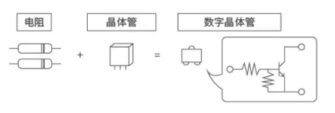
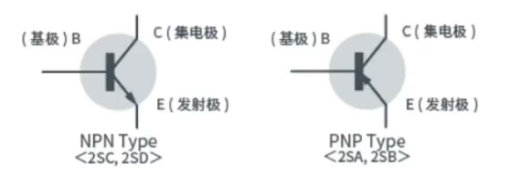

## 01 晶体管的由来及内置电阻晶体管

#### 材料

​	从锗（80℃左右发生损害）到硅（180℃）

#### 作用

​	**增幅**和**开关**

​	增幅：不改变输入信号的波形，只**放大**电压或电流，指模拟信号

​	开关：在数字信号中，晶体管起着切换0和1的开关作用

#### 集电阻和晶体管于一体

​	数字晶体管即内置了电阻的晶体管

**优点：**

- 安装面积减少
- 安装时间减少
- 部件数量减少

#### 基极是自来的阀门，发射极是配管，集电极是水龙头

​	通过微小之力（基极的输入信号）来控制自来水的阀门，从而调节水龙头喷出巨大的水流（集电极电流）

​	**放大+电流型器件**