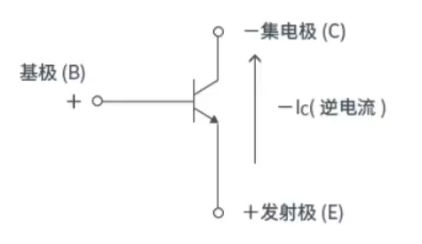
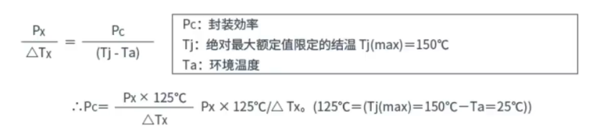

## 02.晶体管截止频率定义和反向漏电流

#### 关于晶体管ON时的逆向电流（E--->C）

这个对于**NPN型**的来说，E-C是逆向的，

​	基极B被偏置为正，集电极C被偏置为负，由发射极流向集电极的是**逆电流**

**逆向晶体管的特点：**

- 放大倍数低h（正向10%一下）
- 耐压低（7..8V与Vebo的导通电压一样低）
- Vce（sat）饱和电压跟Vbe（ON）导通电压没有太大变化

#### 关于封装攻略容许功耗

**定义：** 由于输入晶体管的电压，电流产生的功耗在元件发热时，结温Tj为绝对最大额定值限定的温度（Tj=150℃）时的功率

#### 晶体管的速度

**fT：增益带宽积、截止频率、开关速度**

​	**增益带宽积** 指晶体管能够动作的极限频率，所谓极限，即基极电流对集电极电流的比（放大倍数）为1的情况

提高基极输入频率，则hfe放大倍数变低

这时，hfe为1的频率较多fT，指在该频率下能够工作的极限值

但是实际使用时能够动作的只有fT的1/5to1/10

