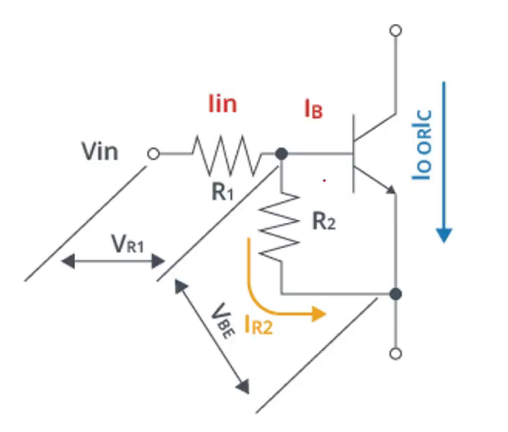
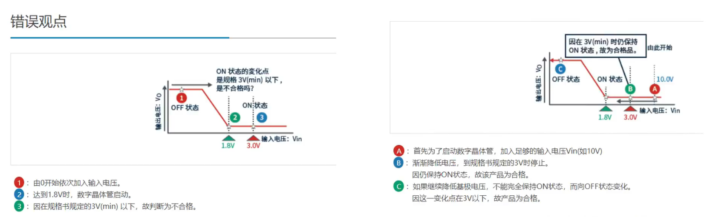
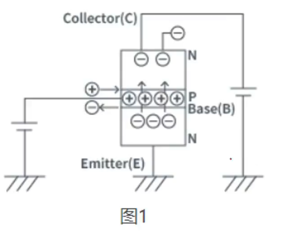
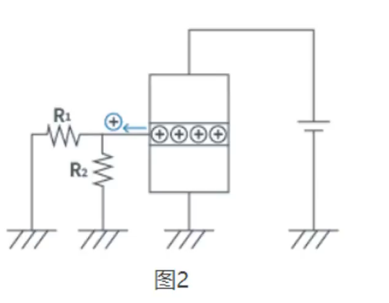
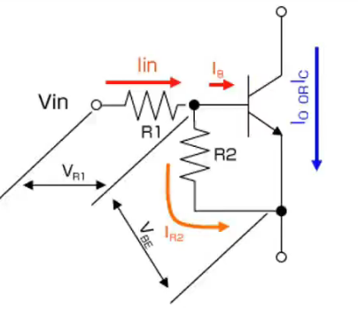
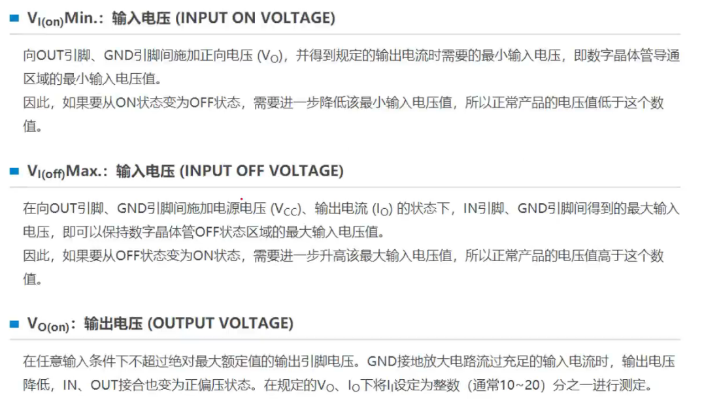
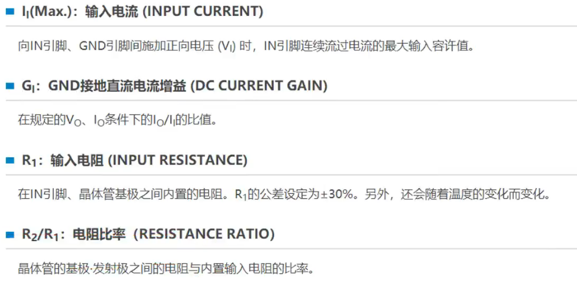

## 04+05.数字晶体管的原理

这就是数字晶体管，里面加了俩内置电阻，（TR指的是晶体管，中间是集电极B，下面是发射极E，上面是集电极C）

- 饱和条件

  - 要使晶体管达到饱和状态，集电极电流 IC与基极电流 IB的比率设为 20:1。这意味着：

  - $$
    \frac{I_C}{I_B}=20
    $$

- 输入电阻

  - R1 是基极电阻，允许有 ±30% 的容差（30%E-B间的电阻）

  - R2 是电阻分压器的一部分，
    $$
    {R}_2/{R}_1=\pm20\%
    $$

- VBE=0.55-0.75V

**数字晶体管直流电流增益率关系式**
$$
G_1=\frac{\mathrm{Ic}}{(\mathrm{Ic/h_{FE}})+(\mathrm{V_{BE}/R_2})}
$$

$$
\begin{aligned}&\mathrm{G_{1}=I_{0}/lin}\\&\mathrm{h_{FE}=I_{C}/I_{B}}\\&\mathrm{I_{O}=I_{C},~lin=I_{B}+I_{R2},~I_{B}=I_{C}/h_{FE}~,~I_{R2}=V_{BE}/R_{2}}\end{aligned}
$$

电压关系式：
$$
\mathrm{V_{IN}=V_{R1}+V_{BE}}
$$
**集电极电流关系式**
$$
I_{C}=h_{FE}\times((Vin-V_{BE})/R_{1})-(V_{BE}/R_{2}))\cdot\cdot\cdot\odot1
$$

$$
\mathrm{I_{C}=20\times((Vin-V_{BE})/R_{1})-(V_{BE}/R_{2}))\cdot\cdot\cdot2}
$$

​	由上面的比率为20，将第一个式子的hFE换为20/1，得到2.再考虑上偏差，最后根据下面的式子**选择数字晶体管的电阻R1，R2**，使数字晶体管的Ic比使用设备上的最大输出电流Iomax大
$$
\mathrm{lomax\leq20((Vin-0.75)/(1.3\times R_1)-0.75/(1.04\times R_2))}
$$

#### Io跟Ic的区别

- Ic： 能够通过晶体管的电流的最大理论值
- Io： 能够作为数字晶体管使用的电流最大值

#### GI跟hFE的区别

- hFE： 作为晶体管的直流电流增幅率
- GI： 作为数字晶体管的直流电流增幅率

​     都表示发射极接地**直流电流放大率**， 数字晶体管有两个电阻器，但是一般的只有一个R1，根据R1的类型，放大率表示为hFE，在E-B之间附加电阻R2，输入电流则分为流过个别晶体管的电流，和流过E-B间电阻R2的电流，因此放大率比单体下降，称为GI

#### Vi（on）与Vi（off）的区别

- Vi（on）: 数字晶体管为保持ON状态的最低电压，定义Vi（on）为min

#### 关于数字晶体管的温度特性

根据环境温度，VBF, hFE， R1，R2，都会变化，

hFE的温度变化率为0.5%℃

VBE的温度系数约为 -2mv/℃（-1.8 to -2.4mv/℃的范围有偏差）

#### 关于输出电压-输出电流特性的低/小电流区域，输出特性不好

低电流区域输出电压(Vo)/Vce(sat)上升（输出的饱和电压上升）

因此**在低电流区域不能测定Vo**

#### 关于数字晶体管的开关动作

- **晶体管的动作**

  

​	在基极（B）-发射极（E）之间输入正向电压，注入基极电流，也就是B里面注入空穴，那么E的载流子会被吸引至基极B，但是B领域非常薄，因此加入集电极电压，载流子可以穿过B，流向C，电流实现从C到E的移动

- 开关动作

晶体管的动作有增幅/放大作用和开关作用

​	在放大作用中，通过注入基极电流IB，能够通过增幅hFE倍的集电极Ic

​	在放大区域中，通过输入信号持续控制集电极电流，可以得到输出电流

​	在开关作用中，在ON时，电气性饱和状态（降低集电极-发射极间的饱和电压）下使用

#### 关于数字晶体管的用语

