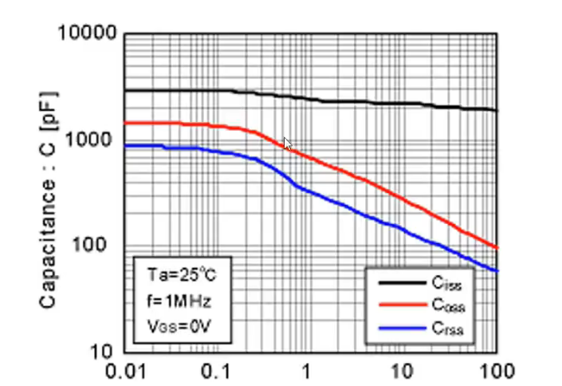
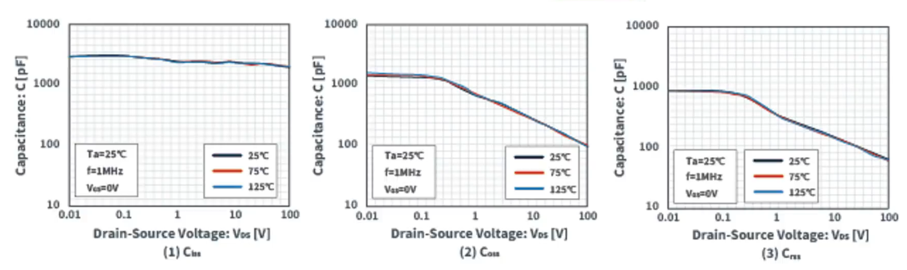
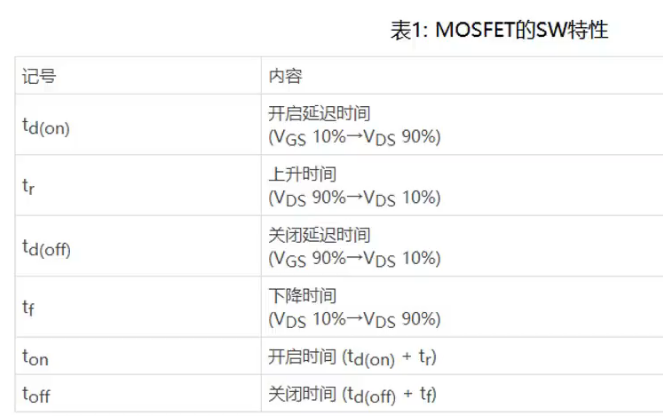
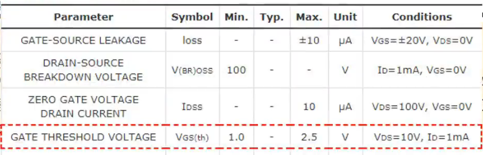
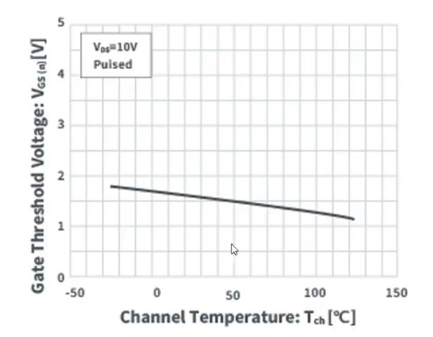
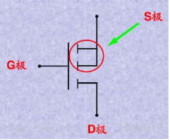

## 06. MOSFET特性简单版，强调温度特性

#### MOSFET特性

**MOSFET寄生电容模型图**

| 符号 | 算式            | 含义     |
| ---- | --------------- | -------- |
| Ciss | Cgs+Cgd         | 输入容量 |
| Coss | Cds（main）+Cgd | 输出容量 |
| Crss | Cgd             | 反馈容量 |

Cgd是反馈电容，Crss称为反向传输电容

Ciss在面对Vds的变化时，反应不是很明显，但是Coss跟Crss会有较大影响

#### 温度特性

​	上面这三个玩意，在面对温度发生改变的时候，基本不受影响

#### 关于MOSFET的开关及其温度特性

**开关时间**

​	栅极电压ON/OFF之后，MOSFET才ON/OFF，这个延迟时间为**开关时间**，一般在规格书上记为下面的

​	（在算一些损耗，阶跃谐振会用到）

**温度特性**

​	温度上升的同时开关时间略微增加，但是100℃上升时增加10%成左右，几乎没有开关特性的温度依存性

#### 关于MOSFET的Vgs（th）（界限值）

​	MOS管开启时，GS（栅极，源极）间的电压称为Vgs（th）

​	即，输入界限值以上的电压时，MOSFET为开启状态。

输入Vds=V时，使1mA电流通过Id所需的栅极界限值电压Id（th）为1.0V to 2.5V

**Id--Vgs特性和温度特性**

​	温度越高，所需导通的阈值电压越低，不太行这玩意

​	可能会误导通

**补充**

- G极(gate)—栅极，不用说比较好认
- S极(source)—源极，不论是P沟道还是N沟道，两根线相交的就是
- D极(drain)—漏极，不论是P沟道还是N沟道，是单独引线的那边
