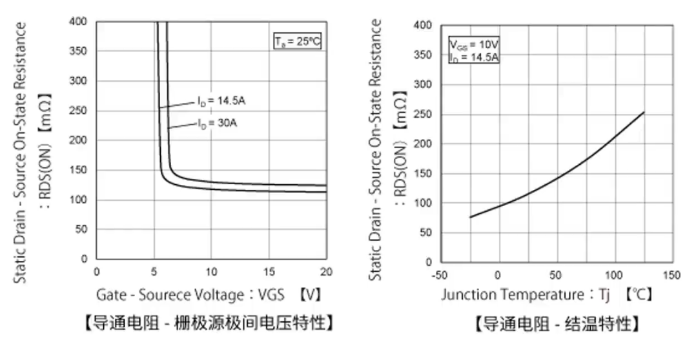

## 0.7 MOSFET导通电阻特性

#### 啥是导通电阻

​	MOS管工作时，漏极跟源极之间的阻值称为导通电阻（RDS(ON))

​	数值**越小**，工作时损耗（功率损耗）越小。

**关于导通电阻的电气特性**

​	晶体管的消耗功率用集电极饱和电压（Vce（sat））乘以集电极电流（Ic）表示

​		（集电极损耗Pc）=（集电极饱和电压Vce（sat））* （集电极电流Ic）

​	MOSFET的消耗功率是用导通电阻（Rds（on））计算的

​	（功率PD） = （导通电阻Rds（on）） * （漏极电流Id）平方

此功率将热量散发出去，MOS管的导通电阻一般在Ω级以下，与一般的晶体管相比，消耗功率小，即发热小，散热策略简单

- 栅极源极之间的电压Vgs越高，导通电阻越小
- 栅极源极间电压相同的条件下，导通电阻因电流不同而不同
- 计算功率损耗时，需要考虑栅极源极间电压和漏极电流，选择合适的导通电阻
- 导通电阻因温度变化而变化，是个正温度系数，但是有个潜在的好处-->多个mos管的并联时实现自动均流，

**导通电阻比较**

​	一般MOS的芯片尺寸（表面面积）越大，导通电阻越小。

​	选择更大尺寸的封装，导通电阻会更小
