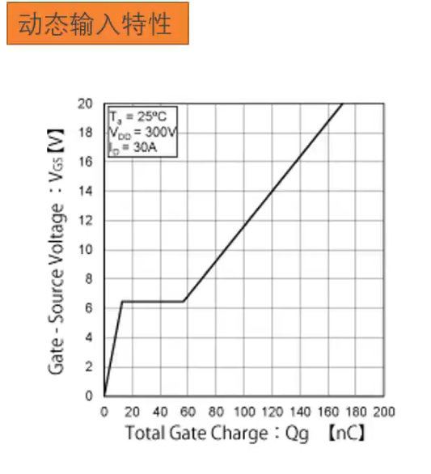
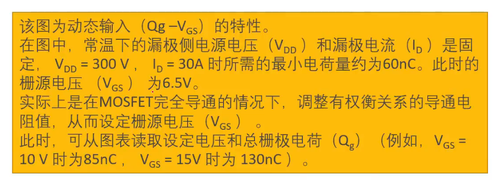

##  08. MOSFET总栅极电荷Qg

 #### 啥是总栅极电荷（Qg）

​	Qg是指： 为导通MOS而注入到栅极电极的电荷量。也称为栅极总电荷，单位为库仑(C)

​	总栅极电荷值较大，则导通MOS所需的电容充电时间变**长**，开关损耗增加，数值越小，开关损耗（切换损耗）越小，从而可实现高速开关。

#### 总栅极电荷和导通电阻

​	**总栅极电荷**越小，开关损耗越小。而且，**导通电阻值越**小，工作时的功耗越小。

​	但需要注意的是，这俩的特性处于**权衡**关系，MOS的芯片尺寸（表面积）越小，总电荷量越小，但导通电阻值会变大，换句话说： **开关损耗与工作时的功耗之间存在权衡关系**

比较复杂，暂时只要知道这个总栅极电荷与损耗，开关速度有关就行