## 09+10. SOA安全使用晶体管的选定方法

#### 判断流程

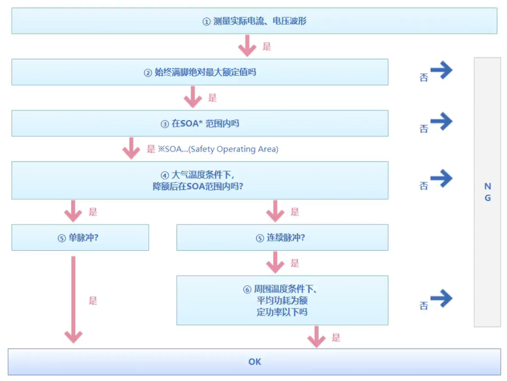

#### 1. 测定实际的电流、电压波形

​	用示波器确定晶体管上的电压电流，需要全部满足规格书上记载的额定值，特别应该确认下列项目

| 晶体管的种类 | 电压                         | 电流             |
| ------------ | ---------------------------- | ---------------- |
| 双极晶体管   | 集电极发射极间电压：V~CE~    | 集电极电流：I~C~ |
| 数字晶体管   | 输出电压：Vo（GND-OUT间电压) | 输出电流：I~O~   |
| MOSFET       | 漏极源极间电压：V~DS~        | 漏极电流：I~D~   |

----

#### 2. 是否一直满足绝对最大额定值

确认‘’[1.测定实际的电流电压](####1. 测定实际的电流、电压波形)‘’中确定的电压，电流是否超过了规格书记载的绝对最大额定值

​	如例1中，未确认的项目全部都需要在绝对最大额定值以下。即是浪涌电流和浪涌电压只在一瞬间超过了绝对最大额定值也不可使用。如果超过绝对最大额定值，有可能会造成破坏和劣化

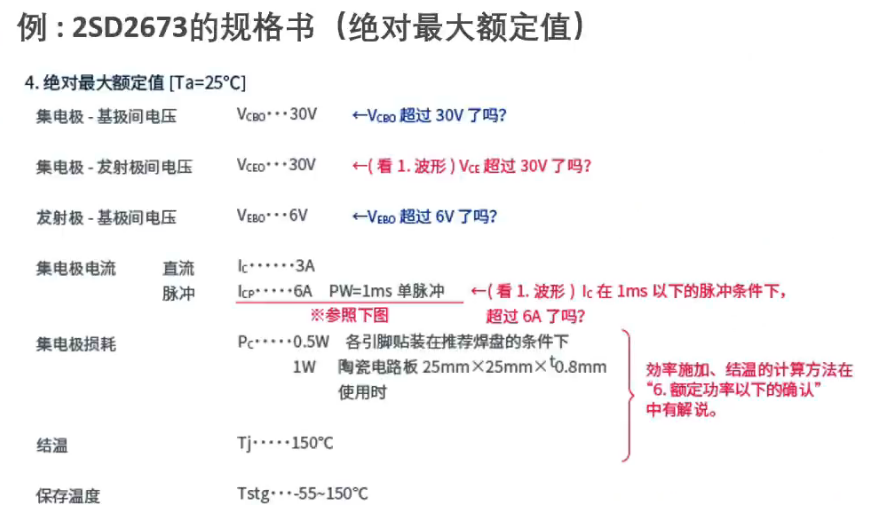

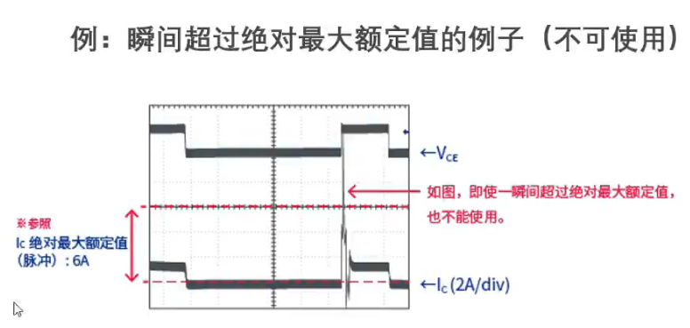

#### 3. 是否在SOA范围内

​	确认安全工作区域（SOA）

​	**安全工作区域（SOA）** 表示晶体管可安全工作的区域

​	不过，SOA只是关于1脉冲的数据，在脉冲反复混入时，需要所有脉冲都进入SOA范围内， 并且通过 ‘’[4.确认安全工作区域（SOA）2](####4. 在使用环境温度下是否在下降的SOA范围内)‘’计算的平均施加功率在额定功率以下

​	SOA安全工作区域的简称，有时也称ASO

**SOA确认方法**

​	确认‘’[1.确认电流、电压](####1. 测定实际的电流、电压波形)‘’中确认的波形是否在SOA范围内，即使浪涌电压电流只在一瞬间超出也不行，另外注意，即使在‘’[2.确认绝对最大额定值](####2. 是否一直满足绝对最大额定值)‘’中确认的绝对最大额定值的范围内，有时也会超出SOA范围

#### 4. 在使用环境温度下是否在下降的SOA范围内

​	（按照使用环境温度或因晶体管发热温度上升时的元件温度来考虑）

由于通常的SOA是在常温（25℃）下的数据，所以周围温度在25℃以上时，或者因晶体管自身发热元件温度上升时，需要降低SOA的温度

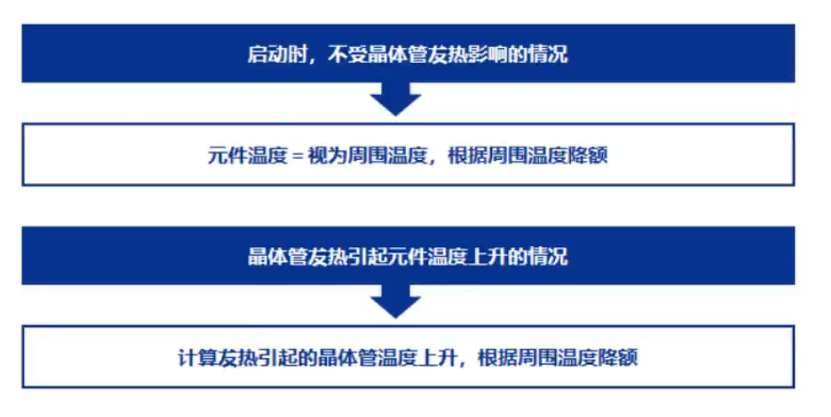

**SOA的温度降低方法**: （降低的温度基本上元件的温度）

**SOA的温度降额方法**

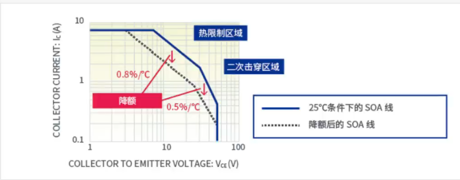

具体的方法就是： 将SOA线平行移向低电流方向。如图所示，下降率根据区域不同而不同

- **1-1 热限制区**
  - 在该区域，SOA线具有45°的倾斜度（功率固定线）
  - 下降率为0.8%/℃
- **1-2 2次下降区域**
  - 晶体管存在热失控引起的2次下降区域
  - SOA线具有45°以上的倾斜度
  - 下降率为0.5%/℃

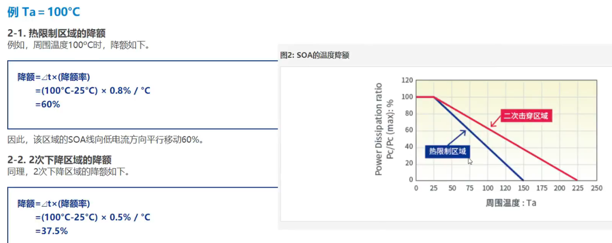

​	因此，该区域SOA线向低电流方向平移37.5%

#### 5. 连续脉冲？单脉冲？

**单脉冲**

​	如同上电和掉电的浪涌电流一样，只发生一次脉冲的情形（无反复脉冲时）称为单脉冲，此时：

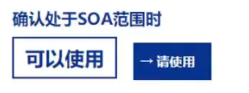

**连续脉冲**

​	将脉冲反复发生的情形称为连续脉冲，此时：

#### 6.平均功耗是否在周围温度的额定功率以下？

​	周围温度的额定功率以下 = 元件温度在绝对最大额定值150℃以下

使元件温度升到150℃的功率定位额定功率，

**功率计算方法**

​	基本上，平均功率是以时间对电流和电压的积进行积分的值除以时间所得的值

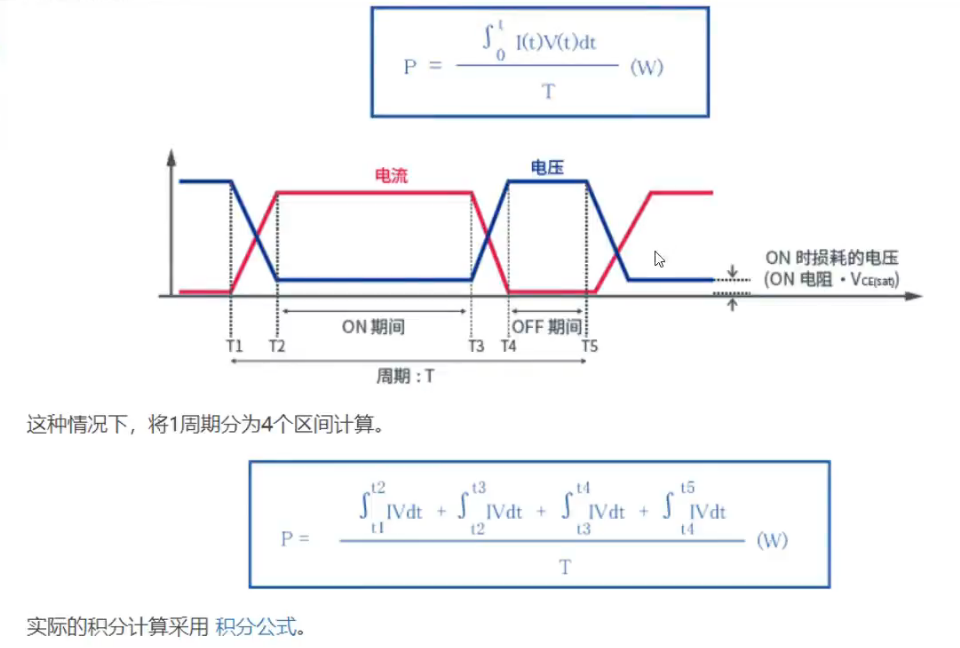

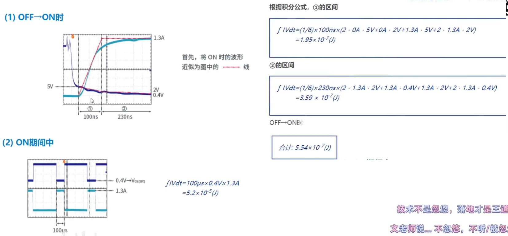

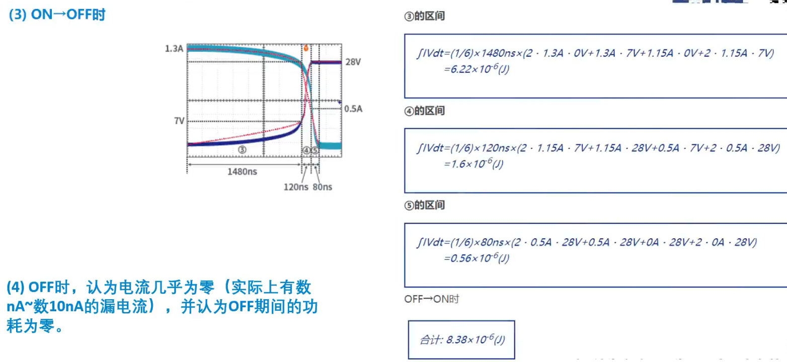

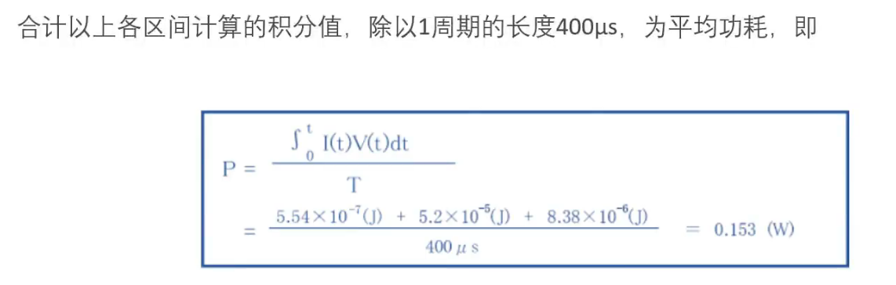

**功率计算的积分公式**---<u>通用，不仅于半导体</u>

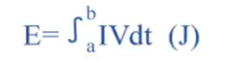