## 运算放大器

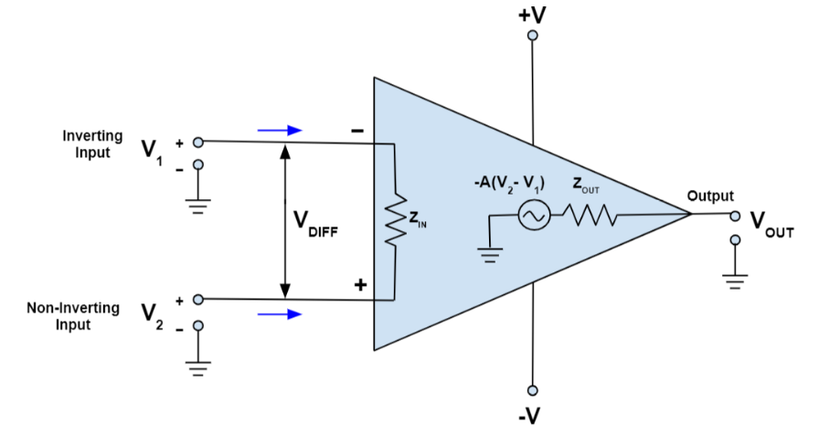

##### 同相？反相？

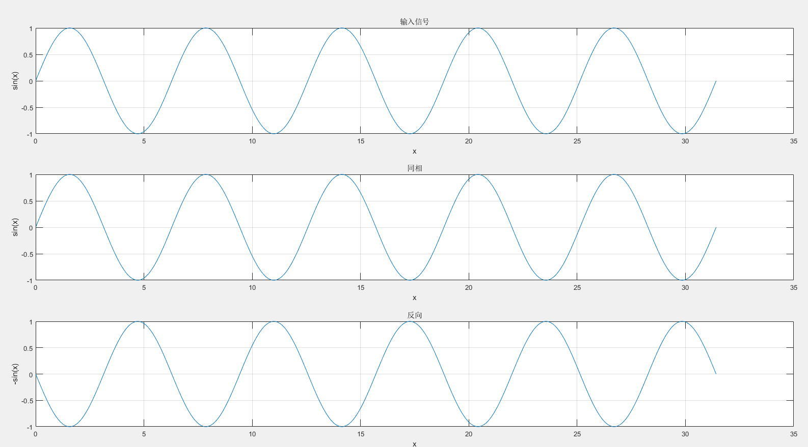

### 了解“虚短”  “虚断”

- 理想运放的输入阻抗无穷大----------虚断
  - 因为无穷大，所以给输入端施加电压，还是没电流，跟断路了一样，但是他又没断，所以叫虚断，
  - 输入两个端口就可以画×了
- 当给运放引入负反馈时，U~n~=U~p~-------虚短
  - 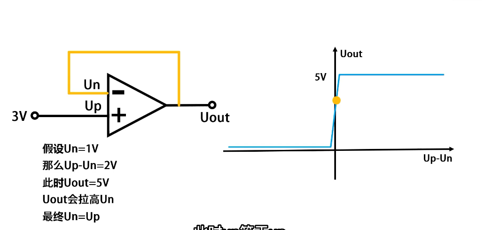
  - 随着反馈，U~p~-U~N~越来越小，最后基本没差，也就是在右侧的图上不断左移，U~n~跟U~out~都在不断修正，最终得到的结果就是U~p~=U~n~;

### 如何理解运放

不接任何反馈: 输出电压只会处于两种状态, 接近供电正电压的高电平或者接近负电压(接地时负电压为0)的低电平

- 如果同相输入(+)电压高于反相输入(-), 输出高电平
- 如果同相输入(+)电压低于反相输入(-), 输出低电平

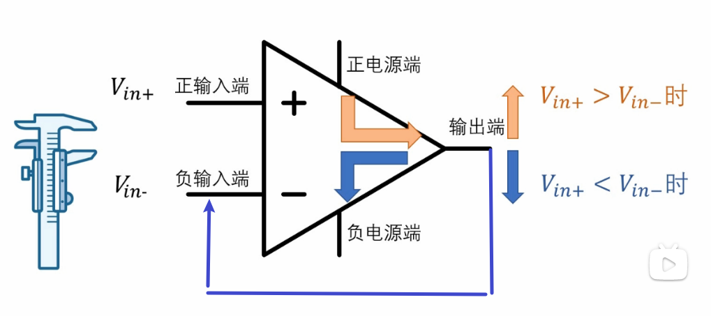

​	反馈接负输入端(存疑，视频里没有反馈，搞不懂)

运放在不断检测正负输入端的电压

- 当正输入端的电压大于负输入端的电压的时候，运算放大器就会尽可能地抬高输出电压，直到正负输入端电压相等或者输出电压无法被继续抬高
- 当正输入端的电压小于负输入端的电压的时候，运算放大器就会尽可能地压低输出电压，直到正负输入端电压相等或者输出电压无法被继续压低

### 运放工作在线性？非线性区域？

判断运放工作区的方法是：

如有负反馈，则工作在线性区；

如有正反馈或者无反馈，则工作在非线性区；

PS：运放处于非线性状态时：虚短不成立，虚断可以使用。

### 运算放大器的应用

##### 同相放大电路

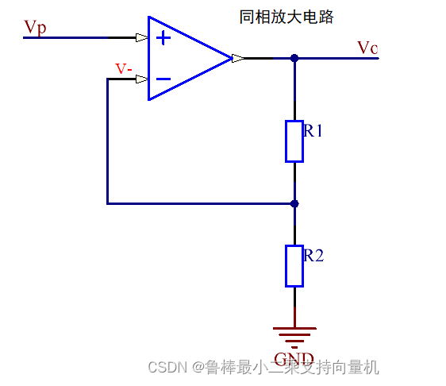

​	因为虚短----->V~P~=V-

​	因为虚断----->输入端没有电流，所以两个电阻串联

​	
$$
I=\frac{V_o}{R_1+R_2}\cdot\cdot\cdot\cdot V_p=V_-=I\cdot R_2\leftarrow 
$$

$$
V_o=\frac{R_1+R_2}{R_2}V_p=1+\frac{R_1}{R_2}V_p
$$

​	输出和输出信号是相位相同。放大倍数由Rg和Rf共同决定。

##### 电压跟随器

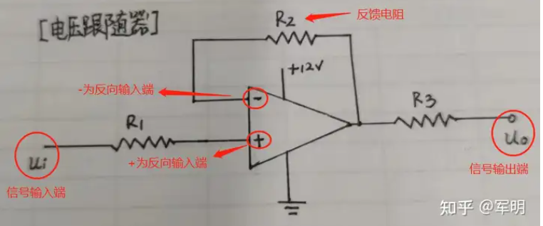

​	输出电压通过反馈电阻（或直接）接到反相输入端，反相输入端不再接地，信号由正向输入端输入

特点：**高阻抗输入，大到兆欧级别，低阻抗输出，低到几欧姆**

作用：**一个是起缓冲作用，前面接高阻抗，后面接低阻抗，二是隔离作用**

​	输入电压与输出电压相同，充当缓冲器，不对信号提供放大或衰减

详解作用：

- 消耗很小的电流
  - 因为它高阻抗呀，电流小
- 适合用于分压电路

##### 反向放大电路

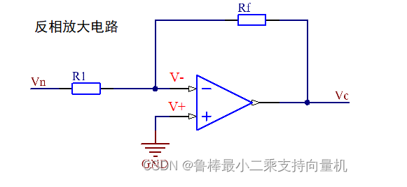

​	因为虚短----->V~P~=V-

​	因为虚断----->输入端没有电流，所以两个电阻串联

​	
$$
I_1=\frac{V_n-V_-}{R_1}\cdot\cdot\cdot\cdot\cdot I_f=\frac{V_--V_o}{R_f}\leftarrow
$$

$$
由I_1=I_f得到  V_0=-\frac{R_1}{R_f}V_n
$$

​	输出和输出信号是相位相反。放大倍数由Rg和Rf共同决定。

##### 加法电路

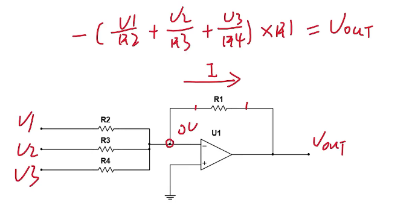

假定四个电阻阻值相同，那么输出电压就等于三个电压之和了，相位相反

**再假定有个R5，给电压限制，只有0跟1V，如图绿色部分，根据电压状态，可以得到下面的表格**

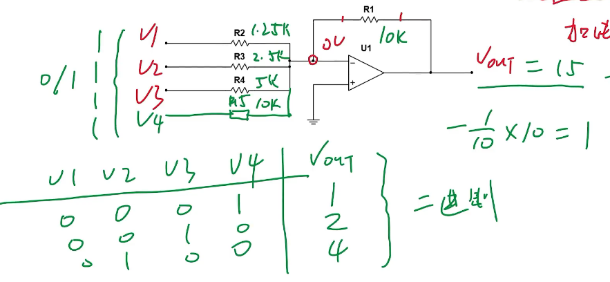

这个表格其实就是数模转换中的DAC

每个信号的放大倍数由反馈电阻Rf与每个输入信号串联的电阻R共同决定。

##### 减法器

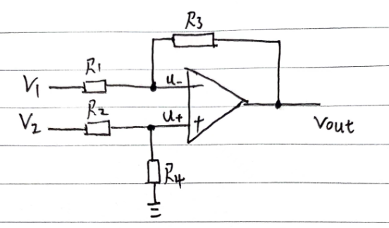

一般R~1~=R~2~=R~A~;    R~3~=R~4~=R~B~

利用叠加定理，将其拆解为反向放大器和同相放大器，最后U~O1~+U~02~即可

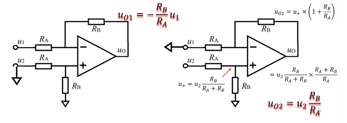
$$
V_{out}=(V_B-V_A)*\frac{R_B}{R_A}
$$

##### 差分放大器

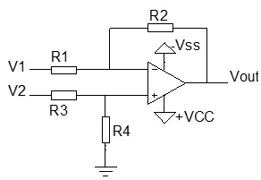

​	它属于是反向比例放大的变种
$$
V_{out}=(\frac{R_1+R_2}{R_3+R_4})\times\frac{R_4}{R_1}\times V_2-\frac{R_2}{R_1}\times V_1
$$
当R~1~=R~3~且R~2~=R~4~时，可以得到下式，可以对差分信号进行放大
$$
V_{out}=\frac{R_{2}}{R_{1}}\times(V_{2}-V_{1})
$$
​	输出信号是输入信号之差。输出信号可先由分压器规则计算同相输入端的电压V+，然后使用同相运放增益公式计算出通相输出电压Vout1。然后在使用反向增益公式计算反向输出级的电压Vout2。最后将两个输出电压相加即可。