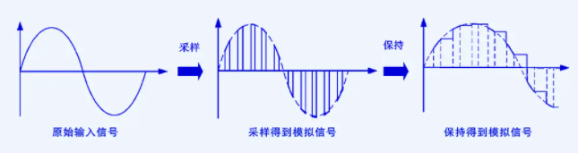
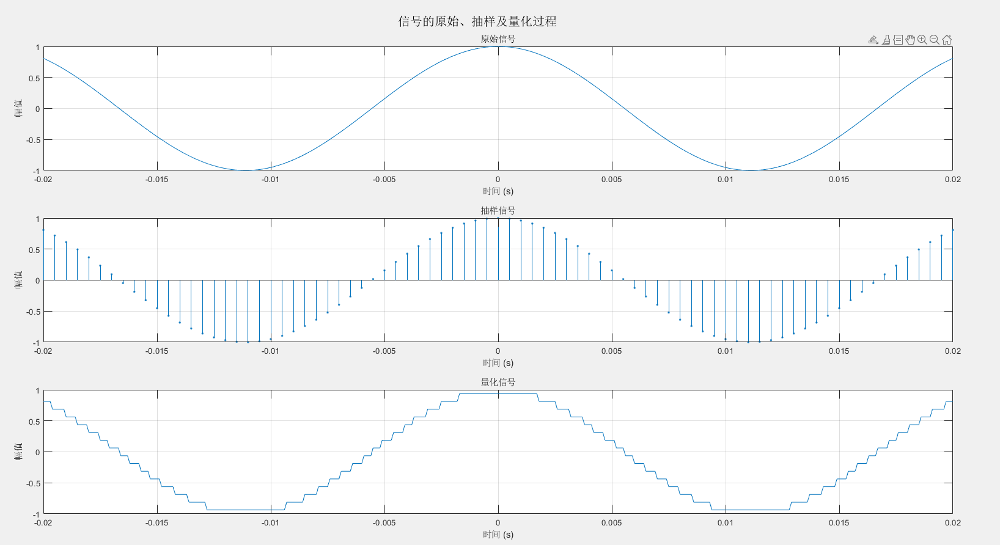
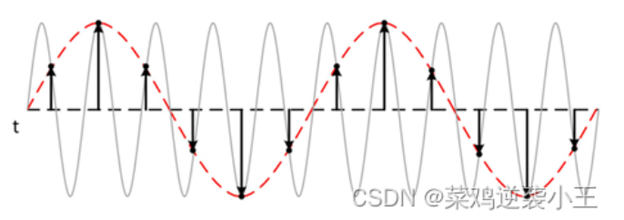
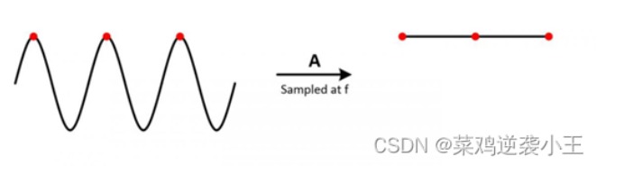
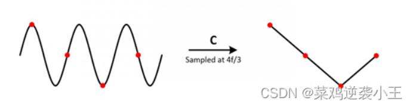

## ADC采样

### ADC采样原理

​	ADC是将模拟信号按照一定的采样频率进行离散化然后转换为数字信号的过程

​	**包含四个步骤**，采样，保持，量化，编码；

采样和保持在采样保持电路中完成，而量化和编码步骤则在ADC中完成。

- 采样
  - 实现模拟信号的离散化
  - 采用的间隔由采样频率决定，频率越高采样得到的信号越接近原始信号，但较高的频率会使得数据量增加，一般取原始信号最高频率的3-5倍
- 保持
  - 模拟信号转化成数字信号也需要时间，所以得保持
  - 可以通过并联电容实现
  - 
- 量化
  - 量化是将采样电压转化为离散电平的近似过程
  - 常用方法有两种，只舍不入；四舍五入
  - 量化过程会产生量化误差，它是一种无法消除的原理性误差，ADC的位数越高，离散电平之间的误差越小，量化误差也会越小
  - 如下图所示，第二个图为采样后的信号，第三个图为量化后，当设置较小的量化位数时，可以明显的看出量化后为阶梯型，但更低的量化位数代表更大的量化误差，更高的量化位数表示信号的数字表示更接近于原始模拟信号
  - 
  - 量化位数指的是每个样本在数字表示时使用的比特数，决定可以用来表示信号的离散电平数量，**8-bit** 量化：信号被分为 2^8^=256 个离散电平。
- 编码
  - 将量化得到的十进制数字信号转化成二进制编码

#### ADC采样详解

​	取样信号的频率越高，所取信号经过低通滤波器后越能真是复现输入信号波形，但同时带来采样数据量过大的问题

​	对于ADC采样定理，必须掌握的就是奈奎斯特定理，该定理可以理解为**一个正弦波每个周期最少两个点才能把正弦波还原**，同时表明采样率f~s~必须大于被测信号最高频率分量f~N~的两倍，将f~N~定义为奈奎斯特频率

##### 为啥采样率为什么需要大于被测试信号最高频率分量两倍。

​	给行驶的汽车拍照，采样率就是按快门的频率，按得越快，越能还原汽车行驶过程。那如果慢了，两张照片显示从A-D，但是中间是走的B还是走的C你就不知道了，在信号里就是出现了**混叠**

​	混叠是指在信号的采样频率低于两倍Nyquist频率时， 采样数据中出现虚假的低频成分现象。

​	灰色波形表示实际测试高频信号，但由于采样率不够，会出现红色虚线所对应的波形，导致原波形频率降低，出现虚假的重建低频信号。

- 假定采样率f~s~=f~N~
  - 采样频率与信号频率相同，所以采样点总是出现在信号波形的同一个位置上，即在每个采样周期内，采集的点都是信号在相同位置的值，那么把这些采样点连接起来的话，就是一条直线了，而不是反映信号实际波动的波形
  - 
- 假设采样率fs= （4/3）*fN
  - 在不同周期内ADC采集点数不一样，有时候采集2个点，有时候采集1个点，最后绘制图形严重失真，证明假设不成立。
  - 
- 假设采样率fs=2fN
  - 能够在一个信号周期内至少捕捉到两个不同的点（如一个波峰和一个波谷），两个点就能描绘出一个正弦波了
    - **第一个点**可以捕获到波峰或波谷的位置
    - **第二个点**则会捕捉到信号的相对相反位置
  - 该方法前提是必须找到信号的波峰或波谷，否则也会出现波形失真现象。
  - 因此，使用Nyquist采样定理时只需要找到**信号最大的频率分量**，再用2倍最大频率分量的采样频率对信号进行采样，理论上可以避免信号波形失真。
    - 对于一个信号，它的频率不是固定的，可能有sina+sinb，对于这种多频信号，就得找它存在的所有频率成分中频率最高的那个

#### ADC采样保持

​	这一部分使用的电路是**采样保持器**（SHA）

​	**采样保持电路**由**开关器件**、**电容**和**运算放大器**组成。**电容是采样和保持电路的核心**，因为它是保持采样输入信号并根据命令输入将其提供到输出端的电路。

##### ADC量化编码

​	将模拟信号转化为数字信号，需要将采样-保持电路的输出电压按某种方式进行划分到相应的离散电平上，将这一转化过程称为数值量化，简称量化。

​	有点复杂看不懂，简单了解点

- 量化位数
- 存在量化误差且无法消除，所谓量化误差是指由于模拟信号电压不一定被D整除，所以会出现误差，位数越多，各离散电平之间的差值越小，量化误差越小