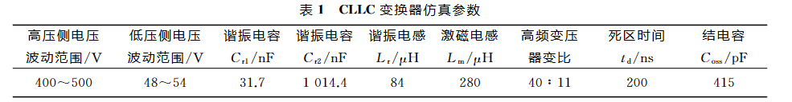

## ＣＬＬＣ 型三电平双向 ＤＣ／ＤＣ 变换器混合控制策略

**设计要求：**

​	400-500V输入，输出48V开关频率范围为：88-170KHz，死区时间t~d~=200ns

- **确定谐振频率** CLLC是由LLC改进而来的，先设计一个LLC的谐振网络，再设计剩余的低压侧谐振电容、选取LLC变换器的第二谐振频率为*f*~LLC~=100 kHz.
- **选取励磁电感：**
  - *i*~Lm~(*t*)的峰值电流公式近似计算得到：$i_{\mathrm{Lmp}}\approx\frac{nU_{\mathrm{ol}}}{L_{\mathrm{m}}} \frac{T_{s}}{4}$
  - 为保证开关管结电容死区时间内完全放电，*i*~Lmp~需满足：$i_\text{ Lmp}t_\text{ d}>2C_\text{ oss}U_1$
  - 由于第二谐振频率处的*M*~1~小于1，$L_\text{m}<\frac{nU_\text{ol}T_st_\text{d}}{8C_\text{oss}U_1}=\frac{M_1T_st_\text{d}}{16C_\text{oss}}<\frac{t_\text{d}}{16C_\text{oss}f_s}$​
  - 死区时间*t~d~*=200 ns， 第二谐振频率*f~s~*=100kHz， 结电容*C~oss~*=415 pF。由上面第二个式子可得 *L~m~*<301.2 uH。 所以Lm实际取值280 uH
- **选取电感比值*h***
  - *h*=*L~m~/L~r~*  ，选取h=3，确定谐振电感Lr为84uh，再由$f_{\mathrm{~LLC}}=1/2\pi \sqrt{L_{\mathrm{~r}}C_{\mathrm{~rl}}}$ 得到高压侧谐振电容C~r1~的数值为31.7uf
- **选取谐振电容比值g**
  - $g=C_{r2}/n^2C_{r1}$​
  - g值太小，则正向电压争议曲线的谐振峰值太高，且在第二谐振频率处的曲线斜率太小，导致变换器在很宽的调节范围内几乎没有电压调节能力
  - g值太大，则反向工作时的直流增益将比正向工作时高很多，不满足设计要求
  - 一般g取值在1-3之间比较合适，取g=2
- **选取变压器的变比n**
  - $n=M_1 \frac{U_1}{2U_{\mathrm{ol}}}$
  - 根据文中设置，U~1~=400，U~0~=48 想要M~1~小于1，需要小于4.167
  - n取值过小，会导致反向工作所需电压增益变高，开关管工作频率变低，从而会失去ZVS条件，故可初步选取 n=40:11
  - 在得到谐振电容比值g之后，通过$g=C_{r2}/n^2C_{r1}$ 计算得到:$C_{r2}=1014.4nF$
- **计算相位角**
  - 移相占空比D和Lm存在对应关系，且在0-0.5内，未必能实现软开关，定义临界移相占空比D~0~ 只有当意向占空比满足0<D<D~0~的条件时，变换器中所有软开关条件才可全部完成，因此对应于变换器高压侧最大输出电压U~1max~，有如下表达式
  - $\begin{cases}(0.5-D_0)\cos(\pi D_0)=\frac{16L_\text{m}C_\text{oss}}{T_\text{s}t_\text{d}}\\\\U_\text{ol}=\frac{\cos(\pi D_0)U_\text{lmax}}{2n}\end{cases}$ -------->D~0~=0.28
  - 移相控制模式中最大移相角为：$_\alpha=0.28\times180^\circ=50.4^\circ $

**参数**

