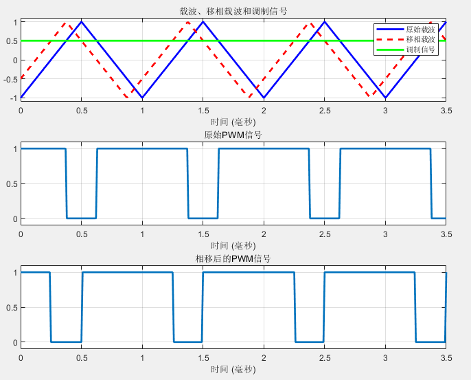
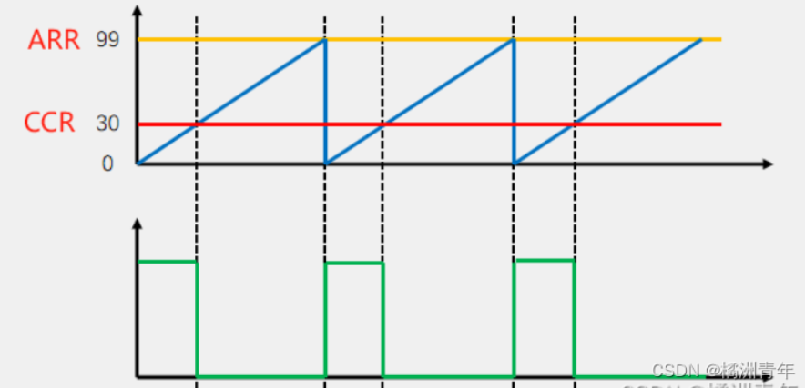

## PWM移相跟占空比可变

### PWM的两种输出方式

#### PWM模式

- ARR 当计数器达到ARR值的时候，计数器会自动重置为0
- CCR  比较寄存器，定时器的计数器与CRR相比，当计数器的值达到CCR时，PWM输出信号会改变状态
- PWM波形的周期由ARR决定，输出频率等于定时器的时钟频率除以ARR。

#### 输出比较模式

​	这里有一个用于递增或递减的计数器**CNT**，当**CNT=CCR**时，电平发生翻转，这个翻转行为决定了PWM的占空比，CNT超过ARR时，溢出置零

#### 二者区别与联系

- **通过调整ARR，可以改变PWM信号的频率，而调整CCR可以改变占空比**

- PWM模式与翻转模式下所输出的波形频率是相差2倍的，即PWM模式下输出频率为10Hz，那么输出比较模式下的输出频率只有5Hz
  - 超过CNT=CCR临界值时跳变一次，CNT溢出置零跳变一次

### PWM的移相

#### PWM模式移相

用PWM模式输出实现45°的移相，其中ARR=2000，占空比=50%

​	把ARR=2000与角度360°一一对应起来，或者说是360°均分为ARR份，那么要移相45°就是

**需要注意的是**，这里求得是CCR的差值，

AB两点之间的△CRR计算公式如下：
$$
\Delta CCR=\frac{ARR}{360^o}*x
$$
**相位移**：当你调整一个PWM信号的CCR值，相对于另一个信号进行移相时，相位的改变实际上是由两个信号的CCR差值决定的。

可以把移相看作是**对两个PWM信号之间CCR差值的调整**，而不是直接在单一路PWM信号的CCR值上做调整。